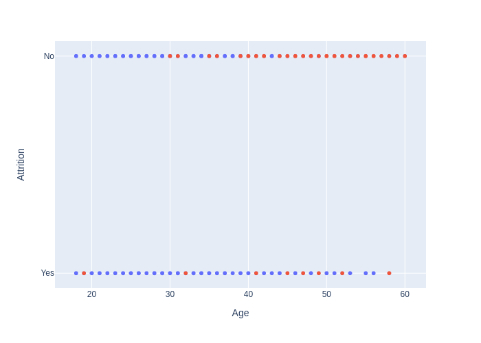
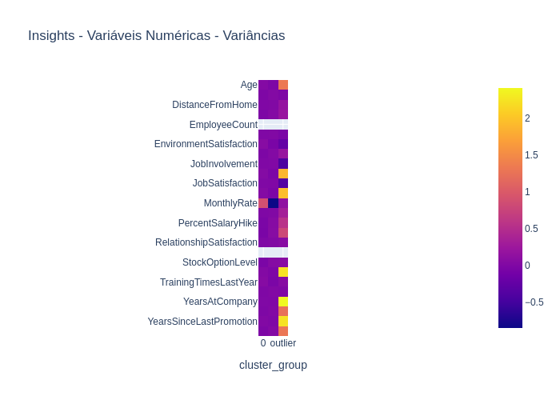

<h1>CPQD AutoML Algorithm - IBM-HR</h1>
<h2>Análise de Outliers</h2>

Os outliers são dados que se diferenciam drasticamente de todos os outros. Em outras palavras, um outlier é um valor que foge da normalidade e que pode (e provavelmente irá) causar anomalias nos resultados obtidos por meio de algoritmos e sistemas de análise. Entender os outliers é fundamental em uma análise de dados por pelo menos dois aspectos: os outliers podem viesar negativamente todo o resultado de uma análise; o comportamento dos outliers pode ser justamente o que está sendo procurado.

<h3>DBscan</h3>

Isolation Forests é um modelo de detecção de anomalias que faz uso de um conjunto de dados onde o alvo, neste caso a anomalia da fraude, do modelo contém poucas amostras entre tantos dados normais. A ideia do modelo é construir Árvores para isolar essas anomalias. Em outras palavras, a floresta de Isolamento é um conjunto de Árvores de Isolamento. Método parecido com a da nossa querida Random Forest.

Utilizando o método DBscan foram detectados 1470 outliers neste dataset, correspondendo a uma proporção de 100.00% do conjunto de amostras.

A orbservação do outliers pode ser feita nas tabelas abaixo, onde serão mostradas as tabelas de descrição dos outliers, tando de todas as features categóricas quanto de todas as features numéricas. Também é mostrado, na figura abaixo, a distribuição dos outliers em relação ao restante da população do dataset.

<table>
<thead>
<tr>
<th align="left"></th>
<th align="right">Age</th>
<th align="right">DailyRate</th>
<th align="right">DistanceFromHome</th>
<th align="right">Education</th>
<th align="right">EmployeeCount</th>
<th align="right">EmployeeNumber</th>
<th align="right">EnvironmentSatisfaction</th>
<th align="right">HourlyRate</th>
<th align="right">JobInvolvement</th>
<th align="right">JobLevel</th>
<th align="right">JobSatisfaction</th>
<th align="right">MonthlyIncome</th>
<th align="right">MonthlyRate</th>
<th align="right">NumCompaniesWorked</th>
<th align="right">PercentSalaryHike</th>
<th align="right">PerformanceRating</th>
<th align="right">RelationshipSatisfaction</th>
<th align="right">StandardHours</th>
<th align="right">StockOptionLevel</th>
<th align="right">TotalWorkingYears</th>
<th align="right">TrainingTimesLastYear</th>
<th align="right">WorkLifeBalance</th>
<th align="right">YearsAtCompany</th>
<th align="right">YearsInCurrentRole</th>
<th align="right">YearsSinceLastPromotion</th>
<th align="right">YearsWithCurrManager</th>
</tr>
</thead>
<tbody>
<tr>
<td align="left">count</td>
<td align="right">1470.00</td>
<td align="right">1470.00</td>
<td align="right">1470.00</td>
<td align="right">1470.00</td>
<td align="right">1470.00</td>
<td align="right">1470.00</td>
<td align="right">1470.00</td>
<td align="right">1470.00</td>
<td align="right">1470.00</td>
<td align="right">1470.00</td>
<td align="right">1470.00</td>
<td align="right">1470.00</td>
<td align="right">1470.00</td>
<td align="right">1470.00</td>
<td align="right">1470.00</td>
<td align="right">1470.00</td>
<td align="right">1470.00</td>
<td align="right">1470.00</td>
<td align="right">1470.00</td>
<td align="right">1470.00</td>
<td align="right">1470.00</td>
<td align="right">1470.00</td>
<td align="right">1470.00</td>
<td align="right">1470.00</td>
<td align="right">1470.00</td>
<td align="right">1470.00</td>
</tr>
<tr>
<td align="left">mean</td>
<td align="right">36.92</td>
<td align="right">802.49</td>
<td align="right">9.19</td>
<td align="right">2.91</td>
<td align="right">1.00</td>
<td align="right">1024.87</td>
<td align="right">2.72</td>
<td align="right">65.89</td>
<td align="right">2.73</td>
<td align="right">2.06</td>
<td align="right">2.73</td>
<td align="right">6502.93</td>
<td align="right">14313.10</td>
<td align="right">2.69</td>
<td align="right">15.21</td>
<td align="right">3.15</td>
<td align="right">2.71</td>
<td align="right">80.00</td>
<td align="right">0.79</td>
<td align="right">11.28</td>
<td align="right">2.80</td>
<td align="right">2.76</td>
<td align="right">7.01</td>
<td align="right">4.23</td>
<td align="right">2.19</td>
<td align="right">4.12</td>
</tr>
<tr>
<td align="left">std</td>
<td align="right">9.14</td>
<td align="right">403.51</td>
<td align="right">8.11</td>
<td align="right">1.02</td>
<td align="right">0.00</td>
<td align="right">602.02</td>
<td align="right">1.09</td>
<td align="right">20.33</td>
<td align="right">0.71</td>
<td align="right">1.11</td>
<td align="right">1.10</td>
<td align="right">4707.96</td>
<td align="right">7117.79</td>
<td align="right">2.50</td>
<td align="right">3.66</td>
<td align="right">0.36</td>
<td align="right">1.08</td>
<td align="right">0.00</td>
<td align="right">0.85</td>
<td align="right">7.78</td>
<td align="right">1.29</td>
<td align="right">0.71</td>
<td align="right">6.13</td>
<td align="right">3.62</td>
<td align="right">3.22</td>
<td align="right">3.57</td>
</tr>
<tr>
<td align="left">min</td>
<td align="right">18.00</td>
<td align="right">102.00</td>
<td align="right">1.00</td>
<td align="right">1.00</td>
<td align="right">1.00</td>
<td align="right">1.00</td>
<td align="right">1.00</td>
<td align="right">30.00</td>
<td align="right">1.00</td>
<td align="right">1.00</td>
<td align="right">1.00</td>
<td align="right">1009.00</td>
<td align="right">2094.00</td>
<td align="right">0.00</td>
<td align="right">11.00</td>
<td align="right">3.00</td>
<td align="right">1.00</td>
<td align="right">80.00</td>
<td align="right">0.00</td>
<td align="right">0.00</td>
<td align="right">0.00</td>
<td align="right">1.00</td>
<td align="right">0.00</td>
<td align="right">0.00</td>
<td align="right">0.00</td>
<td align="right">0.00</td>
</tr>
<tr>
<td align="left">25%</td>
<td align="right">30.00</td>
<td align="right">465.00</td>
<td align="right">2.00</td>
<td align="right">2.00</td>
<td align="right">1.00</td>
<td align="right">491.25</td>
<td align="right">2.00</td>
<td align="right">48.00</td>
<td align="right">2.00</td>
<td align="right">1.00</td>
<td align="right">2.00</td>
<td align="right">2911.00</td>
<td align="right">8047.00</td>
<td align="right">1.00</td>
<td align="right">12.00</td>
<td align="right">3.00</td>
<td align="right">2.00</td>
<td align="right">80.00</td>
<td align="right">0.00</td>
<td align="right">6.00</td>
<td align="right">2.00</td>
<td align="right">2.00</td>
<td align="right">3.00</td>
<td align="right">2.00</td>
<td align="right">0.00</td>
<td align="right">2.00</td>
</tr>
<tr>
<td align="left">50%</td>
<td align="right">36.00</td>
<td align="right">802.00</td>
<td align="right">7.00</td>
<td align="right">3.00</td>
<td align="right">1.00</td>
<td align="right">1020.50</td>
<td align="right">3.00</td>
<td align="right">66.00</td>
<td align="right">3.00</td>
<td align="right">2.00</td>
<td align="right">3.00</td>
<td align="right">4919.00</td>
<td align="right">14235.50</td>
<td align="right">2.00</td>
<td align="right">14.00</td>
<td align="right">3.00</td>
<td align="right">3.00</td>
<td align="right">80.00</td>
<td align="right">1.00</td>
<td align="right">10.00</td>
<td align="right">3.00</td>
<td align="right">3.00</td>
<td align="right">5.00</td>
<td align="right">3.00</td>
<td align="right">1.00</td>
<td align="right">3.00</td>
</tr>
<tr>
<td align="left">75%</td>
<td align="right">43.00</td>
<td align="right">1157.00</td>
<td align="right">14.00</td>
<td align="right">4.00</td>
<td align="right">1.00</td>
<td align="right">1555.75</td>
<td align="right">4.00</td>
<td align="right">83.75</td>
<td align="right">3.00</td>
<td align="right">3.00</td>
<td align="right">4.00</td>
<td align="right">8379.00</td>
<td align="right">20461.50</td>
<td align="right">4.00</td>
<td align="right">18.00</td>
<td align="right">3.00</td>
<td align="right">4.00</td>
<td align="right">80.00</td>
<td align="right">1.00</td>
<td align="right">15.00</td>
<td align="right">3.00</td>
<td align="right">3.00</td>
<td align="right">9.00</td>
<td align="right">7.00</td>
<td align="right">3.00</td>
<td align="right">7.00</td>
</tr>
<tr>
<td align="left">max</td>
<td align="right">60.00</td>
<td align="right">1499.00</td>
<td align="right">29.00</td>
<td align="right">5.00</td>
<td align="right">1.00</td>
<td align="right">2068.00</td>
<td align="right">4.00</td>
<td align="right">100.00</td>
<td align="right">4.00</td>
<td align="right">5.00</td>
<td align="right">4.00</td>
<td align="right">19999.00</td>
<td align="right">26999.00</td>
<td align="right">9.00</td>
<td align="right">25.00</td>
<td align="right">4.00</td>
<td align="right">4.00</td>
<td align="right">80.00</td>
<td align="right">3.00</td>
<td align="right">40.00</td>
<td align="right">6.00</td>
<td align="right">4.00</td>
<td align="right">40.00</td>
<td align="right">18.00</td>
<td align="right">15.00</td>
<td align="right">17.00</td>
</tr>
</tbody>
</table>
<em>Descrição Features Numéricas dos Outliers: DBscan</em>

<table>
<thead>
<tr>
<th align="left"></th>
<th align="left">MaritalStatus</th>
<th align="left">Department</th>
<th align="left">BusinessTravel</th>
<th align="left">Gender</th>
<th align="left">Attrition</th>
<th align="left">JobRole</th>
<th align="left">OverTime</th>
<th align="left">Over18</th>
<th align="left">EducationField</th>
</tr>
</thead>
<tbody>
<tr>
<td align="left">count</td>
<td align="left">1470</td>
<td align="left">1470</td>
<td align="left">1470</td>
<td align="left">1470</td>
<td align="left">1470</td>
<td align="left">1470</td>
<td align="left">1470</td>
<td align="left">1470</td>
<td align="left">1470</td>
</tr>
<tr>
<td align="left">unique</td>
<td align="left">3</td>
<td align="left">3</td>
<td align="left">3</td>
<td align="left">2</td>
<td align="left">2</td>
<td align="left">9</td>
<td align="left">2</td>
<td align="left">1</td>
<td align="left">6</td>
</tr>
<tr>
<td align="left">top</td>
<td align="left">Married</td>
<td align="left">Research &amp; Development</td>
<td align="left">Travel_Rarely</td>
<td align="left">Male</td>
<td align="left">No</td>
<td align="left">Sales Executive</td>
<td align="left">No</td>
<td align="left">Y</td>
<td align="left">Life Sciences</td>
</tr>
<tr>
<td align="left">freq</td>
<td align="left">673</td>
<td align="left">961</td>
<td align="left">1043</td>
<td align="left">882</td>
<td align="left">1233</td>
<td align="left">326</td>
<td align="left">1054</td>
<td align="left">1470</td>
<td align="left">606</td>
</tr>
</tbody>
</table>
<em>Descrição Features Categóricas dos Outliers: DBscan</em>

<em>Visualização dos outliers: DBscan</em>

<h3>Isolation Forest</h3>

Isolation Forests é um modelo de detecção de anomalias que faz uso de um conjunto de dados onde o alvo, neste caso a anomalia da fraude, do modelo contém poucas amostras entre tantos dados normais. A ideia do modelo é construir Árvores para isolar essas anomalias. Em outras palavras, a floresta de Isolamento é um conjunto de Árvores de Isolamento. Método parecido com a da nossa querida Random Forest.

Utilizando o método Isolation Forest foram detectados 74 outliers neste dataset, correspondendo a uma proporção de 5.03% do conjunto de amostras.

A orbservação do outliers pode ser feita nas tabelas abaixo, onde serão mostradas as tabelas de descrição dos outliers, tando de todas as features categóricas quanto de todas as features numéricas. Também é mostrado, na figura abaixo, a distribuição dos outliers em relação ao restante da população do dataset.

<table>
<thead>
<tr>
<th align="left"></th>
<th align="right">Age</th>
<th align="right">DailyRate</th>
<th align="right">DistanceFromHome</th>
<th align="right">Education</th>
<th align="right">EmployeeCount</th>
<th align="right">EmployeeNumber</th>
<th align="right">EnvironmentSatisfaction</th>
<th align="right">HourlyRate</th>
<th align="right">JobInvolvement</th>
<th align="right">JobLevel</th>
<th align="right">JobSatisfaction</th>
<th align="right">MonthlyIncome</th>
<th align="right">MonthlyRate</th>
<th align="right">NumCompaniesWorked</th>
<th align="right">PercentSalaryHike</th>
<th align="right">PerformanceRating</th>
<th align="right">RelationshipSatisfaction</th>
<th align="right">StandardHours</th>
<th align="right">StockOptionLevel</th>
<th align="right">TotalWorkingYears</th>
<th align="right">TrainingTimesLastYear</th>
<th align="right">WorkLifeBalance</th>
<th align="right">YearsAtCompany</th>
<th align="right">YearsInCurrentRole</th>
<th align="right">YearsSinceLastPromotion</th>
<th align="right">YearsWithCurrManager</th>
</tr>
</thead>
<tbody>
<tr>
<td align="left">count</td>
<td align="right">74.00</td>
<td align="right">74.00</td>
<td align="right">74.00</td>
<td align="right">74.00</td>
<td align="right">74.00</td>
<td align="right">74.00</td>
<td align="right">74.00</td>
<td align="right">74.00</td>
<td align="right">74.00</td>
<td align="right">74.00</td>
<td align="right">74.00</td>
<td align="right">74.00</td>
<td align="right">74.00</td>
<td align="right">74.00</td>
<td align="right">74.00</td>
<td align="right">74.00</td>
<td align="right">74.00</td>
<td align="right">74.00</td>
<td align="right">74.00</td>
<td align="right">74.00</td>
<td align="right">74.00</td>
<td align="right">74.00</td>
<td align="right">74.00</td>
<td align="right">74.00</td>
<td align="right">74.00</td>
<td align="right">74.00</td>
</tr>
<tr>
<td align="left">mean</td>
<td align="right">47.96</td>
<td align="right">795.97</td>
<td align="right">10.53</td>
<td align="right">3.11</td>
<td align="right">1.00</td>
<td align="right">999.78</td>
<td align="right">2.47</td>
<td align="right">69.73</td>
<td align="right">2.45</td>
<td align="right">3.88</td>
<td align="right">2.34</td>
<td align="right">14410.66</td>
<td align="right">15217.91</td>
<td align="right">3.46</td>
<td align="right">17.09</td>
<td align="right">3.42</td>
<td align="right">2.77</td>
<td align="right">80.00</td>
<td align="right">0.84</td>
<td align="right">26.05</td>
<td align="right">2.86</td>
<td align="right">2.76</td>
<td align="right">18.73</td>
<td align="right">8.24</td>
<td align="right">7.99</td>
<td align="right">8.28</td>
</tr>
<tr>
<td align="left">std</td>
<td align="right">7.89</td>
<td align="right">452.07</td>
<td align="right">10.23</td>
<td align="right">1.18</td>
<td align="right">0.00</td>
<td align="right">640.98</td>
<td align="right">1.20</td>
<td align="right">22.03</td>
<td align="right">0.85</td>
<td align="right">1.19</td>
<td align="right">1.13</td>
<td align="right">5441.40</td>
<td align="right">8072.09</td>
<td align="right">2.84</td>
<td align="right">4.85</td>
<td align="right">0.50</td>
<td align="right">1.21</td>
<td align="right">0.00</td>
<td align="right">0.94</td>
<td align="right">8.24</td>
<td align="right">1.56</td>
<td align="right">0.70</td>
<td align="right">10.42</td>
<td align="right">5.00</td>
<td align="right">5.49</td>
<td align="right">4.52</td>
</tr>
<tr>
<td align="left">min</td>
<td align="right">19.00</td>
<td align="right">119.00</td>
<td align="right">1.00</td>
<td align="right">1.00</td>
<td align="right">1.00</td>
<td align="right">33.00</td>
<td align="right">1.00</td>
<td align="right">30.00</td>
<td align="right">1.00</td>
<td align="right">1.00</td>
<td align="right">1.00</td>
<td align="right">2325.00</td>
<td align="right">2125.00</td>
<td align="right">0.00</td>
<td align="right">11.00</td>
<td align="right">3.00</td>
<td align="right">1.00</td>
<td align="right">80.00</td>
<td align="right">0.00</td>
<td align="right">1.00</td>
<td align="right">0.00</td>
<td align="right">1.00</td>
<td align="right">0.00</td>
<td align="right">0.00</td>
<td align="right">0.00</td>
<td align="right">0.00</td>
</tr>
<tr>
<td align="left">25%</td>
<td align="right">42.50</td>
<td align="right">368.00</td>
<td align="right">2.00</td>
<td align="right">2.25</td>
<td align="right">1.00</td>
<td align="right">407.00</td>
<td align="right">1.00</td>
<td align="right">55.25</td>
<td align="right">2.00</td>
<td align="right">3.00</td>
<td align="right">1.00</td>
<td align="right">10526.75</td>
<td align="right">7120.75</td>
<td align="right">1.00</td>
<td align="right">12.00</td>
<td align="right">3.00</td>
<td align="right">2.00</td>
<td align="right">80.00</td>
<td align="right">0.00</td>
<td align="right">22.00</td>
<td align="right">2.00</td>
<td align="right">2.00</td>
<td align="right">10.00</td>
<td align="right">5.00</td>
<td align="right">2.00</td>
<td align="right">7.00</td>
</tr>
<tr>
<td align="left">50%</td>
<td align="right">49.50</td>
<td align="right">695.50</td>
<td align="right">6.50</td>
<td align="right">3.00</td>
<td align="right">1.00</td>
<td align="right">1053.50</td>
<td align="right">3.00</td>
<td align="right">71.50</td>
<td align="right">3.00</td>
<td align="right">4.00</td>
<td align="right">2.00</td>
<td align="right">16774.00</td>
<td align="right">17317.50</td>
<td align="right">3.00</td>
<td align="right">16.00</td>
<td align="right">3.00</td>
<td align="right">3.00</td>
<td align="right">80.00</td>
<td align="right">1.00</td>
<td align="right">26.50</td>
<td align="right">3.00</td>
<td align="right">3.00</td>
<td align="right">20.00</td>
<td align="right">8.00</td>
<td align="right">10.50</td>
<td align="right">9.00</td>
</tr>
<tr>
<td align="left">75%</td>
<td align="right">55.00</td>
<td align="right">1218.50</td>
<td align="right">20.00</td>
<td align="right">4.00</td>
<td align="right">1.00</td>
<td align="right">1572.00</td>
<td align="right">4.00</td>
<td align="right">91.00</td>
<td align="right">3.00</td>
<td align="right">5.00</td>
<td align="right">3.00</td>
<td align="right">19125.00</td>
<td align="right">22095.00</td>
<td align="right">5.00</td>
<td align="right">22.00</td>
<td align="right">4.00</td>
<td align="right">4.00</td>
<td align="right">80.00</td>
<td align="right">1.00</td>
<td align="right">32.75</td>
<td align="right">3.75</td>
<td align="right">3.00</td>
<td align="right">26.00</td>
<td align="right">11.75</td>
<td align="right">13.00</td>
<td align="right">11.00</td>
</tr>
<tr>
<td align="left">max</td>
<td align="right">60.00</td>
<td align="right">1499.00</td>
<td align="right">29.00</td>
<td align="right">5.00</td>
<td align="right">1.00</td>
<td align="right">2036.00</td>
<td align="right">4.00</td>
<td align="right">100.00</td>
<td align="right">4.00</td>
<td align="right">5.00</td>
<td align="right">4.00</td>
<td align="right">19999.00</td>
<td align="right">26542.00</td>
<td align="right">9.00</td>
<td align="right">25.00</td>
<td align="right">4.00</td>
<td align="right">4.00</td>
<td align="right">80.00</td>
<td align="right">3.00</td>
<td align="right">40.00</td>
<td align="right">6.00</td>
<td align="right">4.00</td>
<td align="right">40.00</td>
<td align="right">18.00</td>
<td align="right">15.00</td>
<td align="right">17.00</td>
</tr>
</tbody>
</table>
<em>Descrição Features Numéricas dos Outliers: Isolation Forest</em>

<table>
<thead>
<tr>
<th align="left"></th>
<th align="left">MaritalStatus</th>
<th align="left">Department</th>
<th align="left">BusinessTravel</th>
<th align="left">Gender</th>
<th align="left">Attrition</th>
<th align="left">JobRole</th>
<th align="left">OverTime</th>
<th align="left">Over18</th>
<th align="left">EducationField</th>
</tr>
</thead>
<tbody>
<tr>
<td align="left">count</td>
<td align="left">74</td>
<td align="left">74</td>
<td align="left">74</td>
<td align="left">74</td>
<td align="left">74</td>
<td align="left">74</td>
<td align="left">74</td>
<td align="left">74</td>
<td align="left">74</td>
</tr>
<tr>
<td align="left">unique</td>
<td align="left">3</td>
<td align="left">3</td>
<td align="left">3</td>
<td align="left">2</td>
<td align="left">2</td>
<td align="left">8</td>
<td align="left">2</td>
<td align="left">1</td>
<td align="left">6</td>
</tr>
<tr>
<td align="left">top</td>
<td align="left">Married</td>
<td align="left">Research &amp; Development</td>
<td align="left">Travel_Rarely</td>
<td align="left">Male</td>
<td align="left">No</td>
<td align="left">Manager</td>
<td align="left">No</td>
<td align="left">Y</td>
<td align="left">Life Sciences</td>
</tr>
<tr>
<td align="left">freq</td>
<td align="left">34</td>
<td align="left">46</td>
<td align="left">48</td>
<td align="left">46</td>
<td align="left">65</td>
<td align="left">31</td>
<td align="left">58</td>
<td align="left">74</td>
<td align="left">33</td>
</tr>
</tbody>
</table>
<em>Descrição Features Categóricas dos Outliers: Isolation Forest</em>

<em>Visualização dos outliers: Isolation Forest</em>

<h2>Análise de Cluster</h2>

O clustering ou análise de agrupamento de dados é o conjunto de técnicas de prospecção de dados (data mining) que visa fazer agrupamentos automáticos de dados segundo o seu grau de semelhança. O critério de semelhança faz parte da definição do problema e, dependendo, do algoritmo. A cada conjunto de dados resultante do processo dá-se o nome de grupo, aglomerado ou agrupamento (cluster). O procedimento de agrupamento (clustering) também pode ser aplicado a bases de texto utilizando algoritmos de prospeção de texto (text mining), onde o algoritmo procura agrupar textos que falem sobre o mesmo assunto e separar textos de conteúdo diferentes. 

<h3>Feature Permutation 3 dim.</h3>

A melhor separação de grupos ocorreu nas features: ['EmployeeCount', 'JobLevel', 'TrainingTimesLastYear'] com uma quantidade de 9 grupos. A análise multidimensional em 3 dimensões fornece insights de quais features são mais importantes e que distinguem grupos entre si. Esta análise é realizada realizando a permutação das features do dataset.

A matriz de separação abaixo mostra a distribuição populacional normalizada dentro de cada grupo de cluster. Note que valores maiores significam que há maior presença daquela população dentro daquele grupo. Este tipo de tabela também pode ser chamado de matriz de confusão, do inglês Confusion Matrix.

<table>
<thead>
<tr>
<th align="right"></th>
<th align="right">0</th>
<th align="right">1</th>
<th align="right">2</th>
<th align="right">3</th>
<th align="right">4</th>
<th align="right">5</th>
<th align="right">6</th>
<th align="right">7</th>
<th align="right">8</th>
</tr>
</thead>
<tbody>
<tr>
<td align="right">3</td>
<td align="right">0.16</td>
<td align="right">0.12</td>
<td align="right">0.09</td>
<td align="right">0.13</td>
<td align="right">0.17</td>
<td align="right">0.16</td>
<td align="right">0.05</td>
<td align="right">0.06</td>
<td align="right">0.07</td>
</tr>
<tr>
<td align="right">4</td>
<td align="right">0.17</td>
<td align="right">0.10</td>
<td align="right">0.08</td>
<td align="right">0.16</td>
<td align="right">0.14</td>
<td align="right">0.19</td>
<td align="right">0.05</td>
<td align="right">0.02</td>
<td align="right">0.09</td>
</tr>
</tbody>
</table>
<em>Matriz de separação do melhor agrupamento</em>

<h3>Multidimensional</h3>

A melhor separação de grupos ocorreu nas features: ['Age', 'DailyRate', 'DistanceFromHome', 'Education', 'EmployeeCount', 'EmployeeNumber', 'EnvironmentSatisfaction', 'HourlyRate', 'JobInvolvement', 'JobLevel', 'JobSatisfaction', 'MonthlyIncome', 'MonthlyRate', 'NumCompaniesWorked', 'PercentSalaryHike', 'PerformanceRating', 'RelationshipSatisfaction', 'StandardHours', 'StockOptionLevel', 'TotalWorkingYears', 'TrainingTimesLastYear', 'WorkLifeBalance', 'YearsAtCompany', 'YearsInCurrentRole', 'YearsSinceLastPromotion', 'YearsWithCurrManager'] com uma quantidade de 2 grupos. A análise multidimensional de clusters é semelhante a análise bi-dimensional ou tri-dimensional, mas sua principal diferença é que utiliza todas as features disponíveis no dataset.

A matriz de separação abaixo mostra a distribuição populacional normalizada dentro de cada grupo de cluster. Note que valores maiores significam que há maior presença daquela população dentro daquele grupo. Este tipo de tabela também pode ser chamado de matriz de confusão, do inglês Confusion Matrix.

<table>
<thead>
<tr>
<th align="right"></th>
<th align="right">0</th>
<th align="right">1</th>
</tr>
</thead>
<tbody>
<tr>
<td align="right">3</td>
<td align="right">0.50</td>
<td align="right">0.50</td>
</tr>
<tr>
<td align="right">4</td>
<td align="right">0.42</td>
<td align="right">0.58</td>
</tr>
</tbody>
</table>
<em>Matriz de separação do melhor agrupamento</em>

<h3>Comparação dos Métodos</h3>

Na tabela abaixo podemos observar a comparação de todos os métodos de clustering testados. O método com o maior score será considerado o melhor método, sendo este utilizado nas próximas análises.

<table>
<thead>
<tr>
<th align="left"></th>
<th align="right">Feature Permutation 3 dim.</th>
<th align="right">Multidimensional</th>
</tr>
</thead>
<tbody>
<tr>
<td align="left">EmployeeCount - JobLevel - TrainingTimesLastYear</td>
<td align="right">0.69</td>
<td align="right">nan</td>
</tr>
<tr>
<td align="left">EmployeeCount - NumCompaniesWorked - YearsSinceLastPromotion</td>
<td align="right">0.48</td>
<td align="right">nan</td>
</tr>
<tr>
<td align="left">NumCompaniesWorked - TotalWorkingYears - WorkLifeBalance</td>
<td align="right">0.42</td>
<td align="right">nan</td>
</tr>
<tr>
<td align="left">Age - DailyRate - DistanceFromHome - Education - EmployeeCount - EmployeeNumber - EnvironmentSatisfaction - HourlyRate - JobInvolvement - JobLevel - JobSatisfaction - MonthlyIncome - MonthlyRate - NumCompaniesWorked - PercentSalaryHike - PerformanceRating - RelationshipSatisfaction - StandardHours - StockOptionLevel - TotalWorkingYears - TrainingTimesLastYear - WorkLifeBalance - YearsAtCompany - YearsInCurrentRole - YearsSinceLastPromotion - YearsWithCurrManager</td>
<td align="right">nan</td>
<td align="right">0.48</td>
</tr>
</tbody>
</table>
<em>Análise de score do agrupamento.</em>

<h3>Insights - Variáveis Numéricas</h3>

Insights obtidos das variáveis numéricas estão disponíveis nas tabelas de médias e variâncias abaixo, onde são apresentadas as diferenças das médias e variâncias entre a população geral e cada um dos grupos. A idéia é facilitar a observação de tendências distintas em cada um dos grupos, em relação a população geral. A tabela de variância é importante de um ponto de vista de análise da variação das features dentro de cada um dos grupos. A ideia é que a variância dentro de um grupo específico seja menor em relação a população em geral.

Figuras também são aliadas importantes na visualização de dados. Nas figuras de médias e variâncias abaixo estão presentes duas figuras que representam a variação de média e variância de cada grupo em relação a população geral. Dados variando para a cor azul significam que a variação é negativa, enquanto dados variando para cores vermelhas significam que a variação é positiva.

<table>
<thead>
<tr>
<th align="left"></th>
<th align="right">0</th>
<th align="right">1</th>
<th align="right">outlier</th>
</tr>
</thead>
<tbody>
<tr>
<td align="left">Age</td>
<td align="right">0.27</td>
<td align="right">-0.26</td>
<td align="right">11.62</td>
</tr>
<tr>
<td align="left">DailyRate</td>
<td align="right">-8.33</td>
<td align="right">7.96</td>
<td align="right">-6.86</td>
</tr>
<tr>
<td align="left">DistanceFromHome</td>
<td align="right">-0.05</td>
<td align="right">0.05</td>
<td align="right">1.41</td>
</tr>
<tr>
<td align="left">Education</td>
<td align="right">-0.03</td>
<td align="right">0.03</td>
<td align="right">0.21</td>
</tr>
<tr>
<td align="left">EmployeeCount</td>
<td align="right">0.00</td>
<td align="right">0.00</td>
<td align="right">0.00</td>
</tr>
<tr>
<td align="left">EmployeeNumber</td>
<td align="right">-3.31</td>
<td align="right">3.16</td>
<td align="right">-26.41</td>
</tr>
<tr>
<td align="left">EnvironmentSatisfaction</td>
<td align="right">0.06</td>
<td align="right">-0.06</td>
<td align="right">-0.26</td>
</tr>
<tr>
<td align="left">HourlyRate</td>
<td align="right">-0.53</td>
<td align="right">0.50</td>
<td align="right">4.04</td>
</tr>
<tr>
<td align="left">JobInvolvement</td>
<td align="right">-0.00</td>
<td align="right">0.00</td>
<td align="right">-0.30</td>
</tr>
<tr>
<td align="left">JobLevel</td>
<td align="right">0.04</td>
<td align="right">-0.03</td>
<td align="right">1.91</td>
</tr>
<tr>
<td align="left">JobSatisfaction</td>
<td align="right">0.00</td>
<td align="right">-0.00</td>
<td align="right">-0.41</td>
</tr>
<tr>
<td align="left">MonthlyIncome</td>
<td align="right">153.81</td>
<td align="right">-146.92</td>
<td align="right">8326.91</td>
</tr>
<tr>
<td align="left">MonthlyRate</td>
<td align="right">6270.69</td>
<td align="right">-5989.65</td>
<td align="right">952.76</td>
</tr>
<tr>
<td align="left">NumCompaniesWorked</td>
<td align="right">-0.03</td>
<td align="right">0.03</td>
<td align="right">0.81</td>
</tr>
<tr>
<td align="left">PercentSalaryHike</td>
<td align="right">-0.17</td>
<td align="right">0.16</td>
<td align="right">1.98</td>
</tr>
<tr>
<td align="left">PerformanceRating</td>
<td align="right">-0.02</td>
<td align="right">0.02</td>
<td align="right">0.28</td>
</tr>
<tr>
<td align="left">RelationshipSatisfaction</td>
<td align="right">-0.02</td>
<td align="right">0.01</td>
<td align="right">0.06</td>
</tr>
<tr>
<td align="left">StandardHours</td>
<td align="right">0.00</td>
<td align="right">0.00</td>
<td align="right">0.00</td>
</tr>
<tr>
<td align="left">StockOptionLevel</td>
<td align="right">-0.04</td>
<td align="right">0.04</td>
<td align="right">0.05</td>
</tr>
<tr>
<td align="left">TotalWorkingYears</td>
<td align="right">0.15</td>
<td align="right">-0.15</td>
<td align="right">15.56</td>
</tr>
<tr>
<td align="left">TrainingTimesLastYear</td>
<td align="right">0.06</td>
<td align="right">-0.06</td>
<td align="right">0.07</td>
</tr>
<tr>
<td align="left">WorkLifeBalance</td>
<td align="right">-0.01</td>
<td align="right">0.01</td>
<td align="right">-0.00</td>
</tr>
<tr>
<td align="left">YearsAtCompany</td>
<td align="right">0.01</td>
<td align="right">-0.01</td>
<td align="right">12.34</td>
</tr>
<tr>
<td align="left">YearsInCurrentRole</td>
<td align="right">-0.05</td>
<td align="right">0.05</td>
<td align="right">4.23</td>
</tr>
<tr>
<td align="left">YearsSinceLastPromotion</td>
<td align="right">0.04</td>
<td align="right">-0.04</td>
<td align="right">6.11</td>
</tr>
<tr>
<td align="left">YearsWithCurrManager</td>
<td align="right">-0.10</td>
<td align="right">0.10</td>
<td align="right">4.38</td>
</tr>
</tbody>
</table>
<em>Diferença de Média entre População - Grupos</em>

<table>
<thead>
<tr>
<th align="left"></th>
<th align="right">0</th>
<th align="right">1</th>
<th align="right">outlier</th>
</tr>
</thead>
<tbody>
<tr>
<td align="left">Age</td>
<td align="right">0.03</td>
<td align="right">-0.03</td>
<td align="right">1.32</td>
</tr>
<tr>
<td align="left">DailyRate</td>
<td align="right">-0.02</td>
<td align="right">0.02</td>
<td align="right">-0.02</td>
</tr>
<tr>
<td align="left">DistanceFromHome</td>
<td align="right">-0.01</td>
<td align="right">0.01</td>
<td align="right">0.18</td>
</tr>
<tr>
<td align="left">Education</td>
<td align="right">-0.03</td>
<td align="right">0.03</td>
<td align="right">0.20</td>
</tr>
<tr>
<td align="left">EmployeeCount</td>
<td align="right">nan</td>
<td align="right">nan</td>
<td align="right">nan</td>
</tr>
<tr>
<td align="left">EmployeeNumber</td>
<td align="right">-0.01</td>
<td align="right">0.01</td>
<td align="right">-0.04</td>
</tr>
<tr>
<td align="left">EnvironmentSatisfaction</td>
<td align="right">0.06</td>
<td align="right">-0.05</td>
<td align="right">-0.24</td>
</tr>
<tr>
<td align="left">HourlyRate</td>
<td align="right">-0.03</td>
<td align="right">0.02</td>
<td align="right">0.20</td>
</tr>
<tr>
<td align="left">JobInvolvement</td>
<td align="right">-0.00</td>
<td align="right">0.00</td>
<td align="right">-0.43</td>
</tr>
<tr>
<td align="left">JobLevel</td>
<td align="right">0.03</td>
<td align="right">-0.03</td>
<td align="right">1.88</td>
</tr>
<tr>
<td align="left">JobSatisfaction</td>
<td align="right">0.00</td>
<td align="right">-0.00</td>
<td align="right">-0.37</td>
</tr>
<tr>
<td align="left">MonthlyIncome</td>
<td align="right">0.04</td>
<td align="right">-0.03</td>
<td align="right">1.95</td>
</tr>
<tr>
<td align="left">MonthlyRate</td>
<td align="right">0.89</td>
<td align="right">-0.85</td>
<td align="right">0.13</td>
</tr>
<tr>
<td align="left">NumCompaniesWorked</td>
<td align="right">-0.01</td>
<td align="right">0.01</td>
<td align="right">0.33</td>
</tr>
<tr>
<td align="left">PercentSalaryHike</td>
<td align="right">-0.05</td>
<td align="right">0.05</td>
<td align="right">0.56</td>
</tr>
<tr>
<td align="left">PerformanceRating</td>
<td align="right">-0.06</td>
<td align="right">0.05</td>
<td align="right">0.81</td>
</tr>
<tr>
<td align="left">RelationshipSatisfaction</td>
<td align="right">-0.01</td>
<td align="right">0.01</td>
<td align="right">0.06</td>
</tr>
<tr>
<td align="left">StandardHours</td>
<td align="right">nan</td>
<td align="right">nan</td>
<td align="right">nan</td>
</tr>
<tr>
<td align="left">StockOptionLevel</td>
<td align="right">-0.05</td>
<td align="right">0.04</td>
<td align="right">0.05</td>
</tr>
<tr>
<td align="left">TotalWorkingYears</td>
<td align="right">0.02</td>
<td align="right">-0.02</td>
<td align="right">2.25</td>
</tr>
<tr>
<td align="left">TrainingTimesLastYear</td>
<td align="right">0.05</td>
<td align="right">-0.04</td>
<td align="right">0.05</td>
</tr>
<tr>
<td align="left">WorkLifeBalance</td>
<td align="right">-0.01</td>
<td align="right">0.01</td>
<td align="right">-0.01</td>
</tr>
<tr>
<td align="left">YearsAtCompany</td>
<td align="right">0.00</td>
<td align="right">-0.00</td>
<td align="right">2.41</td>
</tr>
<tr>
<td align="left">YearsInCurrentRole</td>
<td align="right">-0.02</td>
<td align="right">0.02</td>
<td align="right">1.24</td>
</tr>
<tr>
<td align="left">YearsSinceLastPromotion</td>
<td align="right">0.02</td>
<td align="right">-0.02</td>
<td align="right">2.23</td>
</tr>
<tr>
<td align="left">YearsWithCurrManager</td>
<td align="right">-0.03</td>
<td align="right">0.03</td>
<td align="right">1.30</td>
</tr>
</tbody>
</table>
<em>Diferença de Variância entre População - Grupos</em>

<em>Diferença de Média entre População - Grupos</em>

<em>Diferença de Variância entre População - Grupos</em>

A maior diferença populacional positiva foi detectada na feature MonthlyIncome e no grupo outlier, com valor de 8326.91. A maior variação negativa foi na feature MonthlyRate e no grupo 1, com o valor registrado de -5989.65

<h3>Insights - Variáveis Categóricas</h3>

É possível observar nas tabelas em ambas tabelas abaixo alguns dados notáveis extraídos dos grupos da base de dados. Estas tabelas de diferenças máximas e mínimas visam demonstrar as diferenças de distribuição entre a população e os grupos. A linha Contagem mostra a contagem daquela classe dentro do grupo, A linha Proporção mostra a proporção da classe em relação a população do grupo, A linha Diferença da População mostra a diferença de proporção daquela população no grupo em relação a população geral. 

<table>
<thead>
<tr>
<th align="left"></th>
<th align="left">MaritalStatus</th>
<th align="left">Department</th>
<th align="left">BusinessTravel</th>
<th align="left">Gender</th>
<th align="left">Attrition</th>
<th align="left">JobRole</th>
<th align="left">OverTime</th>
<th align="left">Over18</th>
<th align="left">EducationField</th>
</tr>
</thead>
<tbody>
<tr>
<td align="left">maior ocorrencia</td>
<td align="left">Married</td>
<td align="left">Research &amp; Development</td>
<td align="left">Travel_Rarely</td>
<td align="left">Male</td>
<td align="left">No</td>
<td align="left">Sales Executive</td>
<td align="left">No</td>
<td align="left">Y</td>
<td align="left">Life Sciences</td>
</tr>
<tr>
<td align="left">contagem</td>
<td align="left">340</td>
<td align="left">468</td>
<td align="left">488</td>
<td align="left">444</td>
<td align="left">599</td>
<td align="left">157</td>
<td align="left">516</td>
<td align="left">682</td>
<td align="left">295</td>
</tr>
<tr>
<td align="left">proporção</td>
<td align="left">0.47619047619047616</td>
<td align="left">0.6554621848739496</td>
<td align="left">0.7155425219941349</td>
<td align="left">0.6218487394957983</td>
<td align="left">0.8389355742296919</td>
<td align="left">0.23020527859237536</td>
<td align="left">0.7226890756302521</td>
<td align="left">1.0</td>
<td align="left">0.43255131964809385</td>
</tr>
<tr>
<td align="left">diferença da população</td>
<td align="left">0.018454086505662437</td>
<td align="left">1.805879945104838e-05</td>
<td align="left">0.002791805661756741</td>
<td align="left">0.0229948713009559</td>
<td align="left">0.0022593564646489206</td>
<td align="left">0.0031279146955272286</td>
<td align="left">0.00922202691965035</td>
<td align="left">0.0</td>
<td align="left">0.022092866926030796</td>
</tr>
<tr>
<td align="left">grupo</td>
<td align="left">1</td>
<td align="left">1</td>
<td align="left">0</td>
<td align="left">1</td>
<td align="left">1</td>
<td align="left">0</td>
<td align="left">1</td>
<td align="left">0</td>
<td align="left">0</td>
</tr>
</tbody>
</table>
<em>Diferença Máxima de População entre Grupos e Dataset</em>

<table>
<thead>
<tr>
<th align="left"></th>
<th align="left">MaritalStatus</th>
<th align="left">Department</th>
<th align="left">BusinessTravel</th>
<th align="left">Gender</th>
<th align="left">Attrition</th>
<th align="left">JobRole</th>
<th align="left">OverTime</th>
<th align="left">Over18</th>
<th align="left">EducationField</th>
</tr>
</thead>
<tbody>
<tr>
<td align="left">maior ocorrencia</td>
<td align="left">Married</td>
<td align="left">Research &amp; Development</td>
<td align="left">Travel_Rarely</td>
<td align="left">Male</td>
<td align="left">No</td>
<td align="left">Sales Executive</td>
<td align="left">No</td>
<td align="left">Y</td>
<td align="left">Life Sciences</td>
</tr>
<tr>
<td align="left">contagem</td>
<td align="left">299</td>
<td align="left">447</td>
<td align="left">507</td>
<td align="left">392</td>
<td align="left">569</td>
<td align="left">160</td>
<td align="left">480</td>
<td align="left">682</td>
<td align="left">278</td>
</tr>
<tr>
<td align="left">proporção</td>
<td align="left">0.43841642228739003</td>
<td align="left">0.655425219941349</td>
<td align="left">0.7100840336134454</td>
<td align="left">0.5747800586510264</td>
<td align="left">0.8343108504398827</td>
<td align="left">0.22408963585434175</td>
<td align="left">0.7038123167155426</td>
<td align="left">1.0</td>
<td align="left">0.38935574229691877</td>
</tr>
<tr>
<td align="left">diferença da população</td>
<td align="left">-0.0193199673974237</td>
<td align="left">-1.8906133149587667e-05</td>
<td align="left">-0.002666682718932778</td>
<td align="left">-0.024073809543815994</td>
<td align="left">-0.002365367325160239</td>
<td align="left">-0.0029877280425063824</td>
<td align="left">-0.009654731995059174</td>
<td align="left">0.0</td>
<td align="left">-0.021102710425144278</td>
</tr>
<tr>
<td align="left">grupo</td>
<td align="left">0</td>
<td align="left">0</td>
<td align="left">1</td>
<td align="left">0</td>
<td align="left">0</td>
<td align="left">1</td>
<td align="left">0</td>
<td align="left">0</td>
<td align="left">1</td>
</tr>
</tbody>
</table>
<em>Diferença Mínima de População entre Grupos e Dataset</em>

<h3>Insights - Resumo Clustering</h3>

Os seguintes insights resumidos foram obtidos a partir dos métodos de agrupamento apresentados:

Grupo 0: Média maior que a população: MonthlyRate

Grupo 1: Média menor que a população: MonthlyRate

Grupo outlier: Média maior que a população: Age, Média maior que a população: JobLevel, Média maior que a população: MonthlyIncome, Média maior que a população: PercentSalaryHike, Média maior que a população: PerformanceRating, Média maior que a população: TotalWorkingYears, Média maior que a população: YearsAtCompany, Média maior que a população: YearsInCurrentRole, Média maior que a população: YearsSinceLastPromotion, Média maior que a população: YearsWithCurrManager

