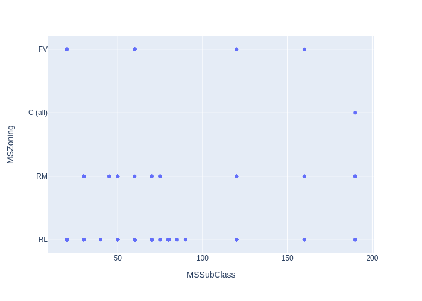
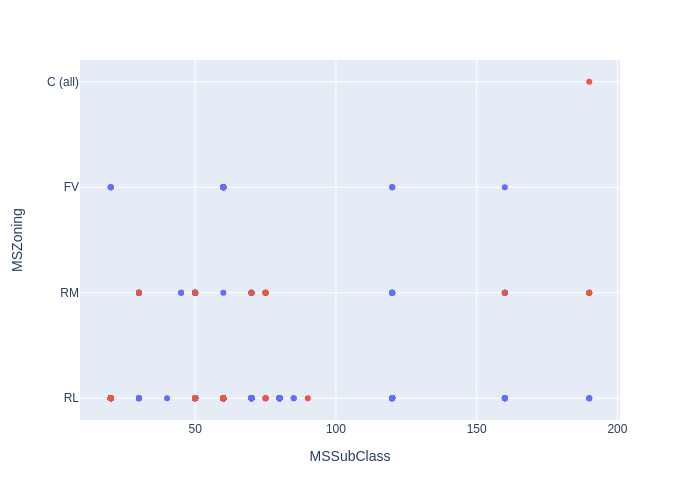
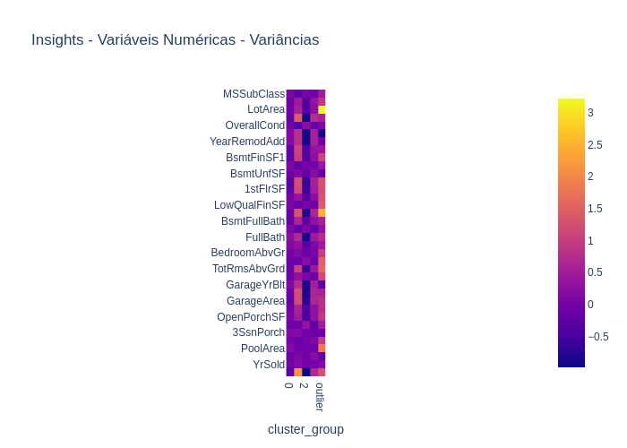

<h1>Relatorio AutoStats CPQD: Clustering - HousePrices</h1>
<h2>Análise Geral</h2>

Uma análise geral pode gerar insighs interessantes, no ponto de vista de dados gerais do banco fornecido. Nas tabelas a seguir serão apresentados dados como média, frequencia, maior valor, etc.

<table>
<thead>
<tr>
<th align="left"></th>
<th align="right">MSSubClass</th>
<th align="right">LotFrontage</th>
<th align="right">LotArea</th>
<th align="right">OverallQual</th>
<th align="right">OverallCond</th>
<th align="right">YearBuilt</th>
<th align="right">YearRemodAdd</th>
<th align="right">MasVnrArea</th>
<th align="right">BsmtFinSF1</th>
<th align="right">BsmtFinSF2</th>
<th align="right">BsmtUnfSF</th>
<th align="right">TotalBsmtSF</th>
<th align="right">1stFlrSF</th>
<th align="right">2ndFlrSF</th>
<th align="right">LowQualFinSF</th>
<th align="right">GrLivArea</th>
<th align="right">BsmtFullBath</th>
<th align="right">BsmtHalfBath</th>
<th align="right">FullBath</th>
<th align="right">HalfBath</th>
<th align="right">BedroomAbvGr</th>
<th align="right">KitchenAbvGr</th>
<th align="right">TotRmsAbvGrd</th>
<th align="right">Fireplaces</th>
<th align="right">GarageYrBlt</th>
<th align="right">GarageCars</th>
<th align="right">GarageArea</th>
<th align="right">WoodDeckSF</th>
<th align="right">OpenPorchSF</th>
<th align="right">EnclosedPorch</th>
<th align="right">3SsnPorch</th>
<th align="right">ScreenPorch</th>
<th align="right">PoolArea</th>
<th align="right">MoSold</th>
<th align="right">YrSold</th>
<th align="right">SalePrice</th>
</tr>
</thead>
<tbody>
<tr>
<td align="left">count</td>
<td align="right">583.00</td>
<td align="right">583.00</td>
<td align="right">583.00</td>
<td align="right">583.00</td>
<td align="right">583.00</td>
<td align="right">583.00</td>
<td align="right">583.00</td>
<td align="right">583.00</td>
<td align="right">583.00</td>
<td align="right">583.00</td>
<td align="right">583.00</td>
<td align="right">583.00</td>
<td align="right">583.00</td>
<td align="right">583.00</td>
<td align="right">583.00</td>
<td align="right">583.00</td>
<td align="right">583.00</td>
<td align="right">583.00</td>
<td align="right">583.00</td>
<td align="right">583.00</td>
<td align="right">583.00</td>
<td align="right">583.00</td>
<td align="right">583.00</td>
<td align="right">583.00</td>
<td align="right">583.00</td>
<td align="right">583.00</td>
<td align="right">583.00</td>
<td align="right">583.00</td>
<td align="right">583.00</td>
<td align="right">583.00</td>
<td align="right">583.00</td>
<td align="right">583.00</td>
<td align="right">583.00</td>
<td align="right">583.00</td>
<td align="right">583.00</td>
<td align="right">583.00</td>
</tr>
<tr>
<td align="left">mean</td>
<td align="right">55.35</td>
<td align="right">75.96</td>
<td align="right">11549.43</td>
<td align="right">6.82</td>
<td align="right">5.51</td>
<td align="right">1978.12</td>
<td align="right">1989.22</td>
<td align="right">155.59</td>
<td align="right">526.86</td>
<td align="right">45.87</td>
<td align="right">646.91</td>
<td align="right">1219.64</td>
<td align="right">1310.38</td>
<td align="right">439.19</td>
<td align="right">4.73</td>
<td align="right">1754.30</td>
<td align="right">0.46</td>
<td align="right">0.07</td>
<td align="right">1.73</td>
<td align="right">0.49</td>
<td align="right">2.96</td>
<td align="right">1.01</td>
<td align="right">7.11</td>
<td align="right">1.15</td>
<td align="right">1981.82</td>
<td align="right">2.07</td>
<td align="right">548.50</td>
<td align="right">117.18</td>
<td align="right">58.16</td>
<td align="right">19.29</td>
<td align="right">3.54</td>
<td align="right">24.81</td>
<td align="right">5.64</td>
<td align="right">6.48</td>
<td align="right">2007.72</td>
<td align="right">222759.43</td>
</tr>
<tr>
<td align="left">std</td>
<td align="right">36.94</td>
<td align="right">27.21</td>
<td align="right">10602.91</td>
<td align="right">1.30</td>
<td align="right">1.00</td>
<td align="right">29.81</td>
<td align="right">19.58</td>
<td align="right">229.15</td>
<td align="right">542.35</td>
<td align="right">171.25</td>
<td align="right">467.57</td>
<td align="right">460.94</td>
<td align="right">411.38</td>
<td align="right">484.12</td>
<td align="right">44.12</td>
<td align="right">547.40</td>
<td align="right">0.52</td>
<td align="right">0.25</td>
<td align="right">0.53</td>
<td align="right">0.52</td>
<td align="right">0.76</td>
<td align="right">0.12</td>
<td align="right">1.57</td>
<td align="right">0.37</td>
<td align="right">25.65</td>
<td align="right">0.66</td>
<td align="right">201.84</td>
<td align="right">131.31</td>
<td align="right">71.15</td>
<td align="right">61.94</td>
<td align="right">28.89</td>
<td align="right">70.77</td>
<td align="right">55.66</td>
<td align="right">2.79</td>
<td align="right">1.32</td>
<td align="right">92364.18</td>
</tr>
<tr>
<td align="left">min</td>
<td align="right">20.00</td>
<td align="right">21.00</td>
<td align="right">1300.00</td>
<td align="right">3.00</td>
<td align="right">2.00</td>
<td align="right">1880.00</td>
<td align="right">1950.00</td>
<td align="right">0.00</td>
<td align="right">0.00</td>
<td align="right">0.00</td>
<td align="right">0.00</td>
<td align="right">360.00</td>
<td align="right">483.00</td>
<td align="right">0.00</td>
<td align="right">0.00</td>
<td align="right">694.00</td>
<td align="right">0.00</td>
<td align="right">0.00</td>
<td align="right">0.00</td>
<td align="right">0.00</td>
<td align="right">0.00</td>
<td align="right">1.00</td>
<td align="right">3.00</td>
<td align="right">1.00</td>
<td align="right">1900.00</td>
<td align="right">1.00</td>
<td align="right">164.00</td>
<td align="right">0.00</td>
<td align="right">0.00</td>
<td align="right">0.00</td>
<td align="right">0.00</td>
<td align="right">0.00</td>
<td align="right">0.00</td>
<td align="right">1.00</td>
<td align="right">2006.00</td>
<td align="right">62383.00</td>
</tr>
<tr>
<td align="left">25%</td>
<td align="right">20.00</td>
<td align="right">60.00</td>
<td align="right">8425.00</td>
<td align="right">6.00</td>
<td align="right">5.00</td>
<td align="right">1959.00</td>
<td align="right">1976.00</td>
<td align="right">0.00</td>
<td align="right">0.00</td>
<td align="right">0.00</td>
<td align="right">289.50</td>
<td align="right">893.50</td>
<td align="right">1005.50</td>
<td align="right">0.00</td>
<td align="right">0.00</td>
<td align="right">1406.50</td>
<td align="right">0.00</td>
<td align="right">0.00</td>
<td align="right">1.00</td>
<td align="right">0.00</td>
<td align="right">3.00</td>
<td align="right">1.00</td>
<td align="right">6.00</td>
<td align="right">1.00</td>
<td align="right">1964.50</td>
<td align="right">2.00</td>
<td align="right">430.00</td>
<td align="right">0.00</td>
<td align="right">0.00</td>
<td align="right">0.00</td>
<td align="right">0.00</td>
<td align="right">0.00</td>
<td align="right">0.00</td>
<td align="right">5.00</td>
<td align="right">2007.00</td>
<td align="right">159975.00</td>
</tr>
<tr>
<td align="left">50%</td>
<td align="right">60.00</td>
<td align="right">75.00</td>
<td align="right">10261.00</td>
<td align="right">7.00</td>
<td align="right">5.00</td>
<td align="right">1990.00</td>
<td align="right">1997.00</td>
<td align="right">16.00</td>
<td align="right">442.00</td>
<td align="right">0.00</td>
<td align="right">548.00</td>
<td align="right">1145.00</td>
<td align="right">1264.00</td>
<td align="right">0.00</td>
<td align="right">0.00</td>
<td align="right">1664.00</td>
<td align="right">0.00</td>
<td align="right">0.00</td>
<td align="right">2.00</td>
<td align="right">0.00</td>
<td align="right">3.00</td>
<td align="right">1.00</td>
<td align="right">7.00</td>
<td align="right">1.00</td>
<td align="right">1992.00</td>
<td align="right">2.00</td>
<td align="right">516.00</td>
<td align="right">100.00</td>
<td align="right">40.00</td>
<td align="right">0.00</td>
<td align="right">0.00</td>
<td align="right">0.00</td>
<td align="right">0.00</td>
<td align="right">6.00</td>
<td align="right">2008.00</td>
<td align="right">193500.00</td>
</tr>
<tr>
<td align="left">75%</td>
<td align="right">60.00</td>
<td align="right">86.00</td>
<td align="right">12436.50</td>
<td align="right">8.00</td>
<td align="right">6.00</td>
<td align="right">2005.00</td>
<td align="right">2005.00</td>
<td align="right">256.00</td>
<td align="right">872.50</td>
<td align="right">0.00</td>
<td align="right">909.50</td>
<td align="right">1480.00</td>
<td align="right">1572.00</td>
<td align="right">839.00</td>
<td align="right">0.00</td>
<td align="right">1980.50</td>
<td align="right">1.00</td>
<td align="right">0.00</td>
<td align="right">2.00</td>
<td align="right">1.00</td>
<td align="right">3.00</td>
<td align="right">1.00</td>
<td align="right">8.00</td>
<td align="right">1.00</td>
<td align="right">2005.00</td>
<td align="right">2.00</td>
<td align="right">672.00</td>
<td align="right">192.00</td>
<td align="right">82.00</td>
<td align="right">0.00</td>
<td align="right">0.00</td>
<td align="right">0.00</td>
<td align="right">0.00</td>
<td align="right">8.00</td>
<td align="right">2009.00</td>
<td align="right">266250.00</td>
</tr>
<tr>
<td align="left">max</td>
<td align="right">190.00</td>
<td align="right">313.00</td>
<td align="right">215245.00</td>
<td align="right">10.00</td>
<td align="right">9.00</td>
<td align="right">2010.00</td>
<td align="right">2010.00</td>
<td align="right">1600.00</td>
<td align="right">5644.00</td>
<td align="right">1474.00</td>
<td align="right">2336.00</td>
<td align="right">6110.00</td>
<td align="right">4692.00</td>
<td align="right">2065.00</td>
<td align="right">572.00</td>
<td align="right">5642.00</td>
<td align="right">2.00</td>
<td align="right">2.00</td>
<td align="right">3.00</td>
<td align="right">2.00</td>
<td align="right">5.00</td>
<td align="right">2.00</td>
<td align="right">12.00</td>
<td align="right">3.00</td>
<td align="right">2010.00</td>
<td align="right">4.00</td>
<td align="right">1418.00</td>
<td align="right">857.00</td>
<td align="right">547.00</td>
<td align="right">552.00</td>
<td align="right">407.00</td>
<td align="right">480.00</td>
<td align="right">648.00</td>
<td align="right">12.00</td>
<td align="right">2010.00</td>
<td align="right">755000.00</td>
</tr>
</tbody>
</table>
<em>Tabela de descrição geral dos dados fornecidos.</em>

A análise por agrupamento pode trazer insights interessantes por considerar uma variável alvo como um ponto em comum dos dados. Assim possibilitando a comparação de quais features mais caracterizam cada um dos grupos alvo.

<table>
<thead>
<tr>
<th align="left">SalePrice categorizado</th>
<th align="right">OverallQual</th>
<th align="right">SalePrice</th>
<th align="right">YearRemodAdd</th>
<th align="right">GarageArea</th>
<th align="right">KitchenAbvGr</th>
<th align="right">BsmtFullBath</th>
<th align="right">3SsnPorch</th>
<th align="right">MoSold</th>
<th align="right">YrSold</th>
<th align="right">Fireplaces</th>
<th align="right">2ndFlrSF</th>
<th align="right">TotalBsmtSF</th>
<th align="right">PoolArea</th>
<th align="right">1stFlrSF</th>
<th align="right">GarageCars</th>
<th align="right">HalfBath</th>
<th align="right">GarageYrBlt</th>
<th align="right">EnclosedPorch</th>
<th align="right">YearBuilt</th>
<th align="right">LotArea</th>
<th align="right">MSSubClass</th>
<th align="right">ScreenPorch</th>
<th align="right">BsmtUnfSF</th>
<th align="right">OpenPorchSF</th>
<th align="right">LowQualFinSF</th>
<th align="right">TotRmsAbvGrd</th>
<th align="right">BsmtFinSF1</th>
<th align="right">OverallCond</th>
<th align="right">BedroomAbvGr</th>
<th align="right">BsmtFinSF2</th>
<th align="right">FullBath</th>
<th align="right">BsmtHalfBath</th>
<th align="right">LotFrontage</th>
<th align="right">GrLivArea</th>
<th align="right">MasVnrArea</th>
<th align="right">WoodDeckSF</th>
</tr>
</thead>
<tbody>
<tr>
<td align="left">(61690.383, 200906.4]</td>
<td align="right">5.98</td>
<td align="right">157209.05</td>
<td align="right">1979.43</td>
<td align="right">438.12</td>
<td align="right">1.03</td>
<td align="right">0.34</td>
<td align="right">2.82</td>
<td align="right">6.23</td>
<td align="right">2007.72</td>
<td align="right">1.12</td>
<td align="right">340.11</td>
<td align="right">1014.25</td>
<td align="right">5.61</td>
<td align="right">1135.54</td>
<td align="right">1.70</td>
<td align="right">0.43</td>
<td align="right">1970.52</td>
<td align="right">26.74</td>
<td align="right">1964.86</td>
<td align="right">9678.39</td>
<td align="right">58.49</td>
<td align="right">23.06</td>
<td align="right">576.20</td>
<td align="right">37.77</td>
<td align="right">5.90</td>
<td align="right">6.48</td>
<td align="right">393.50</td>
<td align="right">5.66</td>
<td align="right">2.89</td>
<td align="right">44.55</td>
<td align="right">1.50</td>
<td align="right">0.10</td>
<td align="right">69.90</td>
<td align="right">1481.55</td>
<td align="right">81.16</td>
<td align="right">84.38</td>
</tr>
<tr>
<td align="left">(200906.4, 339429.8]</td>
<td align="right">7.48</td>
<td align="right">260178.21</td>
<td align="right">1998.88</td>
<td align="right">635.87</td>
<td align="right">1.00</td>
<td align="right">0.53</td>
<td align="right">3.41</td>
<td align="right">6.80</td>
<td align="right">2007.71</td>
<td align="right">1.14</td>
<td align="right">532.53</td>
<td align="right">1353.40</td>
<td align="right">4.67</td>
<td align="right">1420.14</td>
<td align="right">2.36</td>
<td align="right">0.52</td>
<td align="right">1992.18</td>
<td align="right">12.05</td>
<td align="right">1990.72</td>
<td align="right">12172.64</td>
<td align="right">53.82</td>
<td align="right">26.86</td>
<td align="right">726.11</td>
<td align="right">78.73</td>
<td align="right">1.77</td>
<td align="right">7.52</td>
<td align="right">574.53</td>
<td align="right">5.40</td>
<td align="right">3.05</td>
<td align="right">52.76</td>
<td align="right">1.95</td>
<td align="right">0.03</td>
<td align="right">80.86</td>
<td align="right">1954.44</td>
<td align="right">192.85</td>
<td align="right">143.14</td>
</tr>
<tr>
<td align="left">(339429.8, 477953.2]</td>
<td align="right">8.58</td>
<td align="right">387954.25</td>
<td align="right">2003.62</td>
<td align="right">782.31</td>
<td align="right">1.00</td>
<td align="right">0.81</td>
<td align="right">9.52</td>
<td align="right">6.96</td>
<td align="right">2007.71</td>
<td align="right">1.25</td>
<td align="right">510.56</td>
<td align="right">1706.33</td>
<td align="right">0.00</td>
<td align="right">1746.44</td>
<td align="right">2.88</td>
<td align="right">0.62</td>
<td align="right">2001.10</td>
<td align="right">9.48</td>
<td align="right">1998.85</td>
<td align="right">18443.17</td>
<td align="right">44.06</td>
<td align="right">19.67</td>
<td align="right">683.21</td>
<td align="right">88.15</td>
<td align="right">11.92</td>
<td align="right">8.42</td>
<td align="right">1002.29</td>
<td align="right">5.17</td>
<td align="right">2.90</td>
<td align="right">20.83</td>
<td align="right">1.98</td>
<td align="right">0.02</td>
<td align="right">86.92</td>
<td align="right">2268.92</td>
<td align="right">355.56</td>
<td align="right">191.69</td>
</tr>
<tr>
<td align="left">(477953.2, 616476.6]</td>
<td align="right">9.00</td>
<td align="right">547286.86</td>
<td align="right">2007.71</td>
<td align="right">865.00</td>
<td align="right">1.00</td>
<td align="right">0.57</td>
<td align="right">0.00</td>
<td align="right">5.00</td>
<td align="right">2008.86</td>
<td align="right">1.43</td>
<td align="right">675.29</td>
<td align="right">2134.57</td>
<td align="right">0.00</td>
<td align="right">2054.57</td>
<td align="right">3.00</td>
<td align="right">0.71</td>
<td align="right">2007.43</td>
<td align="right">0.00</td>
<td align="right">2007.00</td>
<td align="right">20391.71</td>
<td align="right">42.86</td>
<td align="right">81.71</td>
<td align="right">984.00</td>
<td align="right">84.43</td>
<td align="right">0.00</td>
<td align="right">10.86</td>
<td align="right">1073.57</td>
<td align="right">5.00</td>
<td align="right">3.00</td>
<td align="right">77.00</td>
<td align="right">2.57</td>
<td align="right">0.00</td>
<td align="right">87.29</td>
<td align="right">2729.86</td>
<td align="right">543.29</td>
<td align="right">130.43</td>
</tr>
<tr>
<td align="left">(616476.6, 755000.0]</td>
<td align="right">10.00</td>
<td align="right">708333.33</td>
<td align="right">1995.67</td>
<td align="right">817.33</td>
<td align="right">1.00</td>
<td align="right">0.67</td>
<td align="right">0.00</td>
<td align="right">5.00</td>
<td align="right">2006.67</td>
<td align="right">1.67</td>
<td align="right">1911.00</td>
<td align="right">2256.67</td>
<td align="right">185.00</td>
<td align="right">2228.67</td>
<td align="right">3.00</td>
<td align="right">1.00</td>
<td align="right">1995.00</td>
<td align="right">0.00</td>
<td align="right">1995.00</td>
<td align="right">24306.00</td>
<td align="right">60.00</td>
<td align="right">0.00</td>
<td align="right">610.67</td>
<td align="right">68.00</td>
<td align="right">0.00</td>
<td align="right">10.00</td>
<td align="right">1646.00</td>
<td align="right">5.33</td>
<td align="right">4.00</td>
<td align="right">0.00</td>
<td align="right">3.00</td>
<td align="right">0.33</td>
<td align="right">127.33</td>
<td align="right">4139.67</td>
<td align="right">849.33</td>
<td align="right">304.67</td>
</tr>
</tbody>
</table>
<em>Tabela de agrupamento geral dos dados numéricos, por média.</em>

<table>
<thead>
<tr>
<th align="left">SalePrice categorizado</th>
<th align="right">Exterior2nd</th>
<th align="right">PavedDrive</th>
<th align="right">LotShape</th>
<th align="right">HouseStyle</th>
<th align="right">Street</th>
<th align="right">PoolQC</th>
<th align="right">RoofMatl</th>
<th align="right">Heating</th>
<th align="right">Condition2</th>
<th align="right">ExterCond</th>
<th align="right">GarageFinish</th>
<th align="right">HeatingQC</th>
<th align="right">LandContour</th>
<th align="right">BldgType</th>
<th align="right">KitchenQual</th>
<th align="right">Utilities</th>
<th align="right">BsmtFinType2</th>
<th align="right">Alley</th>
<th align="right">BsmtCond</th>
<th align="right">FireplaceQu</th>
<th align="right">Fence</th>
<th align="right">Exterior1st</th>
<th align="right">GarageQual</th>
<th align="right">Foundation</th>
<th align="right">GarageCond</th>
<th align="right">MSZoning</th>
<th align="right">Condition1</th>
<th align="right">MasVnrType</th>
<th align="right">CentralAir</th>
<th align="right">Neighborhood</th>
<th align="right">ExterQual</th>
<th align="right">Electrical</th>
<th align="right">BsmtFinType1</th>
<th align="right">GarageType</th>
<th align="right">BsmtExposure</th>
<th align="right">RoofStyle</th>
<th align="right">Functional</th>
<th align="right">BsmtQual</th>
<th align="right">LandSlope</th>
<th align="right">LotConfig</th>
</tr>
</thead>
<tbody>
<tr>
<td align="left">(61690.383, 200906.4]</td>
<td align="right">0.52</td>
<td align="right">0.52</td>
<td align="right">0.52</td>
<td align="right">0.52</td>
<td align="right">0.52</td>
<td align="right">0.52</td>
<td align="right">0.52</td>
<td align="right">0.52</td>
<td align="right">0.52</td>
<td align="right">0.52</td>
<td align="right">0.52</td>
<td align="right">0.52</td>
<td align="right">0.52</td>
<td align="right">0.52</td>
<td align="right">0.52</td>
<td align="right">0.52</td>
<td align="right">0.52</td>
<td align="right">0.52</td>
<td align="right">0.52</td>
<td align="right">0.52</td>
<td align="right">0.52</td>
<td align="right">0.52</td>
<td align="right">0.52</td>
<td align="right">0.52</td>
<td align="right">0.52</td>
<td align="right">0.52</td>
<td align="right">0.52</td>
<td align="right">0.52</td>
<td align="right">0.52</td>
<td align="right">0.52</td>
<td align="right">0.52</td>
<td align="right">0.52</td>
<td align="right">0.52</td>
<td align="right">0.52</td>
<td align="right">0.52</td>
<td align="right">0.52</td>
<td align="right">0.52</td>
<td align="right">0.52</td>
<td align="right">0.52</td>
<td align="right">0.52</td>
</tr>
<tr>
<td align="left">(200906.4, 339429.8]</td>
<td align="right">0.38</td>
<td align="right">0.38</td>
<td align="right">0.38</td>
<td align="right">0.38</td>
<td align="right">0.38</td>
<td align="right">0.38</td>
<td align="right">0.38</td>
<td align="right">0.38</td>
<td align="right">0.38</td>
<td align="right">0.38</td>
<td align="right">0.38</td>
<td align="right">0.38</td>
<td align="right">0.38</td>
<td align="right">0.38</td>
<td align="right">0.38</td>
<td align="right">0.38</td>
<td align="right">0.38</td>
<td align="right">0.38</td>
<td align="right">0.38</td>
<td align="right">0.38</td>
<td align="right">0.38</td>
<td align="right">0.38</td>
<td align="right">0.38</td>
<td align="right">0.38</td>
<td align="right">0.38</td>
<td align="right">0.38</td>
<td align="right">0.38</td>
<td align="right">0.38</td>
<td align="right">0.38</td>
<td align="right">0.38</td>
<td align="right">0.38</td>
<td align="right">0.38</td>
<td align="right">0.38</td>
<td align="right">0.38</td>
<td align="right">0.38</td>
<td align="right">0.38</td>
<td align="right">0.38</td>
<td align="right">0.38</td>
<td align="right">0.38</td>
<td align="right">0.38</td>
</tr>
<tr>
<td align="left">(339429.8, 477953.2]</td>
<td align="right">0.08</td>
<td align="right">0.08</td>
<td align="right">0.08</td>
<td align="right">0.08</td>
<td align="right">0.08</td>
<td align="right">0.08</td>
<td align="right">0.08</td>
<td align="right">0.08</td>
<td align="right">0.08</td>
<td align="right">0.08</td>
<td align="right">0.08</td>
<td align="right">0.08</td>
<td align="right">0.08</td>
<td align="right">0.08</td>
<td align="right">0.08</td>
<td align="right">0.08</td>
<td align="right">0.08</td>
<td align="right">0.08</td>
<td align="right">0.08</td>
<td align="right">0.08</td>
<td align="right">0.08</td>
<td align="right">0.08</td>
<td align="right">0.08</td>
<td align="right">0.08</td>
<td align="right">0.08</td>
<td align="right">0.08</td>
<td align="right">0.08</td>
<td align="right">0.08</td>
<td align="right">0.08</td>
<td align="right">0.08</td>
<td align="right">0.08</td>
<td align="right">0.08</td>
<td align="right">0.08</td>
<td align="right">0.08</td>
<td align="right">0.08</td>
<td align="right">0.08</td>
<td align="right">0.08</td>
<td align="right">0.08</td>
<td align="right">0.08</td>
<td align="right">0.08</td>
</tr>
<tr>
<td align="left">(477953.2, 616476.6]</td>
<td align="right">0.01</td>
<td align="right">0.01</td>
<td align="right">0.01</td>
<td align="right">0.01</td>
<td align="right">0.01</td>
<td align="right">0.01</td>
<td align="right">0.01</td>
<td align="right">0.01</td>
<td align="right">0.01</td>
<td align="right">0.01</td>
<td align="right">0.01</td>
<td align="right">0.01</td>
<td align="right">0.01</td>
<td align="right">0.01</td>
<td align="right">0.01</td>
<td align="right">0.01</td>
<td align="right">0.01</td>
<td align="right">0.01</td>
<td align="right">0.01</td>
<td align="right">0.01</td>
<td align="right">0.01</td>
<td align="right">0.01</td>
<td align="right">0.01</td>
<td align="right">0.01</td>
<td align="right">0.01</td>
<td align="right">0.01</td>
<td align="right">0.01</td>
<td align="right">0.01</td>
<td align="right">0.01</td>
<td align="right">0.01</td>
<td align="right">0.01</td>
<td align="right">0.01</td>
<td align="right">0.01</td>
<td align="right">0.01</td>
<td align="right">0.01</td>
<td align="right">0.01</td>
<td align="right">0.01</td>
<td align="right">0.01</td>
<td align="right">0.01</td>
<td align="right">0.01</td>
</tr>
<tr>
<td align="left">(616476.6, 755000.0]</td>
<td align="right">0.01</td>
<td align="right">0.01</td>
<td align="right">0.01</td>
<td align="right">0.01</td>
<td align="right">0.01</td>
<td align="right">0.01</td>
<td align="right">0.01</td>
<td align="right">0.01</td>
<td align="right">0.01</td>
<td align="right">0.01</td>
<td align="right">0.01</td>
<td align="right">0.01</td>
<td align="right">0.01</td>
<td align="right">0.01</td>
<td align="right">0.01</td>
<td align="right">0.01</td>
<td align="right">0.01</td>
<td align="right">0.01</td>
<td align="right">0.01</td>
<td align="right">0.01</td>
<td align="right">0.01</td>
<td align="right">0.01</td>
<td align="right">0.01</td>
<td align="right">0.01</td>
<td align="right">0.01</td>
<td align="right">0.01</td>
<td align="right">0.01</td>
<td align="right">0.01</td>
<td align="right">0.01</td>
<td align="right">0.01</td>
<td align="right">0.01</td>
<td align="right">0.01</td>
<td align="right">0.01</td>
<td align="right">0.01</td>
<td align="right">0.01</td>
<td align="right">0.01</td>
<td align="right">0.01</td>
<td align="right">0.01</td>
<td align="right">0.01</td>
<td align="right">0.01</td>
</tr>
</tbody>
</table>
<em>Tabela de agrupamento geral dos dados categóricos, por moda.</em>

<h2>Análise de Outliers</h2>

Os outliers são dados que se diferenciam drasticamente de todos os outros. Em outras palavras, um outlier é um valor que foge da normalidade e que pode (e provavelmente irá) causar anomalias nos resultados obtidos por meio de algoritmos e sistemas de análise. Entender os outliers é fundamental em uma análise de dados por pelo menos dois aspectos: os outliers podem viesar negativamente todo o resultado de uma análise; o comportamento dos outliers pode ser justamente o que está sendo procurado.

<h3>DBscan</h3>

Isolation Forests é um modelo de detecção de anomalias que faz uso de um conjunto de dados onde o alvo, neste caso a anomalia da fraude, do modelo contém poucas amostras entre tantos dados normais. A ideia do modelo é construir Árvores para isolar essas anomalias. Em outras palavras, a floresta de Isolamento é um conjunto de Árvores de Isolamento. Método parecido com a da nossa querida Random Forest.

Utilizando o método DBscan foram detectados 583 outliers neste dataset, correspondendo a uma proporção de 100.00% do conjunto de amostras.

A orbservação do outliers pode ser feita nas tabelas abaixo, onde serão mostradas as tabelas de descrição dos outliers, tando de todas as features categóricas quanto de todas as features numéricas. Também é mostrado, na figura abaixo, a distribuição dos outliers em relação ao restante da população do dataset.

<table>
<thead>
<tr>
<th align="left"></th>
<th align="right">MSSubClass</th>
<th align="right">LotFrontage</th>
<th align="right">LotArea</th>
<th align="right">OverallQual</th>
<th align="right">OverallCond</th>
<th align="right">YearBuilt</th>
<th align="right">YearRemodAdd</th>
<th align="right">MasVnrArea</th>
<th align="right">BsmtFinSF1</th>
<th align="right">BsmtFinSF2</th>
<th align="right">BsmtUnfSF</th>
<th align="right">TotalBsmtSF</th>
<th align="right">1stFlrSF</th>
<th align="right">2ndFlrSF</th>
<th align="right">LowQualFinSF</th>
<th align="right">GrLivArea</th>
<th align="right">BsmtFullBath</th>
<th align="right">BsmtHalfBath</th>
<th align="right">FullBath</th>
<th align="right">HalfBath</th>
<th align="right">BedroomAbvGr</th>
<th align="right">KitchenAbvGr</th>
<th align="right">TotRmsAbvGrd</th>
<th align="right">Fireplaces</th>
<th align="right">GarageYrBlt</th>
<th align="right">GarageCars</th>
<th align="right">GarageArea</th>
<th align="right">WoodDeckSF</th>
<th align="right">OpenPorchSF</th>
<th align="right">EnclosedPorch</th>
<th align="right">3SsnPorch</th>
<th align="right">ScreenPorch</th>
<th align="right">PoolArea</th>
<th align="right">MoSold</th>
<th align="right">YrSold</th>
<th align="right">SalePrice</th>
</tr>
</thead>
<tbody>
<tr>
<td align="left">count</td>
<td align="right">583.00</td>
<td align="right">583.00</td>
<td align="right">583.00</td>
<td align="right">583.00</td>
<td align="right">583.00</td>
<td align="right">583.00</td>
<td align="right">583.00</td>
<td align="right">583.00</td>
<td align="right">583.00</td>
<td align="right">583.00</td>
<td align="right">583.00</td>
<td align="right">583.00</td>
<td align="right">583.00</td>
<td align="right">583.00</td>
<td align="right">583.00</td>
<td align="right">583.00</td>
<td align="right">583.00</td>
<td align="right">583.00</td>
<td align="right">583.00</td>
<td align="right">583.00</td>
<td align="right">583.00</td>
<td align="right">583.00</td>
<td align="right">583.00</td>
<td align="right">583.00</td>
<td align="right">583.00</td>
<td align="right">583.00</td>
<td align="right">583.00</td>
<td align="right">583.00</td>
<td align="right">583.00</td>
<td align="right">583.00</td>
<td align="right">583.00</td>
<td align="right">583.00</td>
<td align="right">583.00</td>
<td align="right">583.00</td>
<td align="right">583.00</td>
<td align="right">583.00</td>
</tr>
<tr>
<td align="left">mean</td>
<td align="right">55.35</td>
<td align="right">75.96</td>
<td align="right">11549.43</td>
<td align="right">6.82</td>
<td align="right">5.51</td>
<td align="right">1978.12</td>
<td align="right">1989.22</td>
<td align="right">155.59</td>
<td align="right">526.86</td>
<td align="right">45.87</td>
<td align="right">646.91</td>
<td align="right">1219.64</td>
<td align="right">1310.38</td>
<td align="right">439.19</td>
<td align="right">4.73</td>
<td align="right">1754.30</td>
<td align="right">0.46</td>
<td align="right">0.07</td>
<td align="right">1.73</td>
<td align="right">0.49</td>
<td align="right">2.96</td>
<td align="right">1.01</td>
<td align="right">7.11</td>
<td align="right">1.15</td>
<td align="right">1981.82</td>
<td align="right">2.07</td>
<td align="right">548.50</td>
<td align="right">117.18</td>
<td align="right">58.16</td>
<td align="right">19.29</td>
<td align="right">3.54</td>
<td align="right">24.81</td>
<td align="right">5.64</td>
<td align="right">6.48</td>
<td align="right">2007.72</td>
<td align="right">222759.43</td>
</tr>
<tr>
<td align="left">std</td>
<td align="right">36.94</td>
<td align="right">27.21</td>
<td align="right">10602.91</td>
<td align="right">1.30</td>
<td align="right">1.00</td>
<td align="right">29.81</td>
<td align="right">19.58</td>
<td align="right">229.15</td>
<td align="right">542.35</td>
<td align="right">171.25</td>
<td align="right">467.57</td>
<td align="right">460.94</td>
<td align="right">411.38</td>
<td align="right">484.12</td>
<td align="right">44.12</td>
<td align="right">547.40</td>
<td align="right">0.52</td>
<td align="right">0.25</td>
<td align="right">0.53</td>
<td align="right">0.52</td>
<td align="right">0.76</td>
<td align="right">0.12</td>
<td align="right">1.57</td>
<td align="right">0.37</td>
<td align="right">25.65</td>
<td align="right">0.66</td>
<td align="right">201.84</td>
<td align="right">131.31</td>
<td align="right">71.15</td>
<td align="right">61.94</td>
<td align="right">28.89</td>
<td align="right">70.77</td>
<td align="right">55.66</td>
<td align="right">2.79</td>
<td align="right">1.32</td>
<td align="right">92364.18</td>
</tr>
<tr>
<td align="left">min</td>
<td align="right">20.00</td>
<td align="right">21.00</td>
<td align="right">1300.00</td>
<td align="right">3.00</td>
<td align="right">2.00</td>
<td align="right">1880.00</td>
<td align="right">1950.00</td>
<td align="right">0.00</td>
<td align="right">0.00</td>
<td align="right">0.00</td>
<td align="right">0.00</td>
<td align="right">360.00</td>
<td align="right">483.00</td>
<td align="right">0.00</td>
<td align="right">0.00</td>
<td align="right">694.00</td>
<td align="right">0.00</td>
<td align="right">0.00</td>
<td align="right">0.00</td>
<td align="right">0.00</td>
<td align="right">0.00</td>
<td align="right">1.00</td>
<td align="right">3.00</td>
<td align="right">1.00</td>
<td align="right">1900.00</td>
<td align="right">1.00</td>
<td align="right">164.00</td>
<td align="right">0.00</td>
<td align="right">0.00</td>
<td align="right">0.00</td>
<td align="right">0.00</td>
<td align="right">0.00</td>
<td align="right">0.00</td>
<td align="right">1.00</td>
<td align="right">2006.00</td>
<td align="right">62383.00</td>
</tr>
<tr>
<td align="left">25%</td>
<td align="right">20.00</td>
<td align="right">60.00</td>
<td align="right">8425.00</td>
<td align="right">6.00</td>
<td align="right">5.00</td>
<td align="right">1959.00</td>
<td align="right">1976.00</td>
<td align="right">0.00</td>
<td align="right">0.00</td>
<td align="right">0.00</td>
<td align="right">289.50</td>
<td align="right">893.50</td>
<td align="right">1005.50</td>
<td align="right">0.00</td>
<td align="right">0.00</td>
<td align="right">1406.50</td>
<td align="right">0.00</td>
<td align="right">0.00</td>
<td align="right">1.00</td>
<td align="right">0.00</td>
<td align="right">3.00</td>
<td align="right">1.00</td>
<td align="right">6.00</td>
<td align="right">1.00</td>
<td align="right">1964.50</td>
<td align="right">2.00</td>
<td align="right">430.00</td>
<td align="right">0.00</td>
<td align="right">0.00</td>
<td align="right">0.00</td>
<td align="right">0.00</td>
<td align="right">0.00</td>
<td align="right">0.00</td>
<td align="right">5.00</td>
<td align="right">2007.00</td>
<td align="right">159975.00</td>
</tr>
<tr>
<td align="left">50%</td>
<td align="right">60.00</td>
<td align="right">75.00</td>
<td align="right">10261.00</td>
<td align="right">7.00</td>
<td align="right">5.00</td>
<td align="right">1990.00</td>
<td align="right">1997.00</td>
<td align="right">16.00</td>
<td align="right">442.00</td>
<td align="right">0.00</td>
<td align="right">548.00</td>
<td align="right">1145.00</td>
<td align="right">1264.00</td>
<td align="right">0.00</td>
<td align="right">0.00</td>
<td align="right">1664.00</td>
<td align="right">0.00</td>
<td align="right">0.00</td>
<td align="right">2.00</td>
<td align="right">0.00</td>
<td align="right">3.00</td>
<td align="right">1.00</td>
<td align="right">7.00</td>
<td align="right">1.00</td>
<td align="right">1992.00</td>
<td align="right">2.00</td>
<td align="right">516.00</td>
<td align="right">100.00</td>
<td align="right">40.00</td>
<td align="right">0.00</td>
<td align="right">0.00</td>
<td align="right">0.00</td>
<td align="right">0.00</td>
<td align="right">6.00</td>
<td align="right">2008.00</td>
<td align="right">193500.00</td>
</tr>
<tr>
<td align="left">75%</td>
<td align="right">60.00</td>
<td align="right">86.00</td>
<td align="right">12436.50</td>
<td align="right">8.00</td>
<td align="right">6.00</td>
<td align="right">2005.00</td>
<td align="right">2005.00</td>
<td align="right">256.00</td>
<td align="right">872.50</td>
<td align="right">0.00</td>
<td align="right">909.50</td>
<td align="right">1480.00</td>
<td align="right">1572.00</td>
<td align="right">839.00</td>
<td align="right">0.00</td>
<td align="right">1980.50</td>
<td align="right">1.00</td>
<td align="right">0.00</td>
<td align="right">2.00</td>
<td align="right">1.00</td>
<td align="right">3.00</td>
<td align="right">1.00</td>
<td align="right">8.00</td>
<td align="right">1.00</td>
<td align="right">2005.00</td>
<td align="right">2.00</td>
<td align="right">672.00</td>
<td align="right">192.00</td>
<td align="right">82.00</td>
<td align="right">0.00</td>
<td align="right">0.00</td>
<td align="right">0.00</td>
<td align="right">0.00</td>
<td align="right">8.00</td>
<td align="right">2009.00</td>
<td align="right">266250.00</td>
</tr>
<tr>
<td align="left">max</td>
<td align="right">190.00</td>
<td align="right">313.00</td>
<td align="right">215245.00</td>
<td align="right">10.00</td>
<td align="right">9.00</td>
<td align="right">2010.00</td>
<td align="right">2010.00</td>
<td align="right">1600.00</td>
<td align="right">5644.00</td>
<td align="right">1474.00</td>
<td align="right">2336.00</td>
<td align="right">6110.00</td>
<td align="right">4692.00</td>
<td align="right">2065.00</td>
<td align="right">572.00</td>
<td align="right">5642.00</td>
<td align="right">2.00</td>
<td align="right">2.00</td>
<td align="right">3.00</td>
<td align="right">2.00</td>
<td align="right">5.00</td>
<td align="right">2.00</td>
<td align="right">12.00</td>
<td align="right">3.00</td>
<td align="right">2010.00</td>
<td align="right">4.00</td>
<td align="right">1418.00</td>
<td align="right">857.00</td>
<td align="right">547.00</td>
<td align="right">552.00</td>
<td align="right">407.00</td>
<td align="right">480.00</td>
<td align="right">648.00</td>
<td align="right">12.00</td>
<td align="right">2010.00</td>
<td align="right">755000.00</td>
</tr>
</tbody>
</table>
<em>Descrição Features Numéricas dos Outliers: DBscan</em>

<table>
<thead>
<tr>
<th align="left"></th>
<th align="left">Exterior2nd</th>
<th align="left">PavedDrive</th>
<th align="left">LotShape</th>
<th align="left">HouseStyle</th>
<th align="left">Street</th>
<th align="left">PoolQC</th>
<th align="left">RoofMatl</th>
<th align="left">SalePrice categorizado</th>
<th align="left">Heating</th>
<th align="left">Condition2</th>
<th align="left">ExterCond</th>
<th align="left">GarageFinish</th>
<th align="left">HeatingQC</th>
<th align="left">LandContour</th>
<th align="left">BldgType</th>
<th align="left">KitchenQual</th>
<th align="left">BsmtFinType2</th>
<th align="left">GarageCond</th>
<th align="left">Alley</th>
<th align="left">BsmtCond</th>
<th align="left">FireplaceQu</th>
<th align="left">Foundation</th>
<th align="left">Utilities</th>
<th align="left">GarageQual</th>
<th align="left">Exterior1st</th>
<th align="left">Fence</th>
<th align="left">MasVnrType</th>
<th align="left">MSZoning</th>
<th align="left">Condition1</th>
<th align="left">CentralAir</th>
<th align="left">Neighborhood</th>
<th align="left">ExterQual</th>
<th align="left">Electrical</th>
<th align="left">BsmtFinType1</th>
<th align="left">GarageType</th>
<th align="left">BsmtExposure</th>
<th align="left">RoofStyle</th>
<th align="left">Functional</th>
<th align="left">BsmtQual</th>
<th align="left">LandSlope</th>
<th align="left">LotConfig</th>
</tr>
</thead>
<tbody>
<tr>
<td align="left">count</td>
<td align="left">583</td>
<td align="left">583</td>
<td align="left">583</td>
<td align="left">583</td>
<td align="left">583</td>
<td align="left">583</td>
<td align="left">583</td>
<td align="left">583</td>
<td align="left">583</td>
<td align="left">583</td>
<td align="left">583</td>
<td align="left">583</td>
<td align="left">583</td>
<td align="left">583</td>
<td align="left">583</td>
<td align="left">583</td>
<td align="left">583</td>
<td align="left">583</td>
<td align="left">583</td>
<td align="left">583</td>
<td align="left">583</td>
<td align="left">583</td>
<td align="left">583</td>
<td align="left">583</td>
<td align="left">583</td>
<td align="left">583</td>
<td align="left">583</td>
<td align="left">583</td>
<td align="left">583</td>
<td align="left">583</td>
<td align="left">583</td>
<td align="left">583</td>
<td align="left">583</td>
<td align="left">583</td>
<td align="left">583</td>
<td align="left">583</td>
<td align="left">583</td>
<td align="left">583</td>
<td align="left">583</td>
<td align="left">583</td>
<td align="left">583</td>
</tr>
<tr>
<td align="left">unique</td>
<td align="left">15</td>
<td align="left">3</td>
<td align="left">4</td>
<td align="left">8</td>
<td align="left">2</td>
<td align="left">4</td>
<td align="left">6</td>
<td align="left">5</td>
<td align="left">3</td>
<td align="left">4</td>
<td align="left">4</td>
<td align="left">3</td>
<td align="left">4</td>
<td align="left">4</td>
<td align="left">5</td>
<td align="left">4</td>
<td align="left">6</td>
<td align="left">5</td>
<td align="left">3</td>
<td align="left">3</td>
<td align="left">5</td>
<td align="left">4</td>
<td align="left">1</td>
<td align="left">4</td>
<td align="left">12</td>
<td align="left">5</td>
<td align="left">4</td>
<td align="left">4</td>
<td align="left">8</td>
<td align="left">2</td>
<td align="left">25</td>
<td align="left">4</td>
<td align="left">3</td>
<td align="left">6</td>
<td align="left">6</td>
<td align="left">4</td>
<td align="left">5</td>
<td align="left">6</td>
<td align="left">4</td>
<td align="left">3</td>
<td align="left">5</td>
</tr>
<tr>
<td align="left">top</td>
<td align="left">VinylSd</td>
<td align="left">Y</td>
<td align="left">Reg</td>
<td align="left">1Story</td>
<td align="left">Pave</td>
<td align="left">-</td>
<td align="left">CompShg</td>
<td align="left">(61690.383, 200906.4]</td>
<td align="left">GasA</td>
<td align="left">Norm</td>
<td align="left">TA</td>
<td align="left">Fin</td>
<td align="left">Ex</td>
<td align="left">Lvl</td>
<td align="left">1Fam</td>
<td align="left">Gd</td>
<td align="left">Unf</td>
<td align="left">TA</td>
<td align="left">-</td>
<td align="left">TA</td>
<td align="left">Gd</td>
<td align="left">PConc</td>
<td align="left">AllPub</td>
<td align="left">TA</td>
<td align="left">VinylSd</td>
<td align="left">-</td>
<td align="left">None</td>
<td align="left">RL</td>
<td align="left">Norm</td>
<td align="left">Y</td>
<td align="left">NAmes</td>
<td align="left">TA</td>
<td align="left">SBrkr</td>
<td align="left">GLQ</td>
<td align="left">Attchd</td>
<td align="left">No</td>
<td align="left">Gable</td>
<td align="left">Typ</td>
<td align="left">Gd</td>
<td align="left">Gtl</td>
<td align="left">Inside</td>
</tr>
<tr>
<td align="left">freq</td>
<td align="left">236</td>
<td align="left">556</td>
<td align="left">351</td>
<td align="left">268</td>
<td align="left">582</td>
<td align="left">577</td>
<td align="left">569</td>
<td align="left">304</td>
<td align="left">574</td>
<td align="left">579</td>
<td align="left">530</td>
<td align="left">218</td>
<td align="left">362</td>
<td align="left">518</td>
<td align="left">510</td>
<td align="left">276</td>
<td align="left">521</td>
<td align="left">572</td>
<td align="left">558</td>
<td align="left">534</td>
<td align="left">315</td>
<td align="left">320</td>
<td align="left">583</td>
<td align="left">556</td>
<td align="left">239</td>
<td align="left">484</td>
<td align="left">284</td>
<td align="left">508</td>
<td align="left">509</td>
<td align="left">571</td>
<td align="left">73</td>
<td align="left">274</td>
<td align="left">559</td>
<td align="left">205</td>
<td align="left">428</td>
<td align="left">362</td>
<td align="left">412</td>
<td align="left">551</td>
<td align="left">278</td>
<td align="left">552</td>
<td align="left">438</td>
</tr>
</tbody>
</table>
<em>Descrição Features Categóricas dos Outliers: DBscan</em>

<em>Visualização dos outliers: DBscan</em>

<h3>Isolation Forest</h3>

Isolation Forests é um modelo de detecção de anomalias que faz uso de um conjunto de dados onde o alvo, neste caso a anomalia da fraude, do modelo contém poucas amostras entre tantos dados normais. A ideia do modelo é construir Árvores para isolar essas anomalias. Em outras palavras, a floresta de Isolamento é um conjunto de Árvores de Isolamento. Método parecido com a da nossa querida Random Forest.

Utilizando o método Isolation Forest foram detectados 30 outliers neste dataset, correspondendo a uma proporção de 5.15% do conjunto de amostras.

A orbservação do outliers pode ser feita nas tabelas abaixo, onde serão mostradas as tabelas de descrição dos outliers, tando de todas as features categóricas quanto de todas as features numéricas. Também é mostrado, na figura abaixo, a distribuição dos outliers em relação ao restante da população do dataset.

<table>
<thead>
<tr>
<th align="left"></th>
<th align="right">MSSubClass</th>
<th align="right">LotFrontage</th>
<th align="right">LotArea</th>
<th align="right">OverallQual</th>
<th align="right">OverallCond</th>
<th align="right">YearBuilt</th>
<th align="right">YearRemodAdd</th>
<th align="right">MasVnrArea</th>
<th align="right">BsmtFinSF1</th>
<th align="right">BsmtFinSF2</th>
<th align="right">BsmtUnfSF</th>
<th align="right">TotalBsmtSF</th>
<th align="right">1stFlrSF</th>
<th align="right">2ndFlrSF</th>
<th align="right">LowQualFinSF</th>
<th align="right">GrLivArea</th>
<th align="right">BsmtFullBath</th>
<th align="right">BsmtHalfBath</th>
<th align="right">FullBath</th>
<th align="right">HalfBath</th>
<th align="right">BedroomAbvGr</th>
<th align="right">KitchenAbvGr</th>
<th align="right">TotRmsAbvGrd</th>
<th align="right">Fireplaces</th>
<th align="right">GarageYrBlt</th>
<th align="right">GarageCars</th>
<th align="right">GarageArea</th>
<th align="right">WoodDeckSF</th>
<th align="right">OpenPorchSF</th>
<th align="right">EnclosedPorch</th>
<th align="right">3SsnPorch</th>
<th align="right">ScreenPorch</th>
<th align="right">PoolArea</th>
<th align="right">MoSold</th>
<th align="right">YrSold</th>
<th align="right">SalePrice</th>
</tr>
</thead>
<tbody>
<tr>
<td align="left">count</td>
<td align="right">30.00</td>
<td align="right">30.00</td>
<td align="right">30.00</td>
<td align="right">30.00</td>
<td align="right">30.00</td>
<td align="right">30.00</td>
<td align="right">30.00</td>
<td align="right">30.00</td>
<td align="right">30.00</td>
<td align="right">30.00</td>
<td align="right">30.00</td>
<td align="right">30.00</td>
<td align="right">30.00</td>
<td align="right">30.00</td>
<td align="right">30.00</td>
<td align="right">30.00</td>
<td align="right">30.00</td>
<td align="right">30.00</td>
<td align="right">30.00</td>
<td align="right">30.00</td>
<td align="right">30.00</td>
<td align="right">30.00</td>
<td align="right">30.00</td>
<td align="right">30.00</td>
<td align="right">30.00</td>
<td align="right">30.00</td>
<td align="right">30.00</td>
<td align="right">30.00</td>
<td align="right">30.00</td>
<td align="right">30.00</td>
<td align="right">30.00</td>
<td align="right">30.00</td>
<td align="right">30.00</td>
<td align="right">30.00</td>
<td align="right">30.00</td>
<td align="right">30.00</td>
</tr>
<tr>
<td align="left">mean</td>
<td align="right">71.50</td>
<td align="right">96.63</td>
<td align="right">27051.60</td>
<td align="right">7.50</td>
<td align="right">5.63</td>
<td align="right">1953.90</td>
<td align="right">1987.97</td>
<td align="right">234.60</td>
<td align="right">1020.93</td>
<td align="right">103.23</td>
<td align="right">567.97</td>
<td align="right">1692.13</td>
<td align="right">1745.63</td>
<td align="right">999.97</td>
<td align="right">45.37</td>
<td align="right">2790.97</td>
<td align="right">0.73</td>
<td align="right">0.13</td>
<td align="right">2.07</td>
<td align="right">0.70</td>
<td align="right">3.63</td>
<td align="right">1.13</td>
<td align="right">9.30</td>
<td align="right">1.53</td>
<td align="right">1974.97</td>
<td align="right">2.40</td>
<td align="right">694.57</td>
<td align="right">209.43</td>
<td align="right">111.37</td>
<td align="right">46.53</td>
<td align="right">0.00</td>
<td align="right">82.93</td>
<td align="right">68.87</td>
<td align="right">5.90</td>
<td align="right">2007.90</td>
<td align="right">321198.53</td>
</tr>
<tr>
<td align="left">std</td>
<td align="right">48.44</td>
<td align="right">52.12</td>
<td align="right">38769.01</td>
<td align="right">1.96</td>
<td align="right">1.73</td>
<td align="right">44.67</td>
<td align="right">18.13</td>
<td align="right">381.68</td>
<td align="right">1134.99</td>
<td align="right">267.44</td>
<td align="right">473.65</td>
<td align="right">1063.86</td>
<td align="right">757.69</td>
<td align="right">646.26</td>
<td align="right">141.02</td>
<td align="right">1050.74</td>
<td align="right">0.69</td>
<td align="right">0.35</td>
<td align="right">0.91</td>
<td align="right">0.60</td>
<td align="right">1.19</td>
<td align="right">0.35</td>
<td align="right">2.18</td>
<td align="right">0.57</td>
<td align="right">31.46</td>
<td align="right">0.67</td>
<td align="right">239.14</td>
<td align="right">231.48</td>
<td align="right">161.00</td>
<td align="right">129.16</td>
<td align="right">0.00</td>
<td align="right">147.79</td>
<td align="right">178.85</td>
<td align="right">3.06</td>
<td align="right">1.45</td>
<td align="right">197401.66</td>
</tr>
<tr>
<td align="left">min</td>
<td align="right">20.00</td>
<td align="right">42.00</td>
<td align="right">3964.00</td>
<td align="right">4.00</td>
<td align="right">3.00</td>
<td align="right">1880.00</td>
<td align="right">1950.00</td>
<td align="right">0.00</td>
<td align="right">0.00</td>
<td align="right">0.00</td>
<td align="right">0.00</td>
<td align="right">360.00</td>
<td align="right">804.00</td>
<td align="right">0.00</td>
<td align="right">0.00</td>
<td align="right">804.00</td>
<td align="right">0.00</td>
<td align="right">0.00</td>
<td align="right">0.00</td>
<td align="right">0.00</td>
<td align="right">0.00</td>
<td align="right">1.00</td>
<td align="right">4.00</td>
<td align="right">1.00</td>
<td align="right">1900.00</td>
<td align="right">1.00</td>
<td align="right">240.00</td>
<td align="right">0.00</td>
<td align="right">0.00</td>
<td align="right">0.00</td>
<td align="right">0.00</td>
<td align="right">0.00</td>
<td align="right">0.00</td>
<td align="right">1.00</td>
<td align="right">2006.00</td>
<td align="right">119000.00</td>
</tr>
<tr>
<td align="left">25%</td>
<td align="right">50.00</td>
<td align="right">65.00</td>
<td align="right">10731.50</td>
<td align="right">6.00</td>
<td align="right">5.00</td>
<td align="right">1912.00</td>
<td align="right">1975.00</td>
<td align="right">0.00</td>
<td align="right">76.50</td>
<td align="right">0.00</td>
<td align="right">176.75</td>
<td align="right">1091.25</td>
<td align="right">1310.25</td>
<td align="right">684.75</td>
<td align="right">0.00</td>
<td align="right">2047.00</td>
<td align="right">0.00</td>
<td align="right">0.00</td>
<td align="right">2.00</td>
<td align="right">0.00</td>
<td align="right">3.00</td>
<td align="right">1.00</td>
<td align="right">8.00</td>
<td align="right">1.00</td>
<td align="right">1961.25</td>
<td align="right">2.00</td>
<td align="right">522.00</td>
<td align="right">0.00</td>
<td align="right">0.00</td>
<td align="right">0.00</td>
<td align="right">0.00</td>
<td align="right">0.00</td>
<td align="right">0.00</td>
<td align="right">4.25</td>
<td align="right">2007.00</td>
<td align="right">155002.75</td>
</tr>
<tr>
<td align="left">50%</td>
<td align="right">60.00</td>
<td align="right">83.50</td>
<td align="right">15527.00</td>
<td align="right">7.00</td>
<td align="right">5.00</td>
<td align="right">1967.00</td>
<td align="right">1994.00</td>
<td align="right">0.00</td>
<td align="right">813.50</td>
<td align="right">0.00</td>
<td align="right">381.00</td>
<td align="right">1431.00</td>
<td align="right">1629.50</td>
<td align="right">1069.50</td>
<td align="right">0.00</td>
<td align="right">2707.50</td>
<td align="right">1.00</td>
<td align="right">0.00</td>
<td align="right">2.00</td>
<td align="right">1.00</td>
<td align="right">4.00</td>
<td align="right">1.00</td>
<td align="right">10.00</td>
<td align="right">1.50</td>
<td align="right">1981.00</td>
<td align="right">2.00</td>
<td align="right">672.00</td>
<td align="right">153.50</td>
<td align="right">47.00</td>
<td align="right">0.00</td>
<td align="right">0.00</td>
<td align="right">0.00</td>
<td align="right">0.00</td>
<td align="right">6.00</td>
<td align="right">2008.00</td>
<td align="right">253000.00</td>
</tr>
<tr>
<td align="left">75%</td>
<td align="right">75.00</td>
<td align="right">104.75</td>
<td align="right">24801.75</td>
<td align="right">9.75</td>
<td align="right">6.75</td>
<td align="right">1994.75</td>
<td align="right">2001.50</td>
<td align="right">289.25</td>
<td align="right">1445.25</td>
<td align="right">0.00</td>
<td align="right">920.50</td>
<td align="right">1908.00</td>
<td align="right">1839.25</td>
<td align="right">1486.50</td>
<td align="right">0.00</td>
<td align="right">3264.75</td>
<td align="right">1.00</td>
<td align="right">0.00</td>
<td align="right">3.00</td>
<td align="right">1.00</td>
<td align="right">4.00</td>
<td align="right">1.00</td>
<td align="right">11.00</td>
<td align="right">2.00</td>
<td align="right">1998.25</td>
<td align="right">3.00</td>
<td align="right">840.75</td>
<td align="right">356.75</td>
<td align="right">103.50</td>
<td align="right">0.00</td>
<td align="right">0.00</td>
<td align="right">152.25</td>
<td align="right">0.00</td>
<td align="right">7.00</td>
<td align="right">2009.00</td>
<td align="right">452500.00</td>
</tr>
<tr>
<td align="left">max</td>
<td align="right">190.00</td>
<td align="right">313.00</td>
<td align="right">215245.00</td>
<td align="right">10.00</td>
<td align="right">9.00</td>
<td align="right">2009.00</td>
<td align="right">2010.00</td>
<td align="right">1378.00</td>
<td align="right">5644.00</td>
<td align="right">1085.00</td>
<td align="right">1734.00</td>
<td align="right">6110.00</td>
<td align="right">4692.00</td>
<td align="right">2065.00</td>
<td align="right">572.00</td>
<td align="right">5642.00</td>
<td align="right">2.00</td>
<td align="right">1.00</td>
<td align="right">3.00</td>
<td align="right">2.00</td>
<td align="right">5.00</td>
<td align="right">2.00</td>
<td align="right">12.00</td>
<td align="right">3.00</td>
<td align="right">2009.00</td>
<td align="right">4.00</td>
<td align="right">1418.00</td>
<td align="right">857.00</td>
<td align="right">547.00</td>
<td align="right">552.00</td>
<td align="right">0.00</td>
<td align="right">480.00</td>
<td align="right">555.00</td>
<td align="right">12.00</td>
<td align="right">2010.00</td>
<td align="right">755000.00</td>
</tr>
</tbody>
</table>
<em>Descrição Features Numéricas dos Outliers: Isolation Forest</em>

<table>
<thead>
<tr>
<th align="left"></th>
<th align="left">Exterior2nd</th>
<th align="left">PavedDrive</th>
<th align="left">LotShape</th>
<th align="left">HouseStyle</th>
<th align="left">Street</th>
<th align="left">PoolQC</th>
<th align="left">RoofMatl</th>
<th align="left">SalePrice categorizado</th>
<th align="left">Heating</th>
<th align="left">Condition2</th>
<th align="left">ExterCond</th>
<th align="left">GarageFinish</th>
<th align="left">HeatingQC</th>
<th align="left">LandContour</th>
<th align="left">BldgType</th>
<th align="left">KitchenQual</th>
<th align="left">BsmtFinType2</th>
<th align="left">GarageCond</th>
<th align="left">Alley</th>
<th align="left">BsmtCond</th>
<th align="left">FireplaceQu</th>
<th align="left">Foundation</th>
<th align="left">Utilities</th>
<th align="left">GarageQual</th>
<th align="left">Exterior1st</th>
<th align="left">Fence</th>
<th align="left">MasVnrType</th>
<th align="left">MSZoning</th>
<th align="left">Condition1</th>
<th align="left">CentralAir</th>
<th align="left">Neighborhood</th>
<th align="left">ExterQual</th>
<th align="left">Electrical</th>
<th align="left">BsmtFinType1</th>
<th align="left">GarageType</th>
<th align="left">BsmtExposure</th>
<th align="left">RoofStyle</th>
<th align="left">Functional</th>
<th align="left">BsmtQual</th>
<th align="left">LandSlope</th>
<th align="left">LotConfig</th>
</tr>
</thead>
<tbody>
<tr>
<td align="left">count</td>
<td align="left">30</td>
<td align="left">30</td>
<td align="left">30</td>
<td align="left">30</td>
<td align="left">30</td>
<td align="left">30</td>
<td align="left">30</td>
<td align="left">30</td>
<td align="left">30</td>
<td align="left">30</td>
<td align="left">30</td>
<td align="left">30</td>
<td align="left">30</td>
<td align="left">30</td>
<td align="left">30</td>
<td align="left">30</td>
<td align="left">30</td>
<td align="left">30</td>
<td align="left">30</td>
<td align="left">30</td>
<td align="left">30</td>
<td align="left">30</td>
<td align="left">30</td>
<td align="left">30</td>
<td align="left">30</td>
<td align="left">30</td>
<td align="left">30</td>
<td align="left">30</td>
<td align="left">30</td>
<td align="left">30</td>
<td align="left">30</td>
<td align="left">30</td>
<td align="left">30</td>
<td align="left">30</td>
<td align="left">30</td>
<td align="left">30</td>
<td align="left">30</td>
<td align="left">30</td>
<td align="left">30</td>
<td align="left">30</td>
<td align="left">30</td>
</tr>
<tr>
<td align="left">unique</td>
<td align="left">10</td>
<td align="left">2</td>
<td align="left">4</td>
<td align="left">6</td>
<td align="left">1</td>
<td align="left">4</td>
<td align="left">3</td>
<td align="left">5</td>
<td align="left">2</td>
<td align="left">3</td>
<td align="left">3</td>
<td align="left">3</td>
<td align="left">3</td>
<td align="left">4</td>
<td align="left">4</td>
<td align="left">4</td>
<td align="left">4</td>
<td align="left">1</td>
<td align="left">3</td>
<td align="left">2</td>
<td align="left">4</td>
<td align="left">4</td>
<td align="left">1</td>
<td align="left">4</td>
<td align="left">9</td>
<td align="left">3</td>
<td align="left">3</td>
<td align="left">3</td>
<td align="left">5</td>
<td align="left">2</td>
<td align="left">14</td>
<td align="left">4</td>
<td align="left">2</td>
<td align="left">6</td>
<td align="left">4</td>
<td align="left">4</td>
<td align="left">3</td>
<td align="left">4</td>
<td align="left">3</td>
<td align="left">3</td>
<td align="left">3</td>
</tr>
<tr>
<td align="left">top</td>
<td align="left">Plywood</td>
<td align="left">Y</td>
<td align="left">Reg</td>
<td align="left">2Story</td>
<td align="left">Pave</td>
<td align="left">-</td>
<td align="left">CompShg</td>
<td align="left">(61690.383, 200906.4]</td>
<td align="left">GasA</td>
<td align="left">Norm</td>
<td align="left">TA</td>
<td align="left">Unf</td>
<td align="left">Ex</td>
<td align="left">Lvl</td>
<td align="left">1Fam</td>
<td align="left">Gd</td>
<td align="left">Unf</td>
<td align="left">TA</td>
<td align="left">-</td>
<td align="left">TA</td>
<td align="left">Gd</td>
<td align="left">PConc</td>
<td align="left">AllPub</td>
<td align="left">TA</td>
<td align="left">Wd Sdng</td>
<td align="left">-</td>
<td align="left">None</td>
<td align="left">RL</td>
<td align="left">Norm</td>
<td align="left">Y</td>
<td align="left">OldTown</td>
<td align="left">TA</td>
<td align="left">SBrkr</td>
<td align="left">GLQ</td>
<td align="left">Attchd</td>
<td align="left">No</td>
<td align="left">Gable</td>
<td align="left">Typ</td>
<td align="left">TA</td>
<td align="left">Gtl</td>
<td align="left">Inside</td>
</tr>
<tr>
<td align="left">freq</td>
<td align="left">7</td>
<td align="left">27</td>
<td align="left">15</td>
<td align="left">14</td>
<td align="left">30</td>
<td align="left">26</td>
<td align="left">26</td>
<td align="left">12</td>
<td align="left">26</td>
<td align="left">28</td>
<td align="left">23</td>
<td align="left">16</td>
<td align="left">14</td>
<td align="left">21</td>
<td align="left">25</td>
<td align="left">11</td>
<td align="left">25</td>
<td align="left">30</td>
<td align="left">28</td>
<td align="left">28</td>
<td align="left">16</td>
<td align="left">12</td>
<td align="left">30</td>
<td align="left">26</td>
<td align="left">8</td>
<td align="left">20</td>
<td align="left">18</td>
<td align="left">20</td>
<td align="left">21</td>
<td align="left">27</td>
<td align="left">9</td>
<td align="left">14</td>
<td align="left">29</td>
<td align="left">12</td>
<td align="left">15</td>
<td align="left">13</td>
<td align="left">16</td>
<td align="left">26</td>
<td align="left">12</td>
<td align="left">27</td>
<td align="left">18</td>
</tr>
</tbody>
</table>
<em>Descrição Features Categóricas dos Outliers: Isolation Forest</em>

<em>Visualização dos outliers: Isolation Forest</em>

<h2>Análise de Cluster</h2>

O clustering ou análise de agrupamento de dados é o conjunto de técnicas de prospecção de dados (data mining) que visa fazer agrupamentos automáticos de dados segundo o seu grau de semelhança. O critério de semelhança faz parte da definição do problema e, dependendo, do algoritmo. A cada conjunto de dados resultante do processo dá-se o nome de grupo, aglomerado ou agrupamento (cluster). O procedimento de agrupamento (clustering) também pode ser aplicado a bases de texto utilizando algoritmos de prospeção de texto (text mining), onde o algoritmo procura agrupar textos que falem sobre o mesmo assunto e separar textos de conteúdo diferentes. 

<h3>Feature Permutation 3 dim.</h3>

A melhor separação de grupos ocorreu nas features: ['OverallCond', 'BsmtFinSF1', 'GarageCars'] com uma quantidade de 3 grupos. A análise multidimensional em 3 dimensões fornece insights de quais features são mais importantes e que distinguem grupos entre si. Esta análise é realizada realizando a permutação das features do dataset.

A matriz de separação abaixo mostra a distribuição populacional normalizada dentro de cada grupo de cluster. Note que valores maiores significam que há maior presença daquela população dentro daquele grupo. Este tipo de tabela também pode ser chamado de matriz de confusão, do inglês Confusion Matrix.

<table>
<thead>
<tr>
<th align="left"></th>
<th align="right">0</th>
<th align="right">1</th>
<th align="right">2</th>
</tr>
</thead>
<tbody>
<tr>
<td align="left">(358901.8, 457741.4]</td>
<td align="right">0.08</td>
<td align="right">0.69</td>
<td align="right">0.22</td>
</tr>
<tr>
<td align="left">(161222.6, 260062.2]</td>
<td align="right">0.38</td>
<td align="right">0.17</td>
<td align="right">0.45</td>
</tr>
<tr>
<td align="left">(260062.2, 358901.8]</td>
<td align="right">0.17</td>
<td align="right">0.50</td>
<td align="right">0.33</td>
</tr>
<tr>
<td align="left">(61888.802, 161222.6]</td>
<td align="right">0.50</td>
<td align="right">0.05</td>
<td align="right">0.46</td>
</tr>
<tr>
<td align="left">(457741.4, 556581.0]</td>
<td align="right">0.00</td>
<td align="right">0.33</td>
<td align="right">0.67</td>
</tr>
</tbody>
</table>
<em>Matriz de separação do melhor agrupamento</em>

<h3>Multidimensional</h3>

A melhor separação de grupos ocorreu nas features: ['MSSubClass', 'LotFrontage', 'LotArea', 'OverallQual', 'OverallCond', 'YearBuilt', 'YearRemodAdd', 'MasVnrArea', 'BsmtFinSF1', 'BsmtFinSF2', 'BsmtUnfSF', 'TotalBsmtSF', '1stFlrSF', '2ndFlrSF', 'LowQualFinSF', 'GrLivArea', 'BsmtFullBath', 'BsmtHalfBath', 'FullBath', 'HalfBath', 'BedroomAbvGr', 'KitchenAbvGr', 'TotRmsAbvGrd', 'Fireplaces', 'GarageYrBlt', 'GarageCars', 'GarageArea', 'WoodDeckSF', 'OpenPorchSF', 'EnclosedPorch', '3SsnPorch', 'ScreenPorch', 'PoolArea', 'MoSold', 'YrSold', 'SalePrice'] com uma quantidade de 4 grupos. A análise multidimensional de clusters é semelhante a análise bi-dimensional ou tri-dimensional, mas sua principal diferença é que utiliza todas as features disponíveis no dataset.

A matriz de separação abaixo mostra a distribuição populacional normalizada dentro de cada grupo de cluster. Note que valores maiores significam que há maior presença daquela população dentro daquele grupo. Este tipo de tabela também pode ser chamado de matriz de confusão, do inglês Confusion Matrix.

<table>
<thead>
<tr>
<th align="left"></th>
<th align="right">0</th>
<th align="right">1</th>
<th align="right">2</th>
<th align="right">3</th>
</tr>
</thead>
<tbody>
<tr>
<td align="left">(358901.8, 457741.4]</td>
<td align="right">0.00</td>
<td align="right">1.00</td>
<td align="right">0.00</td>
<td align="right">0.00</td>
</tr>
<tr>
<td align="left">(161222.6, 260062.2]</td>
<td align="right">0.72</td>
<td align="right">0.00</td>
<td align="right">0.08</td>
<td align="right">0.21</td>
</tr>
<tr>
<td align="left">(260062.2, 358901.8]</td>
<td align="right">0.00</td>
<td align="right">0.15</td>
<td align="right">0.00</td>
<td align="right">0.85</td>
</tr>
<tr>
<td align="left">(61888.802, 161222.6]</td>
<td align="right">0.00</td>
<td align="right">0.00</td>
<td align="right">1.00</td>
<td align="right">0.00</td>
</tr>
<tr>
<td align="left">(457741.4, 556581.0]</td>
<td align="right">0.00</td>
<td align="right">1.00</td>
<td align="right">0.00</td>
<td align="right">0.00</td>
</tr>
</tbody>
</table>
<em>Matriz de separação do melhor agrupamento</em>

<h3>Comparação dos Métodos</h3>

Na tabela abaixo podemos observar a comparação de todos os métodos de clustering testados. O método com o maior score será considerado o melhor método, sendo este utilizado nas próximas análises.

<table>
<thead>
<tr>
<th align="left"></th>
<th align="right">Feature Permutation 3 dim.</th>
<th align="right">Multidimensional</th>
</tr>
</thead>
<tbody>
<tr>
<td align="left">OverallCond - BsmtFinSF1 - GarageCars</td>
<td align="right">0.67</td>
<td align="right">nan</td>
</tr>
<tr>
<td align="left">OverallCond - GarageYrBlt - EnclosedPorch</td>
<td align="right">0.66</td>
<td align="right">nan</td>
</tr>
<tr>
<td align="left">FullBath - OpenPorchSF - YrSold</td>
<td align="right">0.66</td>
<td align="right">nan</td>
</tr>
<tr>
<td align="left">MSSubClass - LotFrontage - LotArea - OverallQual - OverallCond - YearBuilt - YearRemodAdd - MasVnrArea - BsmtFinSF1 - BsmtFinSF2 - BsmtUnfSF - TotalBsmtSF - 1stFlrSF - 2ndFlrSF - LowQualFinSF - GrLivArea - BsmtFullBath - BsmtHalfBath - FullBath - HalfBath - BedroomAbvGr - KitchenAbvGr - TotRmsAbvGrd - Fireplaces - GarageYrBlt - GarageCars - GarageArea - WoodDeckSF - OpenPorchSF - EnclosedPorch - 3SsnPorch - ScreenPorch - PoolArea - MoSold - YrSold - SalePrice</td>
<td align="right">nan</td>
<td align="right">0.50</td>
</tr>
</tbody>
</table>
<em>Análise de score do agrupamento.</em>

<h3>Insights - Variáveis Numéricas</h3>

Insights obtidos das variáveis numéricas estão disponíveis nas tabelas de médias e variâncias abaixo, onde são apresentadas as diferenças das médias e variâncias entre a população geral e cada um dos grupos. A idéia é facilitar a observação de tendências distintas em cada um dos grupos, em relação a população geral. A tabela de variância é importante de um ponto de vista de análise da variação das features dentro de cada um dos grupos. A ideia é que a variância dentro de um grupo específico seja menor em relação a população em geral.

Figuras também são aliadas importantes na visualização de dados. Nas figuras de médias e variâncias abaixo estão presentes duas figuras que representam a variação de média e variância de cada grupo em relação a população geral. Dados variando para a cor azul significam que a variação é negativa, enquanto dados variando para cores vermelhas significam que a variação é positiva.

<table>
<thead>
<tr>
<th align="left"></th>
<th align="right">0</th>
<th align="right">1</th>
<th align="right">2</th>
<th align="right">3</th>
<th align="right">outlier</th>
</tr>
</thead>
<tbody>
<tr>
<td align="left">MSSubClass</td>
<td align="right">2.84</td>
<td align="right">-9.38</td>
<td align="right">1.55</td>
<td align="right">-1.96</td>
<td align="right">17.02</td>
</tr>
<tr>
<td align="left">LotFrontage</td>
<td align="right">-2.00</td>
<td align="right">11.31</td>
<td align="right">-8.56</td>
<td align="right">8.18</td>
<td align="right">21.80</td>
</tr>
<tr>
<td align="left">LotArea</td>
<td align="right">-194.68</td>
<td align="right">2885.23</td>
<td align="right">-1899.97</td>
<td align="right">1341.24</td>
<td align="right">16343.16</td>
</tr>
<tr>
<td align="left">OverallQual</td>
<td align="right">-0.24</td>
<td align="right">1.78</td>
<td align="right">-1.12</td>
<td align="right">0.93</td>
<td align="right">0.72</td>
</tr>
<tr>
<td align="left">OverallCond</td>
<td align="right">0.02</td>
<td align="right">-0.38</td>
<td align="right">0.23</td>
<td align="right">-0.14</td>
<td align="right">0.13</td>
</tr>
<tr>
<td align="left">YearBuilt</td>
<td align="right">4.38</td>
<td align="right">22.13</td>
<td align="right">-25.81</td>
<td align="right">15.45</td>
<td align="right">-25.53</td>
</tr>
<tr>
<td align="left">YearRemodAdd</td>
<td align="right">2.79</td>
<td align="right">15.39</td>
<td align="right">-18.09</td>
<td align="right">11.24</td>
<td align="right">-1.32</td>
</tr>
<tr>
<td align="left">MasVnrArea</td>
<td align="right">-45.33</td>
<td align="right">237.29</td>
<td align="right">-89.83</td>
<td align="right">72.62</td>
<td align="right">83.29</td>
</tr>
<tr>
<td align="left">BsmtFinSF1</td>
<td align="right">-101.00</td>
<td align="right">476.38</td>
<td align="right">-150.78</td>
<td align="right">124.95</td>
<td align="right">520.88</td>
</tr>
<tr>
<td align="left">BsmtFinSF2</td>
<td align="right">10.65</td>
<td align="right">-39.48</td>
<td align="right">2.56</td>
<td align="right">-1.92</td>
<td align="right">60.48</td>
</tr>
<tr>
<td align="left">BsmtUnfSF</td>
<td align="right">-7.23</td>
<td align="right">55.26</td>
<td align="right">-96.91</td>
<td align="right">100.18</td>
<td align="right">-83.23</td>
</tr>
<tr>
<td align="left">TotalBsmtSF</td>
<td align="right">-97.58</td>
<td align="right">492.16</td>
<td align="right">-245.13</td>
<td align="right">223.20</td>
<td align="right">498.13</td>
</tr>
<tr>
<td align="left">1stFlrSF</td>
<td align="right">-81.15</td>
<td align="right">432.85</td>
<td align="right">-212.76</td>
<td align="right">186.84</td>
<td align="right">458.86</td>
</tr>
<tr>
<td align="left">2ndFlrSF</td>
<td align="right">7.34</td>
<td align="right">154.58</td>
<td align="right">-141.03</td>
<td align="right">93.52</td>
<td align="right">591.20</td>
</tr>
<tr>
<td align="left">LowQualFinSF</td>
<td align="right">1.71</td>
<td align="right">-2.52</td>
<td align="right">1.06</td>
<td align="right">-2.52</td>
<td align="right">42.84</td>
</tr>
<tr>
<td align="left">GrLivArea</td>
<td align="right">-72.10</td>
<td align="right">584.90</td>
<td align="right">-352.73</td>
<td align="right">277.83</td>
<td align="right">1092.90</td>
</tr>
<tr>
<td align="left">BsmtFullBath</td>
<td align="right">-0.09</td>
<td align="right">0.32</td>
<td align="right">-0.12</td>
<td align="right">0.14</td>
<td align="right">0.29</td>
</tr>
<tr>
<td align="left">BsmtHalfBath</td>
<td align="right">0.02</td>
<td align="right">-0.04</td>
<td align="right">0.02</td>
<td align="right">-0.04</td>
<td align="right">0.07</td>
</tr>
<tr>
<td align="left">FullBath</td>
<td align="right">0.11</td>
<td align="right">0.34</td>
<td align="right">-0.44</td>
<td align="right">0.22</td>
<td align="right">0.35</td>
</tr>
<tr>
<td align="left">HalfBath</td>
<td align="right">0.07</td>
<td align="right">0.16</td>
<td align="right">-0.17</td>
<td align="right">0.05</td>
<td align="right">0.22</td>
</tr>
<tr>
<td align="left">BedroomAbvGr</td>
<td align="right">-0.01</td>
<td align="right">0.08</td>
<td align="right">-0.06</td>
<td align="right">0.06</td>
<td align="right">0.71</td>
</tr>
<tr>
<td align="left">KitchenAbvGr</td>
<td align="right">-0.01</td>
<td align="right">-0.01</td>
<td align="right">0.02</td>
<td align="right">-0.01</td>
<td align="right">0.13</td>
</tr>
<tr>
<td align="left">TotRmsAbvGrd</td>
<td align="right">-0.16</td>
<td align="right">1.54</td>
<td align="right">-0.85</td>
<td align="right">0.59</td>
<td align="right">2.31</td>
</tr>
<tr>
<td align="left">Fireplaces</td>
<td align="right">-0.04</td>
<td align="right">0.11</td>
<td align="right">0.01</td>
<td align="right">-0.01</td>
<td align="right">0.41</td>
</tr>
<tr>
<td align="left">GarageYrBlt</td>
<td align="right">3.62</td>
<td align="right">19.57</td>
<td align="right">-21.72</td>
<td align="right">12.72</td>
<td align="right">-7.22</td>
</tr>
<tr>
<td align="left">GarageCars</td>
<td align="right">-0.06</td>
<td align="right">0.82</td>
<td align="right">-0.55</td>
<td align="right">0.40</td>
<td align="right">0.35</td>
</tr>
<tr>
<td align="left">GarageArea</td>
<td align="right">-39.90</td>
<td align="right">243.68</td>
<td align="right">-146.29</td>
<td align="right">128.08</td>
<td align="right">153.99</td>
</tr>
<tr>
<td align="left">WoodDeckSF</td>
<td align="right">-3.25</td>
<td align="right">72.48</td>
<td align="right">-51.08</td>
<td align="right">35.37</td>
<td align="right">97.26</td>
</tr>
<tr>
<td align="left">OpenPorchSF</td>
<td align="right">2.77</td>
<td align="right">29.94</td>
<td align="right">-29.25</td>
<td align="right">18.56</td>
<td align="right">56.09</td>
</tr>
<tr>
<td align="left">EnclosedPorch</td>
<td align="right">-4.35</td>
<td align="right">-6.60</td>
<td align="right">18.08</td>
<td align="right">-12.55</td>
<td align="right">28.72</td>
</tr>
<tr>
<td align="left">3SsnPorch</td>
<td align="right">3.00</td>
<td align="right">4.57</td>
<td align="right">-2.75</td>
<td align="right">-2.56</td>
<td align="right">-3.74</td>
</tr>
<tr>
<td align="left">ScreenPorch</td>
<td align="right">-0.14</td>
<td align="right">-8.67</td>
<td align="right">-1.70</td>
<td align="right">5.48</td>
<td align="right">61.28</td>
</tr>
<tr>
<td align="left">PoolArea</td>
<td align="right">4.23</td>
<td align="right">-2.21</td>
<td align="right">-2.21</td>
<td align="right">-2.21</td>
<td align="right">66.65</td>
</tr>
<tr>
<td align="left">MoSold</td>
<td align="right">-0.27</td>
<td align="right">0.28</td>
<td align="right">-0.21</td>
<td align="right">0.49</td>
<td align="right">-0.62</td>
</tr>
<tr>
<td align="left">YrSold</td>
<td align="right">-0.01</td>
<td align="right">0.19</td>
<td align="right">-0.04</td>
<td align="right">-0.01</td>
<td align="right">0.19</td>
</tr>
<tr>
<td align="left">SalePrice</td>
<td align="right">-24095.89</td>
<td align="right">169469.76</td>
<td align="right">-78321.42</td>
<td align="right">57205.72</td>
<td align="right">103779.38</td>
</tr>
</tbody>
</table>
<em>Diferença de Média entre População - Grupos</em>

<table>
<thead>
<tr>
<th align="left"></th>
<th align="right">0</th>
<th align="right">1</th>
<th align="right">2</th>
<th align="right">3</th>
<th align="right">outlier</th>
</tr>
</thead>
<tbody>
<tr>
<td align="left">MSSubClass</td>
<td align="right">0.08</td>
<td align="right">-0.26</td>
<td align="right">0.04</td>
<td align="right">-0.05</td>
<td align="right">0.47</td>
</tr>
<tr>
<td align="left">LotFrontage</td>
<td align="right">-0.08</td>
<td align="right">0.46</td>
<td align="right">-0.35</td>
<td align="right">0.33</td>
<td align="right">0.88</td>
</tr>
<tr>
<td align="left">LotArea</td>
<td align="right">-0.04</td>
<td align="right">0.57</td>
<td align="right">-0.37</td>
<td align="right">0.26</td>
<td align="right">3.22</td>
</tr>
<tr>
<td align="left">OverallQual</td>
<td align="right">-0.20</td>
<td align="right">1.44</td>
<td align="right">-0.90</td>
<td align="right">0.75</td>
<td align="right">0.58</td>
</tr>
<tr>
<td align="left">OverallCond</td>
<td align="right">0.02</td>
<td align="right">-0.40</td>
<td align="right">0.24</td>
<td align="right">-0.15</td>
<td align="right">0.14</td>
</tr>
<tr>
<td align="left">YearBuilt</td>
<td align="right">0.16</td>
<td align="right">0.78</td>
<td align="right">-0.91</td>
<td align="right">0.55</td>
<td align="right">-0.90</td>
</tr>
<tr>
<td align="left">YearRemodAdd</td>
<td align="right">0.14</td>
<td align="right">0.78</td>
<td align="right">-0.92</td>
<td align="right">0.57</td>
<td align="right">-0.07</td>
</tr>
<tr>
<td align="left">MasVnrArea</td>
<td align="right">-0.21</td>
<td align="right">1.09</td>
<td align="right">-0.41</td>
<td align="right">0.33</td>
<td align="right">0.38</td>
</tr>
<tr>
<td align="left">BsmtFinSF1</td>
<td align="right">-0.21</td>
<td align="right">1.00</td>
<td align="right">-0.32</td>
<td align="right">0.26</td>
<td align="right">1.09</td>
</tr>
<tr>
<td align="left">BsmtFinSF2</td>
<td align="right">0.06</td>
<td align="right">-0.24</td>
<td align="right">0.02</td>
<td align="right">-0.01</td>
<td align="right">0.37</td>
</tr>
<tr>
<td align="left">BsmtUnfSF</td>
<td align="right">-0.02</td>
<td align="right">0.12</td>
<td align="right">-0.21</td>
<td align="right">0.21</td>
<td align="right">-0.18</td>
</tr>
<tr>
<td align="left">TotalBsmtSF</td>
<td align="right">-0.25</td>
<td align="right">1.26</td>
<td align="right">-0.63</td>
<td align="right">0.57</td>
<td align="right">1.28</td>
</tr>
<tr>
<td align="left">1stFlrSF</td>
<td align="right">-0.22</td>
<td align="right">1.17</td>
<td align="right">-0.57</td>
<td align="right">0.50</td>
<td align="right">1.24</td>
</tr>
<tr>
<td align="left">2ndFlrSF</td>
<td align="right">0.02</td>
<td align="right">0.34</td>
<td align="right">-0.31</td>
<td align="right">0.21</td>
<td align="right">1.30</td>
</tr>
<tr>
<td align="left">LowQualFinSF</td>
<td align="right">0.06</td>
<td align="right">-0.08</td>
<td align="right">0.04</td>
<td align="right">-0.08</td>
<td align="right">1.42</td>
</tr>
<tr>
<td align="left">GrLivArea</td>
<td align="right">-0.16</td>
<td align="right">1.32</td>
<td align="right">-0.80</td>
<td align="right">0.63</td>
<td align="right">2.47</td>
</tr>
<tr>
<td align="left">BsmtFullBath</td>
<td align="right">-0.19</td>
<td align="right">0.64</td>
<td align="right">-0.24</td>
<td align="right">0.27</td>
<td align="right">0.58</td>
</tr>
<tr>
<td align="left">BsmtHalfBath</td>
<td align="right">0.09</td>
<td align="right">-0.17</td>
<td align="right">0.09</td>
<td align="right">-0.16</td>
<td align="right">0.29</td>
</tr>
<tr>
<td align="left">FullBath</td>
<td align="right">0.23</td>
<td align="right">0.69</td>
<td align="right">-0.89</td>
<td align="right">0.45</td>
<td align="right">0.72</td>
</tr>
<tr>
<td align="left">HalfBath</td>
<td align="right">0.13</td>
<td align="right">0.32</td>
<td align="right">-0.34</td>
<td align="right">0.10</td>
<td align="right">0.44</td>
</tr>
<tr>
<td align="left">BedroomAbvGr</td>
<td align="right">-0.02</td>
<td align="right">0.11</td>
<td align="right">-0.09</td>
<td align="right">0.08</td>
<td align="right">1.00</td>
</tr>
<tr>
<td align="left">KitchenAbvGr</td>
<td align="right">-0.09</td>
<td align="right">-0.09</td>
<td align="right">0.20</td>
<td align="right">-0.09</td>
<td align="right">1.49</td>
</tr>
<tr>
<td align="left">TotRmsAbvGrd</td>
<td align="right">-0.11</td>
<td align="right">1.07</td>
<td align="right">-0.59</td>
<td align="right">0.41</td>
<td align="right">1.61</td>
</tr>
<tr>
<td align="left">Fireplaces</td>
<td align="right">-0.10</td>
<td align="right">0.32</td>
<td align="right">0.04</td>
<td align="right">-0.04</td>
<td align="right">1.18</td>
</tr>
<tr>
<td align="left">GarageYrBlt</td>
<td align="right">0.14</td>
<td align="right">0.78</td>
<td align="right">-0.86</td>
<td align="right">0.50</td>
<td align="right">-0.29</td>
</tr>
<tr>
<td align="left">GarageCars</td>
<td align="right">-0.09</td>
<td align="right">1.26</td>
<td align="right">-0.85</td>
<td align="right">0.61</td>
<td align="right">0.54</td>
</tr>
<tr>
<td align="left">GarageArea</td>
<td align="right">-0.20</td>
<td align="right">1.24</td>
<td align="right">-0.74</td>
<td align="right">0.65</td>
<td align="right">0.78</td>
</tr>
<tr>
<td align="left">WoodDeckSF</td>
<td align="right">-0.03</td>
<td align="right">0.59</td>
<td align="right">-0.42</td>
<td align="right">0.29</td>
<td align="right">0.80</td>
</tr>
<tr>
<td align="left">OpenPorchSF</td>
<td align="right">0.04</td>
<td align="right">0.49</td>
<td align="right">-0.47</td>
<td align="right">0.30</td>
<td align="right">0.91</td>
</tr>
<tr>
<td align="left">EnclosedPorch</td>
<td align="right">-0.08</td>
<td align="right">-0.12</td>
<td align="right">0.32</td>
<td align="right">-0.22</td>
<td align="right">0.51</td>
</tr>
<tr>
<td align="left">3SsnPorch</td>
<td align="right">0.10</td>
<td align="right">0.15</td>
<td align="right">-0.09</td>
<td align="right">-0.09</td>
<td align="right">-0.13</td>
</tr>
<tr>
<td align="left">ScreenPorch</td>
<td align="right">-0.00</td>
<td align="right">-0.14</td>
<td align="right">-0.03</td>
<td align="right">0.09</td>
<td align="right">0.98</td>
</tr>
<tr>
<td align="left">PoolArea</td>
<td align="right">0.11</td>
<td align="right">-0.06</td>
<td align="right">-0.06</td>
<td align="right">-0.06</td>
<td align="right">1.81</td>
</tr>
<tr>
<td align="left">MoSold</td>
<td align="right">-0.10</td>
<td align="right">0.10</td>
<td align="right">-0.07</td>
<td align="right">0.18</td>
<td align="right">-0.22</td>
</tr>
<tr>
<td align="left">YrSold</td>
<td align="right">-0.01</td>
<td align="right">0.15</td>
<td align="right">-0.03</td>
<td align="right">-0.01</td>
<td align="right">0.14</td>
</tr>
<tr>
<td align="left">SalePrice</td>
<td align="right">-0.30</td>
<td align="right">2.12</td>
<td align="right">-0.98</td>
<td align="right">0.72</td>
<td align="right">1.30</td>
</tr>
</tbody>
</table>
<em>Diferença de Variância entre População - Grupos</em>

<em>Diferença de Média entre População - Grupos</em>

<em>Diferença de Variância entre População - Grupos</em>

A maior diferença populacional positiva foi detectada na feature SalePrice e no grupo 1, com valor de 169469.76. A maior variação negativa foi na feature SalePrice e no grupo 2, com o valor registrado de -78321.42

<h3>Insights - Variáveis Categóricas</h3>

É possível observar nas tabelas em ambas tabelas abaixo alguns dados notáveis extraídos dos grupos da base de dados. Estas tabelas de diferenças máximas e mínimas visam demonstrar as diferenças de distribuição entre a população e os grupos. A linha Contagem mostra a contagem daquela classe dentro do grupo, A linha Proporção mostra a proporção da classe em relação a população do grupo, A linha Diferença da População mostra a diferença de proporção daquela população no grupo em relação a população geral. 

<table>
<thead>
<tr>
<th align="left"></th>
<th align="left">Exterior2nd</th>
<th align="left">PavedDrive</th>
<th align="left">LotShape</th>
<th align="left">HouseStyle</th>
<th align="left">Street</th>
<th align="left">PoolQC</th>
<th align="left">RoofMatl</th>
<th align="left">SalePrice categorizado</th>
<th align="left">Heating</th>
<th align="left">Condition2</th>
<th align="left">ExterCond</th>
<th align="left">GarageFinish</th>
<th align="left">HeatingQC</th>
<th align="left">LandContour</th>
<th align="left">BldgType</th>
<th align="left">KitchenQual</th>
<th align="left">BsmtFinType2</th>
<th align="left">GarageCond</th>
<th align="left">Alley</th>
<th align="left">BsmtCond</th>
<th align="left">FireplaceQu</th>
<th align="left">Foundation</th>
<th align="left">Utilities</th>
<th align="left">GarageQual</th>
<th align="left">Exterior1st</th>
<th align="left">Fence</th>
<th align="left">MasVnrType</th>
<th align="left">MSZoning</th>
<th align="left">Condition1</th>
<th align="left">CentralAir</th>
<th align="left">Neighborhood</th>
<th align="left">ExterQual</th>
<th align="left">Electrical</th>
<th align="left">BsmtFinType1</th>
<th align="left">GarageType</th>
<th align="left">BsmtExposure</th>
<th align="left">RoofStyle</th>
<th align="left">Functional</th>
<th align="left">BsmtQual</th>
<th align="left">LandSlope</th>
<th align="left">LotConfig</th>
</tr>
</thead>
<tbody>
<tr>
<td align="left">maior ocorrencia</td>
<td align="left">VinylSd</td>
<td align="left">Y</td>
<td align="left">Reg</td>
<td align="left">2Story</td>
<td align="left">Pave</td>
<td align="left">-</td>
<td align="left">CompShg</td>
<td align="left">(339429.8, 477953.2]</td>
<td align="left">GasA</td>
<td align="left">Norm</td>
<td align="left">TA</td>
<td align="left">Fin</td>
<td align="left">Ex</td>
<td align="left">Lvl</td>
<td align="left">1Fam</td>
<td align="left">Ex</td>
<td align="left">Unf</td>
<td align="left">TA</td>
<td align="left">-</td>
<td align="left">TA</td>
<td align="left">TA</td>
<td align="left">PConc</td>
<td align="left">AllPub</td>
<td align="left">TA</td>
<td align="left">VinylSd</td>
<td align="left">-</td>
<td align="left">None</td>
<td align="left">RL</td>
<td align="left">Norm</td>
<td align="left">Y</td>
<td align="left">NridgHt</td>
<td align="left">TA</td>
<td align="left">SBrkr</td>
<td align="left">GLQ</td>
<td align="left">Attchd</td>
<td align="left">Gd</td>
<td align="left">Hip</td>
<td align="left">Typ</td>
<td align="left">Ex</td>
<td align="left">Gtl</td>
<td align="left">Inside</td>
</tr>
<tr>
<td align="left">contagem</td>
<td align="left">35</td>
<td align="left">55</td>
<td align="left">137</td>
<td align="left">27</td>
<td align="left">55</td>
<td align="left">55</td>
<td align="left">55</td>
<td align="left">45</td>
<td align="left">55</td>
<td align="left">190</td>
<td align="left">53</td>
<td align="left">43</td>
<td align="left">51</td>
<td align="left">177</td>
<td align="left">53</td>
<td align="left">33</td>
<td align="left">54</td>
<td align="left">55</td>
<td align="left">55</td>
<td align="left">53</td>
<td align="left">94</td>
<td align="left">53</td>
<td align="left">190</td>
<td align="left">55</td>
<td align="left">35</td>
<td align="left">54</td>
<td align="left">121</td>
<td align="left">181</td>
<td align="left">136</td>
<td align="left">190</td>
<td align="left">24</td>
<td align="left">151</td>
<td align="left">55</td>
<td align="left">44</td>
<td align="left">161</td>
<td align="left">19</td>
<td align="left">33</td>
<td align="left">55</td>
<td align="left">38</td>
<td align="left">183</td>
<td align="left">135</td>
</tr>
<tr>
<td align="left">proporção</td>
<td align="left">0.636</td>
<td align="left">1.0</td>
<td align="left">0.83</td>
<td align="left">0.491</td>
<td align="left">1.0</td>
<td align="left">1.0</td>
<td align="left">1.0</td>
<td align="left">0.818</td>
<td align="left">1.0</td>
<td align="left">1.0</td>
<td align="left">0.964</td>
<td align="left">0.782</td>
<td align="left">0.927</td>
<td align="left">0.932</td>
<td align="left">0.964</td>
<td align="left">0.6</td>
<td align="left">0.982</td>
<td align="left">1.0</td>
<td align="left">1.0</td>
<td align="left">0.964</td>
<td align="left">0.495</td>
<td align="left">0.964</td>
<td align="left">1.0</td>
<td align="left">1.0</td>
<td align="left">0.636</td>
<td align="left">0.982</td>
<td align="left">0.733</td>
<td align="left">0.953</td>
<td align="left">0.951</td>
<td align="left">1.0</td>
<td align="left">0.436</td>
<td align="left">0.915</td>
<td align="left">1.0</td>
<td align="left">0.8</td>
<td align="left">0.847</td>
<td align="left">0.345</td>
<td align="left">0.6</td>
<td align="left">1.0</td>
<td align="left">0.691</td>
<td align="left">0.963</td>
<td align="left">0.818</td>
</tr>
<tr>
<td align="left">diferença da população</td>
<td align="left">0.215</td>
<td align="left">0.043</td>
<td align="left">0.223</td>
<td align="left">0.124</td>
<td align="left">0.002</td>
<td align="left">0.004</td>
<td align="left">0.018</td>
<td align="left">0.737</td>
<td align="left">0.009</td>
<td align="left">0.004</td>
<td align="left">0.047</td>
<td align="left">0.407</td>
<td align="left">0.298</td>
<td align="left">0.033</td>
<td align="left">0.087</td>
<td align="left">0.466</td>
<td align="left">0.085</td>
<td align="left">0.02</td>
<td align="left">0.042</td>
<td align="left">0.049</td>
<td align="left">0.129</td>
<td align="left">0.407</td>
<td align="left">0.0</td>
<td align="left">0.042</td>
<td align="left">0.21</td>
<td align="left">0.143</td>
<td align="left">0.252</td>
<td align="left">0.07</td>
<td align="left">0.069</td>
<td align="left">0.016</td>
<td align="left">0.321</td>
<td align="left">0.445</td>
<td align="left">0.042</td>
<td align="left">0.451</td>
<td align="left">0.101</td>
<td align="left">0.232</td>
<td align="left">0.34</td>
<td align="left">0.051</td>
<td align="left">0.526</td>
<td align="left">0.014</td>
<td align="left">0.059</td>
</tr>
<tr>
<td align="left">grupo</td>
<td align="left">1</td>
<td align="left">1</td>
<td align="left">2</td>
<td align="left">1</td>
<td align="left">1</td>
<td align="left">1</td>
<td align="left">1</td>
<td align="left">1</td>
<td align="left">1</td>
<td align="left">0</td>
<td align="left">1</td>
<td align="left">1</td>
<td align="left">1</td>
<td align="left">0</td>
<td align="left">1</td>
<td align="left">1</td>
<td align="left">1</td>
<td align="left">1</td>
<td align="left">1</td>
<td align="left">1</td>
<td align="left">0</td>
<td align="left">1</td>
<td align="left">0</td>
<td align="left">1</td>
<td align="left">1</td>
<td align="left">1</td>
<td align="left">2</td>
<td align="left">0</td>
<td align="left">3</td>
<td align="left">0</td>
<td align="left">1</td>
<td align="left">2</td>
<td align="left">1</td>
<td align="left">1</td>
<td align="left">0</td>
<td align="left">1</td>
<td align="left">1</td>
<td align="left">1</td>
<td align="left">1</td>
<td align="left">0</td>
<td align="left">2</td>
</tr>
</tbody>
</table>
<em>Diferença Máxima de População entre Grupos e Dataset</em>

<table>
<thead>
<tr>
<th align="left"></th>
<th align="left">Exterior2nd</th>
<th align="left">PavedDrive</th>
<th align="left">LotShape</th>
<th align="left">HouseStyle</th>
<th align="left">Street</th>
<th align="left">PoolQC</th>
<th align="left">RoofMatl</th>
<th align="left">SalePrice categorizado</th>
<th align="left">Heating</th>
<th align="left">Condition2</th>
<th align="left">ExterCond</th>
<th align="left">GarageFinish</th>
<th align="left">HeatingQC</th>
<th align="left">LandContour</th>
<th align="left">BldgType</th>
<th align="left">KitchenQual</th>
<th align="left">BsmtFinType2</th>
<th align="left">GarageCond</th>
<th align="left">Alley</th>
<th align="left">BsmtCond</th>
<th align="left">FireplaceQu</th>
<th align="left">Foundation</th>
<th align="left">Utilities</th>
<th align="left">GarageQual</th>
<th align="left">Exterior1st</th>
<th align="left">Fence</th>
<th align="left">MasVnrType</th>
<th align="left">MSZoning</th>
<th align="left">Condition1</th>
<th align="left">CentralAir</th>
<th align="left">Neighborhood</th>
<th align="left">ExterQual</th>
<th align="left">Electrical</th>
<th align="left">BsmtFinType1</th>
<th align="left">GarageType</th>
<th align="left">BsmtExposure</th>
<th align="left">RoofStyle</th>
<th align="left">Functional</th>
<th align="left">BsmtQual</th>
<th align="left">LandSlope</th>
<th align="left">LotConfig</th>
</tr>
</thead>
<tbody>
<tr>
<td align="left">maior ocorrencia</td>
<td align="left">VinylSd</td>
<td align="left">Y</td>
<td align="left">Reg</td>
<td align="left">1Story</td>
<td align="left">Pave</td>
<td align="left">-</td>
<td align="left">CompShg</td>
<td align="left">(61690.383, 200906.4]</td>
<td align="left">GasA</td>
<td align="left">Norm</td>
<td align="left">TA</td>
<td align="left">Fin</td>
<td align="left">Ex</td>
<td align="left">Lvl</td>
<td align="left">1Fam</td>
<td align="left">Gd</td>
<td align="left">Unf</td>
<td align="left">TA</td>
<td align="left">-</td>
<td align="left">TA</td>
<td align="left">Gd</td>
<td align="left">PConc</td>
<td align="left">AllPub</td>
<td align="left">TA</td>
<td align="left">VinylSd</td>
<td align="left">-</td>
<td align="left">None</td>
<td align="left">RL</td>
<td align="left">Norm</td>
<td align="left">Y</td>
<td align="left">NridgHt</td>
<td align="left">Gd</td>
<td align="left">SBrkr</td>
<td align="left">Unf</td>
<td align="left">Attchd</td>
<td align="left">No</td>
<td align="left">Gable</td>
<td align="left">Typ</td>
<td align="left">Gd</td>
<td align="left">Gtl</td>
<td align="left">Inside</td>
</tr>
<tr>
<td align="left">contagem</td>
<td align="left">92</td>
<td align="left">148</td>
<td align="left">26</td>
<td align="left">84</td>
<td align="left">189</td>
<td align="left">188</td>
<td align="left">137</td>
<td align="left">127</td>
<td align="left">162</td>
<td align="left">54</td>
<td align="left">141</td>
<td align="left">75</td>
<td align="left">112</td>
<td align="left">47</td>
<td align="left">164</td>
<td align="left">114</td>
<td align="left">143</td>
<td align="left">156</td>
<td align="left">153</td>
<td align="left">172</td>
<td align="left">88</td>
<td align="left">110</td>
<td align="left">190</td>
<td align="left">151</td>
<td align="left">93</td>
<td align="left">116</td>
<td align="left">93</td>
<td align="left">127</td>
<td align="left">133</td>
<td align="left">157</td>
<td align="left">28</td>
<td align="left">98</td>
<td align="left">146</td>
<td align="left">54</td>
<td align="left">94</td>
<td align="left">74</td>
<td align="left">84</td>
<td align="left">150</td>
<td align="left">89</td>
<td align="left">132</td>
<td align="left">99</td>
</tr>
<tr>
<td align="left">proporção</td>
<td align="left">0.484</td>
<td align="left">0.897</td>
<td align="left">0.473</td>
<td align="left">0.442</td>
<td align="left">0.995</td>
<td align="left">0.989</td>
<td align="left">0.958</td>
<td align="left">0.668</td>
<td align="left">0.982</td>
<td align="left">0.982</td>
<td align="left">0.855</td>
<td align="left">0.395</td>
<td align="left">0.589</td>
<td align="left">0.855</td>
<td align="left">0.863</td>
<td align="left">0.6</td>
<td align="left">0.867</td>
<td align="left">0.945</td>
<td align="left">0.927</td>
<td align="left">0.905</td>
<td align="left">0.533</td>
<td align="left">0.579</td>
<td align="left">1.0</td>
<td align="left">0.915</td>
<td align="left">0.489</td>
<td align="left">0.703</td>
<td align="left">0.489</td>
<td align="left">0.77</td>
<td align="left">0.806</td>
<td align="left">0.952</td>
<td align="left">0.196</td>
<td align="left">0.516</td>
<td align="left">0.885</td>
<td align="left">0.327</td>
<td align="left">0.57</td>
<td align="left">0.517</td>
<td align="left">0.587</td>
<td align="left">0.909</td>
<td align="left">0.622</td>
<td align="left">0.923</td>
<td align="left">0.692</td>
</tr>
<tr>
<td align="left">diferença da população</td>
<td align="left">0.063</td>
<td align="left">-0.06</td>
<td align="left">-0.135</td>
<td align="left">-0.032</td>
<td align="left">-0.003</td>
<td align="left">-0.007</td>
<td align="left">-0.024</td>
<td align="left">0.14</td>
<td align="left">-0.009</td>
<td align="left">-0.015</td>
<td align="left">-0.062</td>
<td align="left">0.02</td>
<td align="left">-0.04</td>
<td align="left">-0.044</td>
<td align="left">-0.014</td>
<td align="left">0.121</td>
<td align="left">-0.03</td>
<td align="left">-0.035</td>
<td align="left">-0.031</td>
<td align="left">-0.01</td>
<td align="left">-0.007</td>
<td align="left">0.022</td>
<td align="left">0.0</td>
<td align="left">-0.043</td>
<td align="left">0.063</td>
<td align="left">-0.136</td>
<td align="left">0.008</td>
<td align="left">-0.113</td>
<td align="left">-0.076</td>
<td align="left">-0.032</td>
<td align="left">0.08</td>
<td align="left">0.053</td>
<td align="left">-0.074</td>
<td align="left">0.027</td>
<td align="left">-0.177</td>
<td align="left">-0.114</td>
<td align="left">-0.129</td>
<td align="left">-0.04</td>
<td align="left">0.136</td>
<td align="left">-0.026</td>
<td align="left">-0.067</td>
</tr>
<tr>
<td align="left">grupo</td>
<td align="left">0</td>
<td align="left">2</td>
<td align="left">1</td>
<td align="left">0</td>
<td align="left">0</td>
<td align="left">0</td>
<td align="left">3</td>
<td align="left">0</td>
<td align="left">2</td>
<td align="left">1</td>
<td align="left">2</td>
<td align="left">0</td>
<td align="left">0</td>
<td align="left">1</td>
<td align="left">0</td>
<td align="left">0</td>
<td align="left">2</td>
<td align="left">2</td>
<td align="left">2</td>
<td align="left">0</td>
<td align="left">2</td>
<td align="left">0</td>
<td align="left">0</td>
<td align="left">2</td>
<td align="left">0</td>
<td align="left">2</td>
<td align="left">0</td>
<td align="left">2</td>
<td align="left">2</td>
<td align="left">2</td>
<td align="left">3</td>
<td align="left">0</td>
<td align="left">2</td>
<td align="left">2</td>
<td align="left">2</td>
<td align="left">3</td>
<td align="left">3</td>
<td align="left">2</td>
<td align="left">3</td>
<td align="left">3</td>
<td align="left">3</td>
</tr>
</tbody>
</table>
<em>Diferença Mínima de População entre Grupos e Dataset</em>

<table>
<thead>
<tr>
<th align="left"></th>
<th align="left">Exterior2nd</th>
<th align="left">PavedDrive</th>
<th align="left">LotShape</th>
<th align="left">HouseStyle</th>
<th align="left">Street</th>
<th align="left">PoolQC</th>
<th align="left">RoofMatl</th>
<th align="left">SalePrice categorizado</th>
<th align="left">Heating</th>
<th align="left">Condition2</th>
<th align="left">ExterCond</th>
<th align="left">GarageFinish</th>
<th align="left">HeatingQC</th>
<th align="left">LandContour</th>
<th align="left">BldgType</th>
<th align="left">KitchenQual</th>
<th align="left">BsmtFinType2</th>
<th align="left">GarageCond</th>
<th align="left">Alley</th>
<th align="left">BsmtCond</th>
<th align="left">FireplaceQu</th>
<th align="left">Foundation</th>
<th align="left">Utilities</th>
<th align="left">GarageQual</th>
<th align="left">Exterior1st</th>
<th align="left">Fence</th>
<th align="left">MasVnrType</th>
<th align="left">MSZoning</th>
<th align="left">Condition1</th>
<th align="left">CentralAir</th>
<th align="left">Neighborhood</th>
<th align="left">ExterQual</th>
<th align="left">Electrical</th>
<th align="left">BsmtFinType1</th>
<th align="left">GarageType</th>
<th align="left">BsmtExposure</th>
<th align="left">RoofStyle</th>
<th align="left">Functional</th>
<th align="left">BsmtQual</th>
<th align="left">LandSlope</th>
<th align="left">LotConfig</th>
</tr>
</thead>
<tbody>
<tr>
<td align="left">maior classe proporcional</td>
<td align="left">AsphShn</td>
<td align="left">P</td>
<td align="left">IR3</td>
<td align="left">2.5Fin</td>
<td align="left">Grvl</td>
<td align="left">Fa</td>
<td align="left">Membran</td>
<td align="left">(339429.8, 477953.2]</td>
<td align="left">OthW</td>
<td align="left">PosN</td>
<td align="left">Ex</td>
<td align="left">Unf</td>
<td align="left">Fa</td>
<td align="left">Low</td>
<td align="left">2fmCon</td>
<td align="left">Fa</td>
<td align="left">BLQ</td>
<td align="left">Gd</td>
<td align="left">Grvl</td>
<td align="left">Fa</td>
<td align="left">Po</td>
<td align="left">Stone</td>
<td align="left">AllPub</td>
<td align="left">Ex</td>
<td align="left">Stone</td>
<td align="left">GdWo</td>
<td align="left">BrkCmn</td>
<td align="left">RM</td>
<td align="left">RRAe</td>
<td align="left">N</td>
<td align="left">Blueste</td>
<td align="left">Ex</td>
<td align="left">FuseF</td>
<td align="left">Rec</td>
<td align="left">2Types</td>
<td align="left">No</td>
<td align="left">Mansard</td>
<td align="left">Maj2</td>
<td align="left">TA</td>
<td align="left">Sev</td>
<td align="left">FR3</td>
</tr>
<tr>
<td align="left">proporção da classe</td>
<td align="left">1.0</td>
<td align="left">0.786</td>
<td align="left">0.75</td>
<td align="left">1.0</td>
<td align="left">1.0</td>
<td align="left">1.0</td>
<td align="left">1.0</td>
<td align="left">1.0</td>
<td align="left">1.0</td>
<td align="left">1.0</td>
<td align="left">1.0</td>
<td align="left">0.65</td>
<td align="left">0.615</td>
<td align="left">0.714</td>
<td align="left">1.0</td>
<td align="left">0.857</td>
<td align="left">0.8</td>
<td align="left">1.0</td>
<td align="left">0.75</td>
<td align="left">0.846</td>
<td align="left">0.818</td>
<td align="left">1.0</td>
<td align="left">0.344</td>
<td align="left">1.0</td>
<td align="left">1.0</td>
<td align="left">0.714</td>
<td align="left">1.0</td>
<td align="left">0.864</td>
<td align="left">1.0</td>
<td align="left">0.889</td>
<td align="left">1.0</td>
<td align="left">0.622</td>
<td align="left">1.0</td>
<td align="left">0.69</td>
<td align="left">1.0</td>
<td align="left">0.39</td>
<td align="left">0.667</td>
<td align="left">1.0</td>
<td align="left">0.681</td>
<td align="left">0.5</td>
<td align="left">0.5</td>
</tr>
<tr>
<td align="left">grupo</td>
<td align="left">0</td>
<td align="left">2</td>
<td align="left">3</td>
<td align="left">0</td>
<td align="left">0</td>
<td align="left">0</td>
<td align="left">3</td>
<td align="left">1</td>
<td align="left">2</td>
<td align="left">1</td>
<td align="left">2</td>
<td align="left">2</td>
<td align="left">2</td>
<td align="left">3</td>
<td align="left">2</td>
<td align="left">2</td>
<td align="left">2</td>
<td align="left">0</td>
<td align="left">2</td>
<td align="left">2</td>
<td align="left">2</td>
<td align="left">3</td>
<td align="left">0</td>
<td align="left">2</td>
<td align="left">0</td>
<td align="left">2</td>
<td align="left">2</td>
<td align="left">2</td>
<td align="left">2</td>
<td align="left">2</td>
<td align="left">2</td>
<td align="left">1</td>
<td align="left">2</td>
<td align="left">2</td>
<td align="left">0</td>
<td align="left">2</td>
<td align="left">0</td>
<td align="left">2</td>
<td align="left">2</td>
<td align="left">2</td>
<td align="left">0</td>
</tr>
</tbody>
</table>
<em>Maior proporção de população no grupo.</em>

<table>
<thead>
<tr>
<th align="left"></th>
<th align="left">Exterior2nd</th>
<th align="left">PavedDrive</th>
<th align="left">LotShape</th>
<th align="left">HouseStyle</th>
<th align="left">Street</th>
<th align="left">PoolQC</th>
<th align="left">RoofMatl</th>
<th align="left">SalePrice categorizado</th>
<th align="left">Heating</th>
<th align="left">Condition2</th>
<th align="left">ExterCond</th>
<th align="left">GarageFinish</th>
<th align="left">HeatingQC</th>
<th align="left">LandContour</th>
<th align="left">BldgType</th>
<th align="left">KitchenQual</th>
<th align="left">BsmtFinType2</th>
<th align="left">GarageCond</th>
<th align="left">Alley</th>
<th align="left">BsmtCond</th>
<th align="left">FireplaceQu</th>
<th align="left">Foundation</th>
<th align="left">Utilities</th>
<th align="left">GarageQual</th>
<th align="left">Exterior1st</th>
<th align="left">Fence</th>
<th align="left">MasVnrType</th>
<th align="left">MSZoning</th>
<th align="left">Condition1</th>
<th align="left">CentralAir</th>
<th align="left">Neighborhood</th>
<th align="left">ExterQual</th>
<th align="left">Electrical</th>
<th align="left">BsmtFinType1</th>
<th align="left">GarageType</th>
<th align="left">BsmtExposure</th>
<th align="left">RoofStyle</th>
<th align="left">Functional</th>
<th align="left">BsmtQual</th>
<th align="left">LandSlope</th>
<th align="left">LotConfig</th>
</tr>
</thead>
<tbody>
<tr>
<td align="left">maior classe proporcional</td>
<td align="left">CmentBd</td>
<td align="left">Y</td>
<td align="left">IR2</td>
<td align="left">2Story</td>
<td align="left">Pave</td>
<td align="left">-</td>
<td align="left">CompShg</td>
<td align="left">(61690.383, 200906.4]</td>
<td align="left">GasA</td>
<td align="left">Norm</td>
<td align="left">TA</td>
<td align="left">Fin</td>
<td align="left">Ex</td>
<td align="left">HLS</td>
<td align="left">1Fam</td>
<td align="left">Gd</td>
<td align="left">Unf</td>
<td align="left">TA</td>
<td align="left">-</td>
<td align="left">TA</td>
<td align="left">Ex</td>
<td align="left">PConc</td>
<td align="left">AllPub</td>
<td align="left">TA</td>
<td align="left">CemntBd</td>
<td align="left">-</td>
<td align="left">Stone</td>
<td align="left">FV</td>
<td align="left">PosA</td>
<td align="left">Y</td>
<td align="left">StoneBr</td>
<td align="left">Gd</td>
<td align="left">SBrkr</td>
<td align="left">GLQ</td>
<td align="left">BuiltIn</td>
<td align="left">Gd</td>
<td align="left">Hip</td>
<td align="left">Typ</td>
<td align="left">Ex</td>
<td align="left">Mod</td>
<td align="left">CulDSac</td>
</tr>
<tr>
<td align="left">proporção da classe</td>
<td align="left">0.379</td>
<td align="left">0.104</td>
<td align="left">0.308</td>
<td align="left">0.133</td>
<td align="left">0.1</td>
<td align="left">0.1</td>
<td align="left">0.101</td>
<td align="left">0.435</td>
<td align="left">0.1</td>
<td align="left">0.26</td>
<td align="left">0.105</td>
<td align="left">0.208</td>
<td align="left">0.147</td>
<td align="left">0.267</td>
<td align="left">0.109</td>
<td align="left">0.43</td>
<td align="left">0.109</td>
<td align="left">0.101</td>
<td align="left">0.104</td>
<td align="left">0.105</td>
<td align="left">0.412</td>
<td align="left">0.172</td>
<td align="left">0.099</td>
<td align="left">0.104</td>
<td align="left">0.357</td>
<td align="left">0.116</td>
<td align="left">0.275</td>
<td align="left">0.143</td>
<td align="left">0.25</td>
<td align="left">0.101</td>
<td align="left">0.471</td>
<td align="left">0.383</td>
<td align="left">0.104</td>
<td align="left">0.228</td>
<td align="left">0.271</td>
<td align="left">0.302</td>
<td align="left">0.229</td>
<td align="left">0.105</td>
<td align="left">0.418</td>
<td align="left">0.115</td>
<td align="left">0.188</td>
</tr>
<tr>
<td align="left">grupo</td>
<td align="left">1</td>
<td align="left">1</td>
<td align="left">1</td>
<td align="left">1</td>
<td align="left">1</td>
<td align="left">1</td>
<td align="left">1</td>
<td align="left">0</td>
<td align="left">1</td>
<td align="left">3</td>
<td align="left">1</td>
<td align="left">1</td>
<td align="left">1</td>
<td align="left">1</td>
<td align="left">1</td>
<td align="left">0</td>
<td align="left">1</td>
<td align="left">1</td>
<td align="left">1</td>
<td align="left">1</td>
<td align="left">3</td>
<td align="left">1</td>
<td align="left">1</td>
<td align="left">1</td>
<td align="left">1</td>
<td align="left">1</td>
<td align="left">1</td>
<td align="left">1</td>
<td align="left">1</td>
<td align="left">1</td>
<td align="left">1</td>
<td align="left">0</td>
<td align="left">1</td>
<td align="left">1</td>
<td align="left">1</td>
<td align="left">1</td>
<td align="left">1</td>
<td align="left">1</td>
<td align="left">1</td>
<td align="left">1</td>
<td align="left">1</td>
</tr>
</tbody>
</table>
<em>Menor proporção de população no grupo.</em>

<h3>Insights - Resumo Clustering</h3>

Os seguintes insights resumidos foram obtidos a partir dos métodos de agrupamento apresentados:

Grupo 0:  &emsp;Presença maior de população na feature SalePrice categorizado: (61690.383, 200906.4] &emsp;Presença maior de população na feature KitchenQual: Gd &emsp;Presença maior de população na feature FireplaceQu: TA &emsp;Presença maior de população na feature Neighborhood: Gilbert &emsp;Presença maior de população na feature GarageType: Attchd &emsp;Presença maior de população na feature BsmtQual: Gd

Grupo 1:  &emsp;Média maior que a população: LotArea &emsp;Média maior que a população: OverallQual &emsp;Média maior que a população: YearBuilt &emsp;Média maior que a população: YearRemodAdd &emsp;Média maior que a população: MasVnrArea &emsp;Média maior que a população: BsmtFinSF1 &emsp;Média maior que a população: TotalBsmtSF &emsp;Média maior que a população: 1stFlrSF &emsp;Média maior que a população: GrLivArea &emsp;Média maior que a população: BsmtFullBath &emsp;Média maior que a população: FullBath &emsp;Média maior que a população: TotRmsAbvGrd &emsp;Média maior que a população: GarageYrBlt &emsp;Média maior que a população: GarageCars &emsp;Média maior que a população: GarageArea &emsp;Média maior que a população: WoodDeckSF &emsp;Média maior que a população: SalePrice &emsp;Presença maior de população na feature Exterior2nd: VinylSd &emsp;Presença maior de população na feature HouseStyle: 2Story &emsp;Presença maior de população na feature SalePrice categorizado: (339429.8, 477953.2] &emsp;Presença maior de população na feature GarageFinish: Fin &emsp;Presença maior de população na feature HeatingQC: Ex &emsp;Presença maior de população na feature KitchenQual: Ex &emsp;Presença maior de população na feature FireplaceQu: Gd &emsp;Presença maior de população na feature Foundation: PConc &emsp;Presença maior de população na feature Exterior1st: VinylSd &emsp;Presença maior de população na feature Fence: - &emsp;Presença maior de população na feature MasVnrType: BrkFace &emsp;Presença maior de população na feature Neighborhood: NridgHt &emsp;Presença maior de população na feature ExterQual: Gd &emsp;Presença maior de população na feature BsmtFinType1: GLQ &emsp;Presença maior de população na feature BsmtExposure: Gd &emsp;Presença maior de população na feature RoofStyle: Hip &emsp;Presença maior de população na feature BsmtQual: Ex

Grupo 2:  &emsp;Média menor que a população: OverallQual &emsp;Média menor que a população: YearBuilt &emsp;Média menor que a população: YearRemodAdd &emsp;Média menor que a população: TotalBsmtSF &emsp;Média menor que a população: 1stFlrSF &emsp;Média menor que a população: GrLivArea &emsp;Média menor que a população: FullBath &emsp;Média menor que a população: TotRmsAbvGrd &emsp;Média menor que a população: GarageYrBlt &emsp;Média menor que a população: GarageCars &emsp;Média menor que a população: GarageArea &emsp;Média menor que a população: SalePrice &emsp;Presença maior de população na feature Exterior2nd: MetalSd &emsp;Presença maior de população na feature LotShape: Reg &emsp;Presença maior de população na feature SalePrice categorizado: (61690.383, 200906.4] &emsp;Presença maior de população na feature GarageFinish: Unf &emsp;Presença maior de população na feature HeatingQC: TA &emsp;Presença maior de população na feature KitchenQual: TA &emsp;Presença maior de população na feature Foundation: CBlock &emsp;Presença maior de população na feature Exterior1st: Wd Sdng &emsp;Presença maior de população na feature MasVnrType: None &emsp;Presença maior de população na feature Neighborhood: NAmes &emsp;Presença maior de população na feature ExterQual: TA &emsp;Presença maior de população na feature BsmtExposure: No &emsp;Presença maior de população na feature RoofStyle: Gable &emsp;Presença maior de população na feature BsmtQual: TA

Grupo 3:  &emsp;Média maior que a população: OverallQual &emsp;Média maior que a população: YearBuilt &emsp;Média maior que a população: YearRemodAdd &emsp;Média maior que a população: TotalBsmtSF &emsp;Média maior que a população: 1stFlrSF &emsp;Média maior que a população: GrLivArea &emsp;Média maior que a população: GarageYrBlt &emsp;Média maior que a população: GarageCars &emsp;Média maior que a população: GarageArea &emsp;Média maior que a população: SalePrice &emsp;Presença maior de população na feature Exterior2nd: VinylSd &emsp;Presença maior de população na feature LotShape: IR1 &emsp;Presença maior de população na feature SalePrice categorizado: (200906.4, 339429.8] &emsp;Presença maior de população na feature GarageFinish: Fin &emsp;Presença maior de população na feature HeatingQC: Ex &emsp;Presença maior de população na feature KitchenQual: Gd &emsp;Presença maior de população na feature Foundation: PConc &emsp;Presença maior de população na feature Exterior1st: VinylSd &emsp;Presença maior de população na feature ExterQual: Gd &emsp;Presença maior de população na feature BsmtFinType1: GLQ &emsp;Presença maior de população na feature BsmtQual: Gd

Grupo outlier:  &emsp;Média maior que a população: LotFrontage &emsp;Média maior que a população: LotArea &emsp;Média maior que a população: OverallQual &emsp;Média menor que a população: YearBuilt &emsp;Média maior que a população: BsmtFinSF1 &emsp;Média maior que a população: TotalBsmtSF &emsp;Média maior que a população: 1stFlrSF &emsp;Média maior que a população: 2ndFlrSF &emsp;Média maior que a população: LowQualFinSF &emsp;Média maior que a população: GrLivArea &emsp;Média maior que a população: BsmtFullBath &emsp;Média maior que a população: FullBath &emsp;Média maior que a população: BedroomAbvGr &emsp;Média maior que a população: KitchenAbvGr &emsp;Média maior que a população: TotRmsAbvGrd &emsp;Média maior que a população: Fireplaces &emsp;Média maior que a população: GarageCars &emsp;Média maior que a população: GarageArea &emsp;Média maior que a população: WoodDeckSF &emsp;Média maior que a população: OpenPorchSF &emsp;Média maior que a população: EnclosedPorch &emsp;Média maior que a população: ScreenPorch &emsp;Média maior que a população: PoolArea &emsp;Média maior que a população: SalePrice

