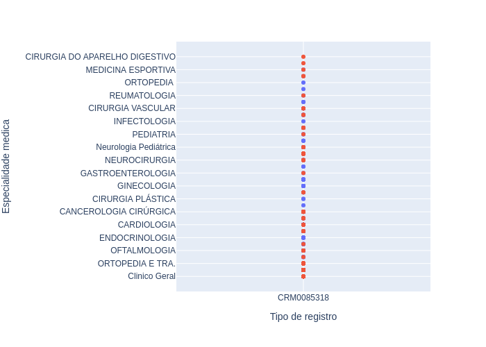
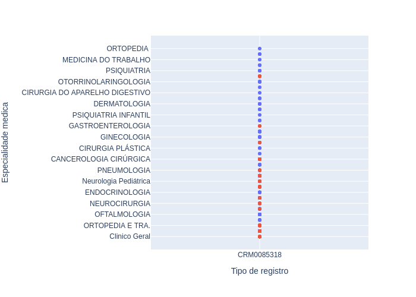
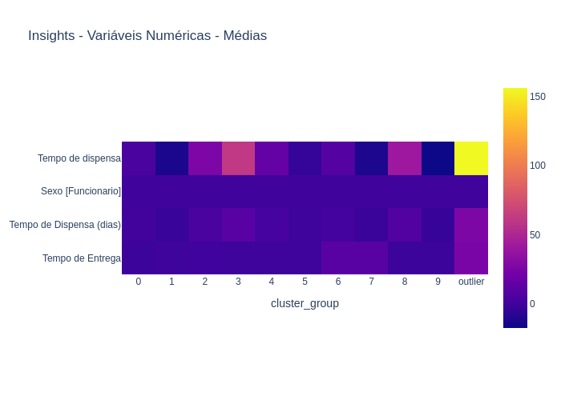
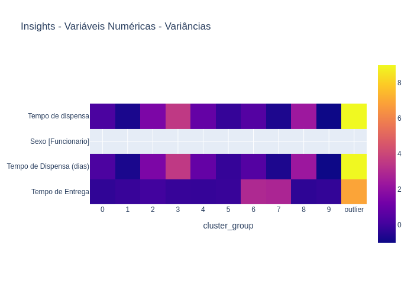

<h1>Relatorio AutoStats CPQD: Clustering - siklee</h1>
<h2>Análise Geral</h2>

Uma análise geral pode gerar insighs interessantes, no ponto de vista de dados gerais do banco fornecido. Nas tabelas a seguir serão apresentados dados como média, frequencia, maior valor, etc.

<table>
<thead>
<tr>
<th align="left"></th>
<th align="right">Tempo de dispensa</th>
<th align="right">Sexo [Funcionario]</th>
<th align="right">Tempo de Dispensa (dias)</th>
<th align="right">Tempo de Entrega</th>
</tr>
</thead>
<tbody>
<tr>
<td align="left">count</td>
<td align="right">819.00</td>
<td align="right">819.00</td>
<td align="right">819.00</td>
<td align="right">819.00</td>
</tr>
<tr>
<td align="left">mean</td>
<td align="right">27.49</td>
<td align="right">0.00</td>
<td align="right">4.68</td>
<td align="right">4.57</td>
</tr>
<tr>
<td align="left">std</td>
<td align="right">58.69</td>
<td align="right">0.00</td>
<td align="right">10.00</td>
<td align="right">11.44</td>
</tr>
<tr>
<td align="left">min</td>
<td align="right">0.00</td>
<td align="right">0.00</td>
<td align="right">0.00</td>
<td align="right">-14.00</td>
</tr>
<tr>
<td align="left">25%</td>
<td align="right">7.00</td>
<td align="right">0.00</td>
<td align="right">1.20</td>
<td align="right">1.00</td>
</tr>
<tr>
<td align="left">50%</td>
<td align="right">15.74</td>
<td align="right">0.00</td>
<td align="right">2.70</td>
<td align="right">2.00</td>
</tr>
<tr>
<td align="left">75%</td>
<td align="right">30.65</td>
<td align="right">0.00</td>
<td align="right">5.20</td>
<td align="right">5.00</td>
</tr>
<tr>
<td align="left">max</td>
<td align="right">973.53</td>
<td align="right">0.00</td>
<td align="right">165.90</td>
<td align="right">194.00</td>
</tr>
</tbody>
</table>
<em>Tabela de descrição geral dos dados fornecidos.</em>

A análise por agrupamento pode trazer insights interessantes por considerar uma variável alvo como um ponto em comum dos dados. Assim possibilitando a comparação de quais features mais caracterizam cada um dos grupos alvo.

<table>
<thead>
<tr>
<th align="left">Tempo de Entrega categorizado</th>
<th align="right">Tempo de Dispensa (dias)</th>
<th align="right">Tempo de dispensa</th>
<th align="right">Sexo [Funcionario]</th>
<th align="right">Tempo de Entrega</th>
</tr>
</thead>
<tbody>
<tr>
<td align="left">(-14.208, 27.6]</td>
<td align="right">3.65</td>
<td align="right">21.45</td>
<td align="right">0.00</td>
<td align="right">3.40</td>
</tr>
<tr>
<td align="left">(27.6, 69.2]</td>
<td align="right">51.48</td>
<td align="right">302.13</td>
<td align="right">0.00</td>
<td align="right">54.67</td>
</tr>
<tr>
<td align="left">(69.2, 110.8]</td>
<td align="right">82.66</td>
<td align="right">484.95</td>
<td align="right">0.00</td>
<td align="right">95.60</td>
</tr>
<tr>
<td align="left">(110.8, 152.4]</td>
<td align="right">nan</td>
<td align="right">nan</td>
<td align="right">nan</td>
<td align="right">nan</td>
</tr>
<tr>
<td align="left">(152.4, 194.0]</td>
<td align="right">165.90</td>
<td align="right">973.53</td>
<td align="right">0.00</td>
<td align="right">194.00</td>
</tr>
</tbody>
</table>
<em>Tabela de agrupamento geral dos dados numéricos, por média.</em>

<table>
<thead>
<tr>
<th align="left">Tempo de Entrega categorizado</th>
<th align="right">Tipo de registro</th>
<th align="right">Area de atuacao [Funcionario]</th>
<th align="right">Cfm</th>
<th align="right">Cid</th>
<th align="right">Instituicao de saude</th>
<th align="right">Empresa [Funcionario]</th>
<th align="right">Dia da Semana</th>
<th align="right">Especialidade medica</th>
</tr>
</thead>
<tbody>
<tr>
<td align="left">(-14.208, 27.6]</td>
<td align="right">0.99</td>
<td align="right">0.99</td>
<td align="right">0.99</td>
<td align="right">0.99</td>
<td align="right">0.99</td>
<td align="right">0.99</td>
<td align="right">0.99</td>
<td align="right">0.99</td>
</tr>
<tr>
<td align="left">(27.6, 69.2]</td>
<td align="right">0.01</td>
<td align="right">0.01</td>
<td align="right">0.01</td>
<td align="right">0.01</td>
<td align="right">0.01</td>
<td align="right">0.01</td>
<td align="right">0.01</td>
<td align="right">0.01</td>
</tr>
<tr>
<td align="left">(69.2, 110.8]</td>
<td align="right">0.01</td>
<td align="right">0.01</td>
<td align="right">0.01</td>
<td align="right">0.01</td>
<td align="right">0.01</td>
<td align="right">0.01</td>
<td align="right">0.01</td>
<td align="right">0.01</td>
</tr>
<tr>
<td align="left">(110.8, 152.4]</td>
<td align="right">0.00</td>
<td align="right">0.00</td>
<td align="right">0.00</td>
<td align="right">0.00</td>
<td align="right">0.00</td>
<td align="right">0.00</td>
<td align="right">0.00</td>
<td align="right">0.00</td>
</tr>
<tr>
<td align="left">(152.4, 194.0]</td>
<td align="right">0.00</td>
<td align="right">0.00</td>
<td align="right">0.00</td>
<td align="right">0.00</td>
<td align="right">0.00</td>
<td align="right">0.00</td>
<td align="right">0.00</td>
<td align="right">0.00</td>
</tr>
</tbody>
</table>
<em>Tabela de agrupamento geral dos dados categóricos, por moda.</em>

<h2>Análise de Outliers</h2>

Os outliers são dados que se diferenciam drasticamente de todos os outros. Em outras palavras, um outlier é um valor que foge da normalidade e que pode (e provavelmente irá) causar anomalias nos resultados obtidos por meio de algoritmos e sistemas de análise. Entender os outliers é fundamental em uma análise de dados por pelo menos dois aspectos: os outliers podem viesar negativamente todo o resultado de uma análise; o comportamento dos outliers pode ser justamente o que está sendo procurado.

<h3>DBscan</h3>

Isolation Forests é um modelo de detecção de anomalias que faz uso de um conjunto de dados onde o alvo, neste caso a anomalia da fraude, do modelo contém poucas amostras entre tantos dados normais. A ideia do modelo é construir Árvores para isolar essas anomalias. Em outras palavras, a floresta de Isolamento é um conjunto de Árvores de Isolamento. Método parecido com a da nossa querida Random Forest.

Utilizando o método DBscan foram detectados 173 outliers neste dataset, correspondendo a uma proporção de 21.12% do conjunto de amostras.

A orbservação do outliers pode ser feita nas tabelas abaixo, onde serão mostradas as tabelas de descrição dos outliers, tando de todas as features categóricas quanto de todas as features numéricas. Também é mostrado, na figura abaixo, a distribuição dos outliers em relação ao restante da população do dataset.

<table>
<thead>
<tr>
<th align="left"></th>
<th align="right">Tempo de dispensa</th>
<th align="right">Sexo [Funcionario]</th>
<th align="right">Tempo de Dispensa (dias)</th>
<th align="right">Tempo de Entrega</th>
</tr>
</thead>
<tbody>
<tr>
<td align="left">count</td>
<td align="right">173.00</td>
<td align="right">173.00</td>
<td align="right">173.00</td>
<td align="right">173.00</td>
</tr>
<tr>
<td align="left">mean</td>
<td align="right">72.74</td>
<td align="right">0.00</td>
<td align="right">12.39</td>
<td align="right">12.47</td>
</tr>
<tr>
<td align="left">std</td>
<td align="right">115.37</td>
<td align="right">0.00</td>
<td align="right">19.66</td>
<td align="right">23.01</td>
</tr>
<tr>
<td align="left">min</td>
<td align="right">0.00</td>
<td align="right">0.00</td>
<td align="right">0.00</td>
<td align="right">-14.00</td>
</tr>
<tr>
<td align="left">25%</td>
<td align="right">23.61</td>
<td align="right">0.00</td>
<td align="right">4.00</td>
<td align="right">2.00</td>
</tr>
<tr>
<td align="left">50%</td>
<td align="right">49.00</td>
<td align="right">0.00</td>
<td align="right">8.40</td>
<td align="right">7.00</td>
</tr>
<tr>
<td align="left">75%</td>
<td align="right">81.07</td>
<td align="right">0.00</td>
<td align="right">13.80</td>
<td align="right">13.00</td>
</tr>
<tr>
<td align="left">max</td>
<td align="right">973.53</td>
<td align="right">0.00</td>
<td align="right">165.90</td>
<td align="right">194.00</td>
</tr>
</tbody>
</table>
<em>Descrição Features Numéricas dos Outliers: DBscan</em>

<table>
<thead>
<tr>
<th align="left"></th>
<th align="left">Tipo de registro</th>
<th align="left">Area de atuacao [Funcionario]</th>
<th align="left">Tempo de Entrega categorizado</th>
<th align="left">Cfm</th>
<th align="left">Cid</th>
<th align="left">Instituicao de saude</th>
<th align="left">Empresa [Funcionario]</th>
<th align="left">Dia da Semana</th>
<th align="left">Especialidade medica</th>
</tr>
</thead>
<tbody>
<tr>
<td align="left">count</td>
<td align="left">173</td>
<td align="left">173</td>
<td align="left">173</td>
<td align="left">173</td>
<td align="left">173</td>
<td align="left">173</td>
<td align="left">173</td>
<td align="left">173</td>
<td align="left">173</td>
</tr>
<tr>
<td align="left">unique</td>
<td align="left">1</td>
<td align="left">26</td>
<td align="left">4</td>
<td align="left">1</td>
<td align="left">74</td>
<td align="left">9</td>
<td align="left">1</td>
<td align="left">7</td>
<td align="left">24</td>
</tr>
<tr>
<td align="left">top</td>
<td align="left">CRM0085318</td>
<td align="left">Operador Manufatura I</td>
<td align="left">(-14.208, 27.6]</td>
<td align="left">Não</td>
<td align="left">J110</td>
<td align="left">HOSPITAL SANTA FILOMENA</td>
<td align="left">E-LifeTech</td>
<td align="left">ter.</td>
<td align="left">Clinico Geral</td>
</tr>
<tr>
<td align="left">freq</td>
<td align="left">173</td>
<td align="left">66</td>
<td align="left">161</td>
<td align="left">173</td>
<td align="left">23</td>
<td align="left">108</td>
<td align="left">173</td>
<td align="left">39</td>
<td align="left">59</td>
</tr>
</tbody>
</table>
<em>Descrição Features Categóricas dos Outliers: DBscan</em>

<em>Visualização dos outliers: DBscan</em>

<h3>Isolation Forest</h3>

Isolation Forests é um modelo de detecção de anomalias que faz uso de um conjunto de dados onde o alvo, neste caso a anomalia da fraude, do modelo contém poucas amostras entre tantos dados normais. A ideia do modelo é construir Árvores para isolar essas anomalias. Em outras palavras, a floresta de Isolamento é um conjunto de Árvores de Isolamento. Método parecido com a da nossa querida Random Forest.

Utilizando o método Isolation Forest foram detectados 41 outliers neste dataset, correspondendo a uma proporção de 5.01% do conjunto de amostras.

A orbservação do outliers pode ser feita nas tabelas abaixo, onde serão mostradas as tabelas de descrição dos outliers, tando de todas as features categóricas quanto de todas as features numéricas. Também é mostrado, na figura abaixo, a distribuição dos outliers em relação ao restante da população do dataset.

<table>
<thead>
<tr>
<th align="left"></th>
<th align="right">Tempo de dispensa</th>
<th align="right">Sexo [Funcionario]</th>
<th align="right">Tempo de Dispensa (dias)</th>
<th align="right">Tempo de Entrega</th>
</tr>
</thead>
<tbody>
<tr>
<td align="left">count</td>
<td align="right">41.00</td>
<td align="right">41.00</td>
<td align="right">41.00</td>
<td align="right">41.00</td>
</tr>
<tr>
<td align="left">mean</td>
<td align="right">175.83</td>
<td align="right">0.00</td>
<td align="right">29.95</td>
<td align="right">28.22</td>
</tr>
<tr>
<td align="left">std</td>
<td align="right">202.12</td>
<td align="right">0.00</td>
<td align="right">34.45</td>
<td align="right">42.70</td>
</tr>
<tr>
<td align="left">min</td>
<td align="right">0.00</td>
<td align="right">0.00</td>
<td align="right">0.00</td>
<td align="right">-14.00</td>
</tr>
<tr>
<td align="left">25%</td>
<td align="right">76.50</td>
<td align="right">0.00</td>
<td align="right">13.00</td>
<td align="right">2.00</td>
</tr>
<tr>
<td align="left">50%</td>
<td align="right">93.50</td>
<td align="right">0.00</td>
<td align="right">15.90</td>
<td align="right">11.00</td>
</tr>
<tr>
<td align="left">75%</td>
<td align="right">237.08</td>
<td align="right">0.00</td>
<td align="right">40.40</td>
<td align="right">49.00</td>
</tr>
<tr>
<td align="left">max</td>
<td align="right">973.53</td>
<td align="right">0.00</td>
<td align="right">165.90</td>
<td align="right">194.00</td>
</tr>
</tbody>
</table>
<em>Descrição Features Numéricas dos Outliers: Isolation Forest</em>

<table>
<thead>
<tr>
<th align="left"></th>
<th align="left">Tipo de registro</th>
<th align="left">Area de atuacao [Funcionario]</th>
<th align="left">Tempo de Entrega categorizado</th>
<th align="left">Cfm</th>
<th align="left">Cid</th>
<th align="left">Instituicao de saude</th>
<th align="left">Empresa [Funcionario]</th>
<th align="left">Dia da Semana</th>
<th align="left">Especialidade medica</th>
</tr>
</thead>
<tbody>
<tr>
<td align="left">count</td>
<td align="left">41</td>
<td align="left">41</td>
<td align="left">41</td>
<td align="left">41</td>
<td align="left">41</td>
<td align="left">41</td>
<td align="left">41</td>
<td align="left">41</td>
<td align="left">41</td>
</tr>
<tr>
<td align="left">unique</td>
<td align="left">1</td>
<td align="left">15</td>
<td align="left">4</td>
<td align="left">1</td>
<td align="left">24</td>
<td align="left">4</td>
<td align="left">1</td>
<td align="left">7</td>
<td align="left">14</td>
</tr>
<tr>
<td align="left">top</td>
<td align="left">CRM0085318</td>
<td align="left">Operador Manufatura I</td>
<td align="left">(-14.208, 27.6]</td>
<td align="left">Não</td>
<td align="left">M659</td>
<td align="left">HOSPITAL SANTA FILOMENA</td>
<td align="left">E-LifeTech</td>
<td align="left">ter.</td>
<td align="left">ORTOPEDIA E TRA.</td>
</tr>
<tr>
<td align="left">freq</td>
<td align="left">41</td>
<td align="left">15</td>
<td align="left">29</td>
<td align="left">41</td>
<td align="left">6</td>
<td align="left">21</td>
<td align="left">41</td>
<td align="left">11</td>
<td align="left">11</td>
</tr>
</tbody>
</table>
<em>Descrição Features Categóricas dos Outliers: Isolation Forest</em>

<em>Visualização dos outliers: Isolation Forest</em>

<h2>Análise de Cluster</h2>

O clustering ou análise de agrupamento de dados é o conjunto de técnicas de prospecção de dados (data mining) que visa fazer agrupamentos automáticos de dados segundo o seu grau de semelhança. O critério de semelhança faz parte da definição do problema e, dependendo, do algoritmo. A cada conjunto de dados resultante do processo dá-se o nome de grupo, aglomerado ou agrupamento (cluster). O procedimento de agrupamento (clustering) também pode ser aplicado a bases de texto utilizando algoritmos de prospeção de texto (text mining), onde o algoritmo procura agrupar textos que falem sobre o mesmo assunto e separar textos de conteúdo diferentes. 

<h3>Feature Permutation 3 dim.</h3>

A melhor separação de grupos ocorreu nas features: ['Tempo de dispensa', 'Sexo [Funcionario]', 'Tempo de Dispensa (dias)'] com uma quantidade de 10 grupos. A análise multidimensional em 3 dimensões fornece insights de quais features são mais importantes e que distinguem grupos entre si. Esta análise é realizada realizando a permutação das features do dataset.

A matriz de separação abaixo mostra a distribuição populacional normalizada dentro de cada grupo de cluster. Note que valores maiores significam que há maior presença daquela população dentro daquele grupo. Este tipo de tabela também pode ser chamado de matriz de confusão, do inglês Confusion Matrix.

<table>
<thead>
<tr>
<th align="left"></th>
<th align="right">0</th>
<th align="right">1</th>
<th align="right">2</th>
<th align="right">3</th>
<th align="right">4</th>
<th align="right">5</th>
<th align="right">6</th>
<th align="right">7</th>
<th align="right">8</th>
<th align="right">9</th>
</tr>
</thead>
<tbody>
<tr>
<td align="left">(12.6, 18.8]</td>
<td align="right">0.00</td>
<td align="right">0.00</td>
<td align="right">0.35</td>
<td align="right">0.05</td>
<td align="right">0.00</td>
<td align="right">0.10</td>
<td align="right">0.15</td>
<td align="right">0.30</td>
<td align="right">0.00</td>
<td align="right">0.05</td>
</tr>
<tr>
<td align="left">(0.2, 6.4]</td>
<td align="right">0.09</td>
<td align="right">0.02</td>
<td align="right">0.37</td>
<td align="right">0.07</td>
<td align="right">0.03</td>
<td align="right">0.08</td>
<td align="right">0.11</td>
<td align="right">0.12</td>
<td align="right">0.03</td>
<td align="right">0.09</td>
</tr>
<tr>
<td align="left">(-6.031, 0.2]</td>
<td align="right">0.11</td>
<td align="right">0.04</td>
<td align="right">0.22</td>
<td align="right">0.05</td>
<td align="right">0.03</td>
<td align="right">0.04</td>
<td align="right">0.05</td>
<td align="right">0.20</td>
<td align="right">0.04</td>
<td align="right">0.20</td>
</tr>
<tr>
<td align="left">(6.4, 12.6]</td>
<td align="right">0.11</td>
<td align="right">0.02</td>
<td align="right">0.29</td>
<td align="right">0.11</td>
<td align="right">0.03</td>
<td align="right">0.09</td>
<td align="right">0.05</td>
<td align="right">0.14</td>
<td align="right">0.00</td>
<td align="right">0.18</td>
</tr>
<tr>
<td align="left">(18.8, 25.0]</td>
<td align="right">0.00</td>
<td align="right">0.00</td>
<td align="right">0.67</td>
<td align="right">0.00</td>
<td align="right">0.00</td>
<td align="right">0.00</td>
<td align="right">0.00</td>
<td align="right">0.33</td>
<td align="right">0.00</td>
<td align="right">0.00</td>
</tr>
</tbody>
</table>
<em>Matriz de separação do melhor agrupamento</em>

<h3>Multidimensional</h3>

A melhor separação de grupos ocorreu nas features: ['Tempo de dispensa', 'Sexo [Funcionario]', 'Tempo de Dispensa (dias)', 'Tempo de Entrega'] com uma quantidade de 10 grupos. A análise multidimensional de clusters é semelhante a análise bi-dimensional ou tri-dimensional, mas sua principal diferença é que utiliza todas as features disponíveis no dataset.

A matriz de separação abaixo mostra a distribuição populacional normalizada dentro de cada grupo de cluster. Note que valores maiores significam que há maior presença daquela população dentro daquele grupo. Este tipo de tabela também pode ser chamado de matriz de confusão, do inglês Confusion Matrix.

<table>
<thead>
<tr>
<th align="left"></th>
<th align="right">0</th>
<th align="right">1</th>
<th align="right">2</th>
<th align="right">3</th>
<th align="right">4</th>
<th align="right">5</th>
<th align="right">6</th>
<th align="right">7</th>
<th align="right">8</th>
<th align="right">9</th>
</tr>
</thead>
<tbody>
<tr>
<td align="left">(12.6, 18.8]</td>
<td align="right">0.00</td>
<td align="right">0.00</td>
<td align="right">0.00</td>
<td align="right">0.00</td>
<td align="right">0.00</td>
<td align="right">0.00</td>
<td align="right">0.45</td>
<td align="right">0.55</td>
<td align="right">0.00</td>
<td align="right">0.00</td>
</tr>
<tr>
<td align="left">(0.2, 6.4]</td>
<td align="right">0.15</td>
<td align="right">0.37</td>
<td align="right">0.05</td>
<td align="right">0.03</td>
<td align="right">0.13</td>
<td align="right">0.15</td>
<td align="right">0.00</td>
<td align="right">0.00</td>
<td align="right">0.02</td>
<td align="right">0.11</td>
</tr>
<tr>
<td align="left">(-6.031, 0.2]</td>
<td align="right">0.29</td>
<td align="right">0.22</td>
<td align="right">0.01</td>
<td align="right">0.03</td>
<td align="right">0.09</td>
<td align="right">0.22</td>
<td align="right">0.00</td>
<td align="right">0.00</td>
<td align="right">0.09</td>
<td align="right">0.05</td>
</tr>
<tr>
<td align="left">(6.4, 12.6]</td>
<td align="right">0.09</td>
<td align="right">0.18</td>
<td align="right">0.03</td>
<td align="right">0.03</td>
<td align="right">0.12</td>
<td align="right">0.17</td>
<td align="right">0.14</td>
<td align="right">0.20</td>
<td align="right">0.02</td>
<td align="right">0.03</td>
</tr>
<tr>
<td align="left">(18.8, 25.0]</td>
<td align="right">0.00</td>
<td align="right">0.00</td>
<td align="right">0.00</td>
<td align="right">0.00</td>
<td align="right">0.00</td>
<td align="right">0.00</td>
<td align="right">0.33</td>
<td align="right">0.67</td>
<td align="right">0.00</td>
<td align="right">0.00</td>
</tr>
</tbody>
</table>
<em>Matriz de separação do melhor agrupamento</em>

<h3>Comparação dos Métodos</h3>

Na tabela abaixo podemos observar a comparação de todos os métodos de clustering testados. O método com o maior score será considerado o melhor método, sendo este utilizado nas próximas análises.

<table>
<thead>
<tr>
<th align="left"></th>
<th align="right">Feature Permutation 3 dim.</th>
<th align="right">Multidimensional</th>
</tr>
</thead>
<tbody>
<tr>
<td align="left">Tempo de dispensa - Sexo [Funcionario] - Tempo de Dispensa (dias)</td>
<td align="right">0.66</td>
<td align="right">nan</td>
</tr>
<tr>
<td align="left">Tempo de dispensa - Sexo [Funcionario] - Tempo de Entrega</td>
<td align="right">0.44</td>
<td align="right">nan</td>
</tr>
<tr>
<td align="left">Tempo de dispensa - Tempo de Dispensa (dias) - Tempo de Entrega</td>
<td align="right">0.44</td>
<td align="right">nan</td>
</tr>
<tr>
<td align="left">Tempo de dispensa - Sexo [Funcionario] - Tempo de Dispensa (dias) - Tempo de Entrega</td>
<td align="right">nan</td>
<td align="right">0.45</td>
</tr>
</tbody>
</table>
<em>Análise de score do agrupamento.</em>

<h3>Insights - Variáveis Numéricas</h3>

Insights obtidos das variáveis numéricas estão disponíveis nas tabelas de médias e variâncias abaixo, onde são apresentadas as diferenças das médias e variâncias entre a população geral e cada um dos grupos. A idéia é facilitar a observação de tendências distintas em cada um dos grupos, em relação a população geral. A tabela de variância é importante de um ponto de vista de análise da variação das features dentro de cada um dos grupos. A ideia é que a variância dentro de um grupo específico seja menor em relação a população em geral.

Figuras também são aliadas importantes na visualização de dados. Nas figuras de médias e variâncias abaixo estão presentes duas figuras que representam a variação de média e variância de cada grupo em relação a população geral. Dados variando para a cor azul significam que a variação é negativa, enquanto dados variando para cores vermelhas significam que a variação é positiva.

<table>
<thead>
<tr>
<th align="left"></th>
<th align="right">0</th>
<th align="right">1</th>
<th align="right">2</th>
<th align="right">3</th>
<th align="right">4</th>
<th align="right">5</th>
<th align="right">6</th>
<th align="right">7</th>
<th align="right">8</th>
<th align="right">9</th>
<th align="right">outlier</th>
</tr>
</thead>
<tbody>
<tr>
<td align="left">Tempo de dispensa</td>
<td align="right">4.48</td>
<td align="right">-12.65</td>
<td align="right">26.00</td>
<td align="right">61.23</td>
<td align="right">15.23</td>
<td align="right">-3.61</td>
<td align="right">8.01</td>
<td align="right">-11.82</td>
<td align="right">40.97</td>
<td align="right">-17.17</td>
<td align="right">156.15</td>
</tr>
<tr>
<td align="left">Sexo [Funcionario]</td>
<td align="right">0.00</td>
<td align="right">0.00</td>
<td align="right">0.00</td>
<td align="right">0.00</td>
<td align="right">0.00</td>
<td align="right">0.00</td>
<td align="right">0.00</td>
<td align="right">0.00</td>
<td align="right">0.00</td>
<td align="right">0.00</td>
<td align="right">0.00</td>
</tr>
<tr>
<td align="left">Tempo de Dispensa (dias)</td>
<td align="right">0.77</td>
<td align="right">-2.17</td>
<td align="right">4.45</td>
<td align="right">10.44</td>
<td align="right">2.61</td>
<td align="right">-0.60</td>
<td align="right">1.37</td>
<td align="right">-2.02</td>
<td align="right">6.97</td>
<td align="right">-2.92</td>
<td align="right">26.61</td>
</tr>
<tr>
<td align="left">Tempo de Entrega</td>
<td align="right">-1.11</td>
<td align="right">-0.54</td>
<td align="right">0.19</td>
<td align="right">-0.61</td>
<td align="right">-0.73</td>
<td align="right">-0.53</td>
<td align="right">10.62</td>
<td align="right">10.21</td>
<td align="right">-1.28</td>
<td align="right">-0.88</td>
<td align="right">24.89</td>
</tr>
</tbody>
</table>
<em>Diferença de Média entre População - Grupos</em>

<table>
<thead>
<tr>
<th align="left"></th>
<th align="right">0</th>
<th align="right">1</th>
<th align="right">2</th>
<th align="right">3</th>
<th align="right">4</th>
<th align="right">5</th>
<th align="right">6</th>
<th align="right">7</th>
<th align="right">8</th>
<th align="right">9</th>
<th align="right">outlier</th>
</tr>
</thead>
<tbody>
<tr>
<td align="left">Tempo de dispensa</td>
<td align="right">0.26</td>
<td align="right">-0.73</td>
<td align="right">1.50</td>
<td align="right">3.53</td>
<td align="right">0.88</td>
<td align="right">-0.21</td>
<td align="right">0.46</td>
<td align="right">-0.68</td>
<td align="right">2.36</td>
<td align="right">-0.99</td>
<td align="right">9.01</td>
</tr>
<tr>
<td align="left">Sexo [Funcionario]</td>
<td align="right">nan</td>
<td align="right">nan</td>
<td align="right">nan</td>
<td align="right">nan</td>
<td align="right">nan</td>
<td align="right">nan</td>
<td align="right">nan</td>
<td align="right">nan</td>
<td align="right">nan</td>
<td align="right">nan</td>
<td align="right">nan</td>
</tr>
<tr>
<td align="left">Tempo de Dispensa (dias)</td>
<td align="right">0.26</td>
<td align="right">-0.73</td>
<td align="right">1.50</td>
<td align="right">3.53</td>
<td align="right">0.88</td>
<td align="right">-0.20</td>
<td align="right">0.46</td>
<td align="right">-0.68</td>
<td align="right">2.35</td>
<td align="right">-0.99</td>
<td align="right">8.99</td>
</tr>
<tr>
<td align="left">Tempo de Entrega</td>
<td align="right">-0.31</td>
<td align="right">-0.15</td>
<td align="right">0.05</td>
<td align="right">-0.17</td>
<td align="right">-0.20</td>
<td align="right">-0.15</td>
<td align="right">2.95</td>
<td align="right">2.84</td>
<td align="right">-0.36</td>
<td align="right">-0.24</td>
<td align="right">6.92</td>
</tr>
</tbody>
</table>
<em>Diferença de Variância entre População - Grupos</em>

<em>Diferença de Média entre População - Grupos</em>

<em>Diferença de Variância entre População - Grupos</em>

A maior diferença populacional positiva foi detectada na feature Tempo de dispensa e no grupo outlier, com valor de 156.15. A maior variação negativa foi na feature Tempo de dispensa e no grupo 9, com o valor registrado de -17.17

<h3>Insights - Variáveis Categóricas</h3>

É possível observar nas tabelas em ambas tabelas abaixo alguns dados notáveis extraídos dos grupos da base de dados. Estas tabelas de diferenças máximas e mínimas visam demonstrar as diferenças de distribuição entre a população e os grupos. A linha Contagem mostra a contagem daquela classe dentro do grupo, A linha Proporção mostra a proporção da classe em relação a população do grupo, A linha Diferença da População mostra a diferença de proporção daquela população no grupo em relação a população geral. 

<table>
<thead>
<tr>
<th align="left"></th>
<th align="left">Tipo de registro</th>
<th align="left">Area de atuacao [Funcionario]</th>
<th align="left">Tempo de Entrega categorizado</th>
<th align="left">Cfm</th>
<th align="left">Cid</th>
<th align="left">Instituicao de saude</th>
<th align="left">Empresa [Funcionario]</th>
<th align="left">Dia da Semana</th>
<th align="left">Especialidade medica</th>
</tr>
</thead>
<tbody>
<tr>
<td align="left">maior ocorrencia</td>
<td align="left">CRM0085318</td>
<td align="left">Operador Manufatura I</td>
<td align="left">(-14.208, 27.6]</td>
<td align="left">Não</td>
<td align="left">M659</td>
<td align="left">CONSULTÓRIO MÉDICO</td>
<td align="left">E-LifeTech</td>
<td align="left">qui.</td>
<td align="left">ORTOPEDIA E TRA.</td>
</tr>
<tr>
<td align="left">contagem</td>
<td align="left">123</td>
<td align="left">12</td>
<td align="left">123</td>
<td align="left">123</td>
<td align="left">5</td>
<td align="left">13</td>
<td align="left">123</td>
<td align="left">7</td>
<td align="left">11</td>
</tr>
<tr>
<td align="left">proporção</td>
<td align="left">1.0</td>
<td align="left">0.545</td>
<td align="left">1.0</td>
<td align="left">1.0</td>
<td align="left">0.238</td>
<td align="left">0.619</td>
<td align="left">1.0</td>
<td align="left">0.333</td>
<td align="left">0.524</td>
</tr>
<tr>
<td align="left">diferença da população</td>
<td align="left">0.0</td>
<td align="left">0.161</td>
<td align="left">0.0</td>
<td align="left">0.0</td>
<td align="left">0.227</td>
<td align="left">0.485</td>
<td align="left">0.0</td>
<td align="left">0.182</td>
<td align="left">0.46</td>
</tr>
<tr>
<td align="left">grupo</td>
<td align="left">0</td>
<td align="left">8</td>
<td align="left">0</td>
<td align="left">0</td>
<td align="left">3</td>
<td align="left">3</td>
<td align="left">0</td>
<td align="left">3</td>
<td align="left">3</td>
</tr>
</tbody>
</table>
<em>Diferença Máxima de População entre Grupos e Dataset</em>

<table>
<thead>
<tr>
<th align="left"></th>
<th align="left">Tipo de registro</th>
<th align="left">Area de atuacao [Funcionario]</th>
<th align="left">Tempo de Entrega categorizado</th>
<th align="left">Cfm</th>
<th align="left">Cid</th>
<th align="left">Instituicao de saude</th>
<th align="left">Empresa [Funcionario]</th>
<th align="left">Dia da Semana</th>
<th align="left">Especialidade medica</th>
</tr>
</thead>
<tbody>
<tr>
<td align="left">maior ocorrencia</td>
<td align="left">CRM0085318</td>
<td align="left">Operador Manufatura I</td>
<td align="left">(-14.208, 27.6]</td>
<td align="left">Não</td>
<td align="left">J110</td>
<td align="left">HOSPITAL SANTA FILOMENA</td>
<td align="left">E-LifeTech</td>
<td align="left">qua.</td>
<td align="left">Clinico Geral</td>
</tr>
<tr>
<td align="left">contagem</td>
<td align="left">123</td>
<td align="left">20</td>
<td align="left">123</td>
<td align="left">123</td>
<td align="left">4</td>
<td align="left">10</td>
<td align="left">123</td>
<td align="left">16</td>
<td align="left">12</td>
</tr>
<tr>
<td align="left">proporção</td>
<td align="left">1.0</td>
<td align="left">0.282</td>
<td align="left">1.0</td>
<td align="left">1.0</td>
<td align="left">0.143</td>
<td align="left">0.455</td>
<td align="left">1.0</td>
<td align="left">0.225</td>
<td align="left">0.364</td>
</tr>
<tr>
<td align="left">diferença da população</td>
<td align="left">0.0</td>
<td align="left">-0.103</td>
<td align="left">0.0</td>
<td align="left">0.0</td>
<td align="left">-0.058</td>
<td align="left">-0.216</td>
<td align="left">0.0</td>
<td align="left">0.024</td>
<td align="left">-0.037</td>
</tr>
<tr>
<td align="left">grupo</td>
<td align="left">0</td>
<td align="left">9</td>
<td align="left">0</td>
<td align="left">0</td>
<td align="left">7</td>
<td align="left">8</td>
<td align="left">0</td>
<td align="left">9</td>
<td align="left">2</td>
</tr>
</tbody>
</table>
<em>Diferença Mínima de População entre Grupos e Dataset</em>

<table>
<thead>
<tr>
<th align="left"></th>
<th align="left">Tipo de registro</th>
<th align="left">Area de atuacao [Funcionario]</th>
<th align="left">Tempo de Entrega categorizado</th>
<th align="left">Cfm</th>
<th align="left">Cid</th>
<th align="left">Instituicao de saude</th>
<th align="left">Empresa [Funcionario]</th>
<th align="left">Dia da Semana</th>
<th align="left">Especialidade medica</th>
</tr>
</thead>
<tbody>
<tr>
<td align="left">maior classe proporcional</td>
<td align="left">CRM0085318</td>
<td align="left">Controlador Produção</td>
<td align="left">(-14.208, 27.6]</td>
<td align="left">Não</td>
<td align="left">J100</td>
<td align="left">HOSPITAL SANTA CASA</td>
<td align="left">E-LifeTech</td>
<td align="left">sex.</td>
<td align="left">GINECOLOGIA</td>
</tr>
<tr>
<td align="left">proporção da classe</td>
<td align="left">0.321</td>
<td align="left">1.0</td>
<td align="left">0.321</td>
<td align="left">0.321</td>
<td align="left">1.0</td>
<td align="left">1.0</td>
<td align="left">0.321</td>
<td align="left">0.463</td>
<td align="left">1.0</td>
</tr>
<tr>
<td align="left">grupo</td>
<td align="left">1</td>
<td align="left">1</td>
<td align="left">1</td>
<td align="left">1</td>
<td align="left">0</td>
<td align="left">1</td>
<td align="left">1</td>
<td align="left">1</td>
<td align="left">1</td>
</tr>
</tbody>
</table>
<em>Maior proporção de população no grupo.</em>

<table>
<thead>
<tr>
<th align="left"></th>
<th align="left">Tipo de registro</th>
<th align="left">Area de atuacao [Funcionario]</th>
<th align="left">Tempo de Entrega categorizado</th>
<th align="left">Cfm</th>
<th align="left">Cid</th>
<th align="left">Instituicao de saude</th>
<th align="left">Empresa [Funcionario]</th>
<th align="left">Dia da Semana</th>
<th align="left">Especialidade medica</th>
</tr>
</thead>
<tbody>
<tr>
<td align="left">maior classe proporcional</td>
<td align="left">CRM0085318</td>
<td align="left">Inspetor Qualidade I</td>
<td align="left">(-14.208, 27.6]</td>
<td align="left">Não</td>
<td align="left">J100</td>
<td align="left">CONSULTÓRIO MÉDICO</td>
<td align="left">E-LifeTech</td>
<td align="left">sáb.</td>
<td align="left">UROLOGIA</td>
</tr>
<tr>
<td align="left">proporção da classe</td>
<td align="left">0.026</td>
<td align="left">0.167</td>
<td align="left">0.026</td>
<td align="left">0.026</td>
<td align="left">1.0</td>
<td align="left">0.048</td>
<td align="left">0.026</td>
<td align="left">0.056</td>
<td align="left">0.375</td>
</tr>
<tr>
<td align="left">grupo</td>
<td align="left">6</td>
<td align="left">3</td>
<td align="left">6</td>
<td align="left">6</td>
<td align="left">0</td>
<td align="left">7</td>
<td align="left">6</td>
<td align="left">6</td>
<td align="left">7</td>
</tr>
</tbody>
</table>
<em>Menor proporção de população no grupo.</em>

<h3>Insights - Resumo Clustering</h3>

Os seguintes insights resumidos foram obtidos a partir dos métodos de agrupamento apresentados:

Grupo 0:  &emsp;Presença maior de população na feature Cid: J110 &emsp;Presença maior de população na feature Instituicao de saude: HOSPITAL SANTA FILOMENA &emsp;Presença maior de população na feature Dia da Semana: qua. &emsp;Presença maior de população na feature Especialidade medica: Médico do Trabalho

Grupo 1:  &emsp;Média menor que a população: Tempo de dispensa &emsp;Média menor que a população: Tempo de Dispensa (dias)

Grupo 2:  &emsp;Média maior que a população: Tempo de dispensa &emsp;Média maior que a população: Tempo de Dispensa (dias)

Grupo 3:  &emsp;Média maior que a população: Tempo de dispensa &emsp;Média maior que a população: Tempo de Dispensa (dias) &emsp;Presença maior de população na feature Cid: M659 &emsp;Presença maior de população na feature Instituicao de saude: CONSULTÓRIO MÉDICO &emsp;Presença maior de população na feature Dia da Semana: qui. &emsp;Presença maior de população na feature Especialidade medica: ORTOPEDIA E TRA.

Grupo 4:  &emsp;Média maior que a população: Tempo de dispensa &emsp;Média maior que a população: Tempo de Dispensa (dias) &emsp;Presença maior de população na feature Instituicao de saude: HOSPITAL SANTA FILOMENA &emsp;Presença maior de população na feature Especialidade medica: Clinico Geral

Grupo 5:  &emsp;Presença maior de população na feature Cid: J110 &emsp;Presença maior de população na feature Especialidade medica: Clinico Geral

Grupo 6:  &emsp;Média maior que a população: Tempo de Entrega &emsp;Presença maior de população na feature Instituicao de saude: HOSPITAL SANTA FILOMENA

Grupo 7:  &emsp;Média menor que a população: Tempo de dispensa &emsp;Média menor que a população: Tempo de Dispensa (dias) &emsp;Média maior que a população: Tempo de Entrega &emsp;Presença maior de população na feature Instituicao de saude: HOSPITAL SANTA FILOMENA &emsp;Presença maior de população na feature Dia da Semana: ter.

Grupo 8:  &emsp;Média maior que a população: Tempo de dispensa &emsp;Média maior que a população: Tempo de Dispensa (dias) &emsp;Presença maior de população na feature Area de atuacao [Funcionario]: Operador Manufatura I &emsp;Presença maior de população na feature Cid: Z290 &emsp;Presença maior de população na feature Dia da Semana: qui.

Grupo 9:  &emsp;Média menor que a população: Tempo de dispensa &emsp;Média menor que a população: Tempo de Dispensa (dias) &emsp;Presença maior de população na feature Cid: Z000

Grupo outlier:  &emsp;Média maior que a população: Tempo de dispensa &emsp;Média maior que a população: Tempo de Dispensa (dias) &emsp;Média maior que a população: Tempo de Entrega

