<h1>Relatório AutoML CPQD</h1>
<h2>Criação de features Temporais</h2>

Uma das etapas do componente de insights é a criação de novas featres temporais, e ela se torna            importante para esse componente, pois, essas novas features melhoram a performace dos modelos            de Machine Learning.              Para criar essas novas features foi utilizada médias moveis agrupadas por uma coluna categórica,            então, se a base de dados possui mais de uma coluna categórica haverá mais de um agrupamento, e            assim gerando várias features novas.              A cada agrupamento, quando é calculado as médias moveis, é calculado também o desvio padrão            da mesma.

<h3>Análise das novas features</h3>

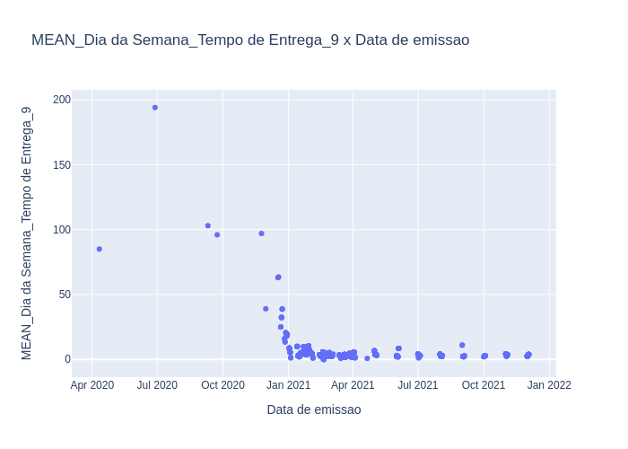

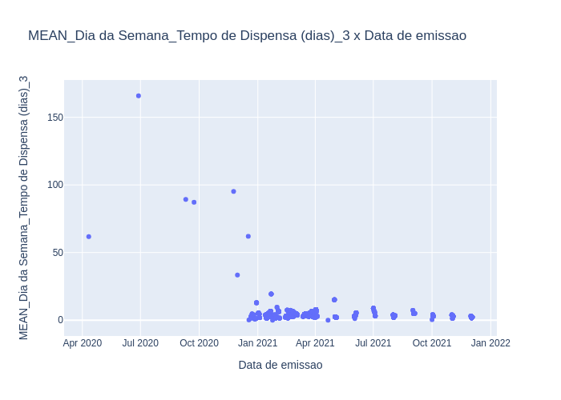

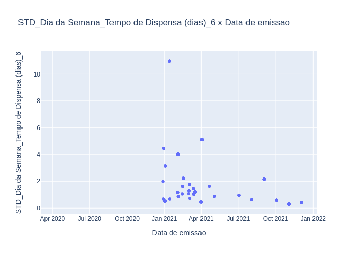

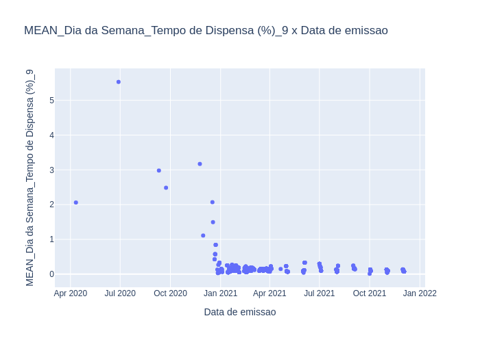

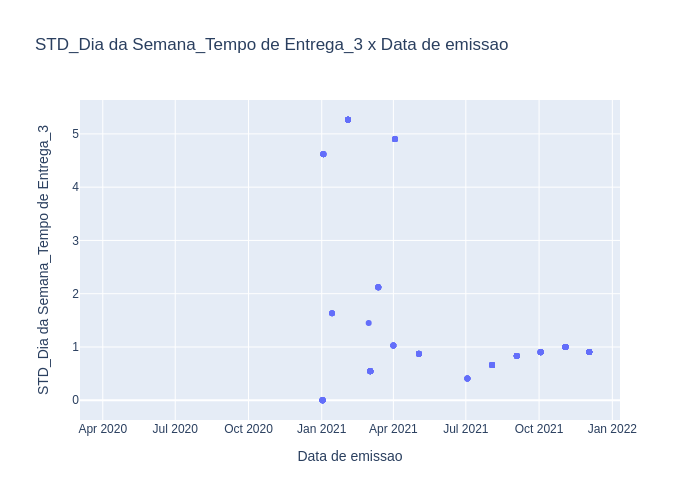

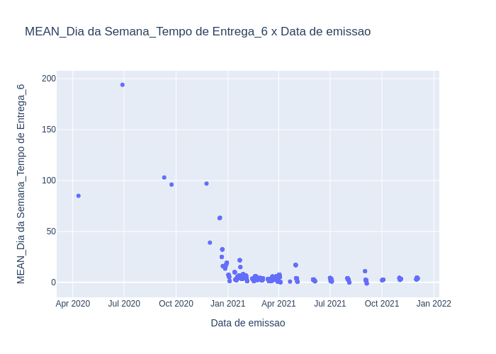

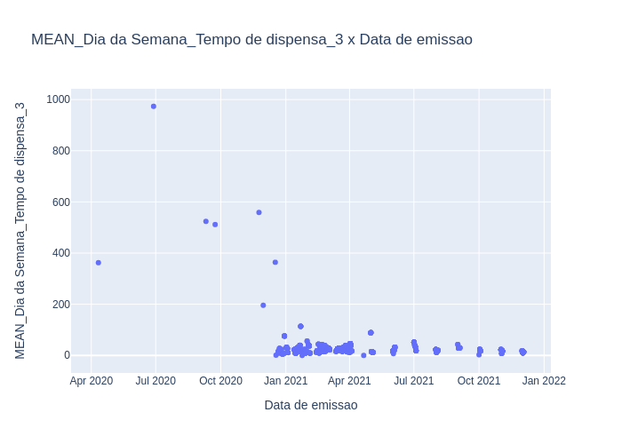

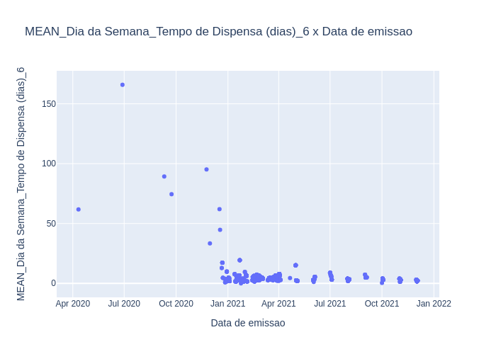

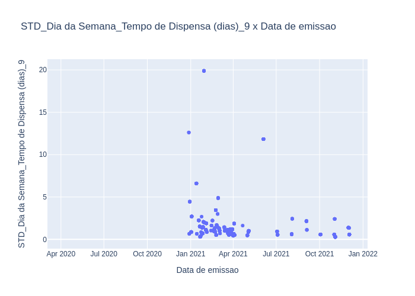

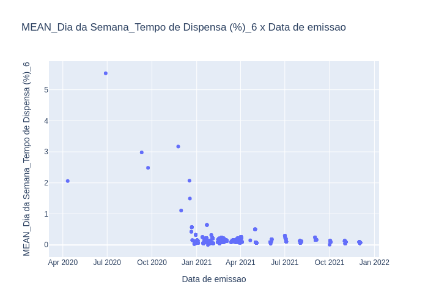

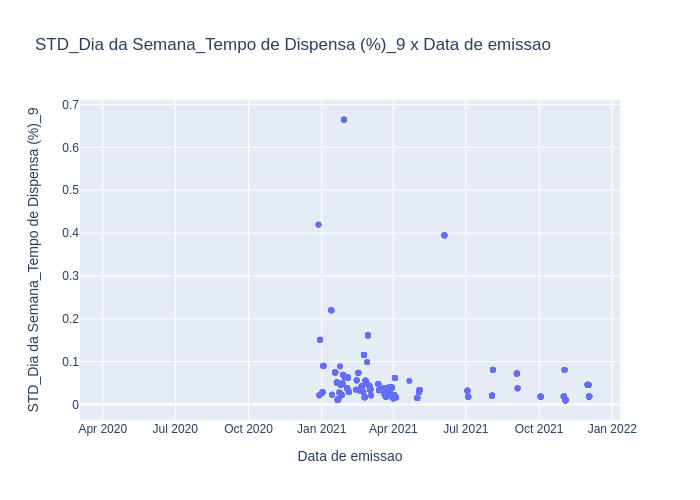

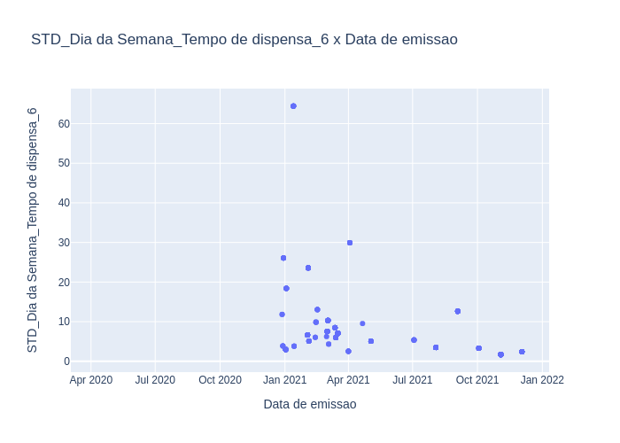

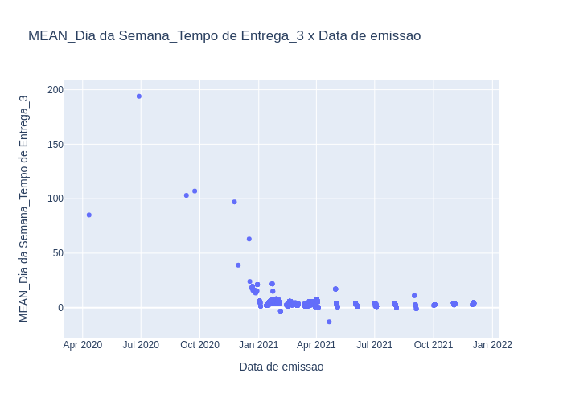

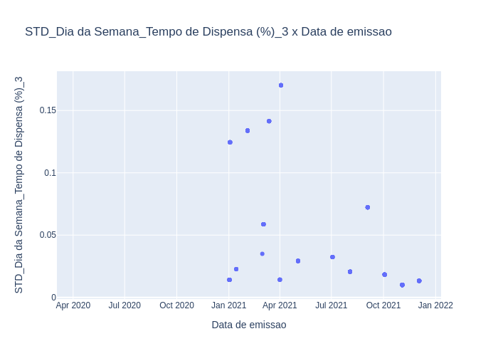

<h3>Análise das features categóricas</h3>

<h3>Análise de frequência dos dias da semana e meses</h3>
<h3>- Coluna de datatime: Mes</h3>

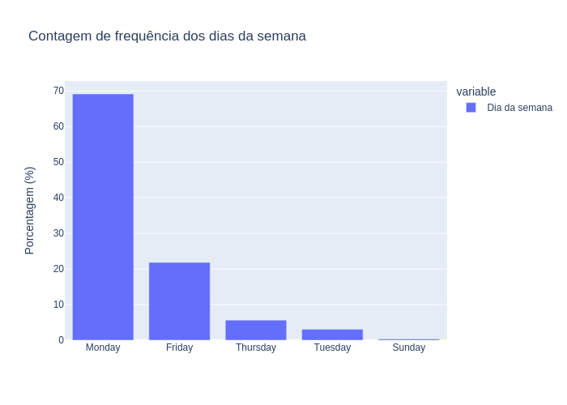

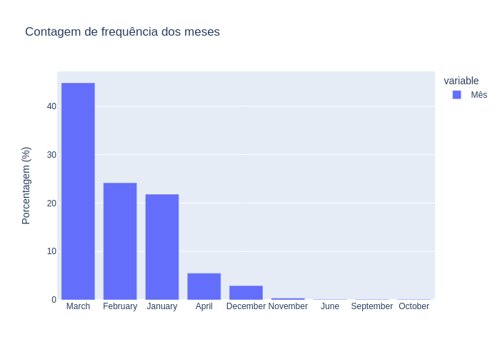

<h3>- Coluna de datatime: Data de emissao</h3>

<h3>- Coluna de datatime: Data de apresentacao</h3>

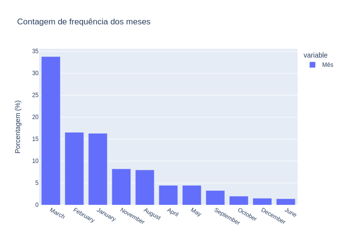

